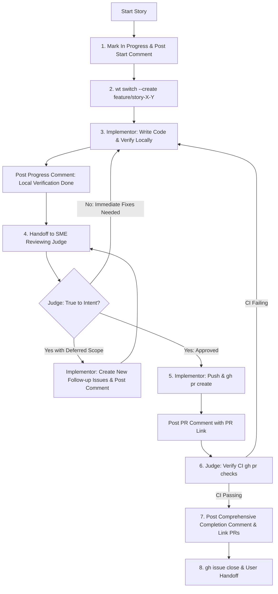

# Story Implementation & SME Judge Feedback Loop Skill

This skill defines the mandatory protocol for implementing and reviewing user stories on the **ChrisShop** monorepo using isolated `wt` worktrees, an intent-driven Subject Matter Expert (SME) Judge feedback loop, mandatory issue status updates (`in-progress`), periodic issue comments at major milestones, comprehensive completion comments with linked PRs and follow-up actions, PR creation, and automated CI verification.

## When to Use This Skill

Use this skill whenever:

- Tackling shovel-ready user stories across any delivery phase.
- Isolating story implementation using `wt` git worktrees.
- Running a dual-role feedback loop between an **Implementor** agent and an **SME Reviewing Judge** agent.
- Updating GitHub issue status and keeping issue audit trails updated with periodic comments.
- Ensuring story deliverables meet the **true architectural intent** rather than merely ticking off basic checklist items.
- Documenting comprehensive completion summaries, linked PRs, and follow-up actions on GitHub.
- Verifying that GitHub Actions CI passes on the resulting Pull Request before handoff.

---

## 1. Environment & Story Initialization (`In Progress` Setup)

Before writing any code for a story:

1. **Ensure Worktree Tooling**: Confirm Git 2.43+ and `wt` (worktrunk) are available in `PATH` (`export PATH="/opt/homebrew/bin:$PATH"`).
2. **Mark Story as In Progress**:
   - Add the `status:in-progress` label to the GitHub Issue:
     ```bash
     gh issue edit <IssueNumber> --add-label "status:in-progress"
     ```
   - Move issue card on GitHub Project v2 board (if applicable) to `In Progress`.
3. **Post Start-of-Work Comment**: Post an explicit comment on the GitHub Issue initiating work:
   ```bash
   gh issue comment <IssueNumber> --body "🚀 **Status**: In Progress

   - **Worktree**: `feature/story-<X>-<Y>-<shortname>`
   - **Implementor**: AI Agent
   - **Initial Technical Approach**: <Brief overview of planned architecture and files to modify>
   - **Target Acceptance Criteria**: <Key goals being tackled in this iteration>"
   ```
4. **Provision Isolated Worktree**: Create and switch to a dedicated isolated worktree and branch for the story using `wt`:
   ```bash
   wt switch --create feature/story-<X>-<Y>-<short-description>
   ```
5. Confirm clean worktree state before beginning code modifications.

---

## 2. Periodic Progress Comments (Issue Audit Trail)

To maintain visibility for team members and project stakeholders, **periodic comments MUST be posted on the GitHub issue** as work moves through key milestones:

1. **Local Implementation Milestone**: When core implementation and local verification (typecheck/lint/build) finish:

   ```bash
   gh issue comment <IssueNumber> --body "🔄 **Progress Update**: Local Implementation & Verification Complete

   - **Changes Made**: <Summary of modified files/components>
   - **Local Status**: Typecheck & build passed locally
   - **Next Step**: Handoff to SME Reviewing Judge for intent check"
   ```

2. **SME Judge Review Milestone**: When the SME Judge evaluates implementation against architecture intent:

   ```bash
   gh issue comment <IssueNumber> --body "🔍 **SME Judge Review Findings**

   - **Intent Alignment**: <Pass / Adjustments Required>
   - **Scope Findings**: <Immediate adjustments needed or deferred enhancements identified>
   - **Action Taken**: <Refactoring in progress / Proceeding to PR creation>"
   ```

3. **Follow-Up Story Creation Milestone**: If new follow-up stories/issues are created during review:

   ```bash
   gh issue comment <IssueNumber> --body "📌 **Scope Expansion Update**: Follow-Up Stories Created

   - Created #<FollowUpIssueNumber>: <Title>
   - Deferred Reason: <Why item is tracked separately>"
   ```

4. **PR Opened Milestone**: When the Pull Request is opened:
   ```bash
   gh issue comment <IssueNumber> --body "🔀 **Pull Request Opened**

   - **PR Link**: https://github.com/jacobmiller22/chrishop/pull/<PR_NUMBER> (`Fixes #<IssueNumber>`)
   - **Status**: CI checks pending..."
   ```

---

## 3. Dual-Role Feedback Loop Workflow

Each story execution requires two distinct operational roles: **Implementor** and **SME Reviewing Judge**.



### 3.1 Role 1: Implementor Execution Protocol

1. **Implementation**: Build all required code, configuration, tests, or documentation files in the story's worktree.
2. **Local Monorepo Verification**:
   - Run typecheck and linting: `pnpm run check`
   - Run build validation: `pnpm run build`
   - Run applicable unit/integration tests: `pnpm run test`
3. **Progress Update**: Post a progress comment on the GitHub issue detailing local verification results.
4. **Judge Review Handoff**: Submit code state to SME Reviewing Judge for intent and scope review.
5. **Follow-up Story Creation**: If the Judge identifies valuable scope expansion that should be deferred, create new GitHub issues via `gh issue create` with proper `epic:*` labels, milestones, and dependency references, post a comment referencing them, and re-submit to the Judge for review.
6. **PR Creation**: Once approved by the Judge:
   - Push branch to remote.
   - Create PR using `gh pr create` with `Fixes #<IssueNumber>` in the PR body.
   - Post PR link comment on the GitHub issue.

### 3.2 Role 2: SME Reviewing Judge Protocol

The SME Judge is a domain expert aware that initial user stories may be hastily written or incomplete. The Judge must **NOT** just check off boxes.

1. **Intent Evaluation**:
   - Examine the implementation against the high-level architecture (`docs/HIGH_LEVEL_DESIGN.md`) and project goals.
   - Evaluate if the solution is robust, maintainable, resilient, and true to the feature's underlying intent.
2. **Scope Expansion Management**:
   - **Immediate Expansion**: If missing elements are critical to the current story's intent or functionality, instruct the Implementor to make immediate adjustments.
   - **Deferred Expansion**: If the Judge identifies valuable enhancements or future edge-case handling that should be tackled later, require the Implementor to create official GitHub issues (stories) for them before approving.
3. **CI Verification**:
   - After the PR is created, monitor CI checks using `gh pr checks <pr-number>`.
   - If CI fails, work iteratively with the Implementor to fix the issue.
   - If CI remains unfixable after reasonable troubleshooting, officially notify the user that CI verification was aborted ("giving up") with full diagnostic logs.
4. **Comprehensive Completion Comment & Handoff**:
   - Post the mandatory comprehensive completion comment on the GitHub issue (see Section 4).
   - Close the issue via `gh issue close <IssueNumber>`.
   - Provide final summary report to the user with PR links, CI status, and follow-up actions.

---

## 4. Comprehensive Completion Comment & Deliverables Protocol

Upon completion of story implementation and passing CI verification, the SME Judge / Implementor MUST post a comprehensive completion comment on the GitHub issue before closing it.

### 4.1 GitHub Issue Completion Comment Template

```bash
gh issue comment <IssueNumber> --body "✅ **Story Execution Completed**

### 📦 Summary of Accomplishments & Deliverables
<Detailed technical summary of changes made across components, packages, tests, and configuration files>

### 🔗 Relevant Pull Requests & Commits
- **Pull Request**: https://github.com/jacobmiller22/chrishop/pull/<PR_NUMBER> (`Fixes #<IssueNumber>`)
- **Commit SHA**: `<CommitSHA>`
- **CI Status**: `PASSING` (Verified via \`gh pr checks\`)

### 🧪 Verification & Validation Results
- **Typecheck & Lint**: Passed (\`pnpm run check\`)
- **Build Validation**: Passed (\`pnpm run build\`)
- **Automated Tests**: Passed (\`pnpm run test\`)

### 🚀 Follow-Up Actions & Next Steps
- **Follow-up Stories Created**:
  - #<NewIssue1>: <Title of deferred scope item>
  - #<NewIssue2>: <Title of deferred scope item>
- **Unblocked Next Stories**:
  - Story <X>.<Y+1>: <Title>
- **Deployment / Manual Verification Instructions**: <Any manual verification steps if required>"
```

### 4.2 Closing the Issue

Once the comprehensive comment is posted and CI has passed:

```bash
gh issue edit <IssueNumber> --remove-label "status:in-progress" --add-label "status:completed"
gh issue close <IssueNumber>
```

---

## 5. Mandatory Checklist for Story Loop Execution

Every agent executing a story must ensure:

- [ ] Story marked `In Progress` with label `status:in-progress` upon start.
- [ ] Start-of-work comment posted on GitHub Issue with worktree name and technical plan.
- [ ] Periodic progress comments posted on GitHub Issue at key milestones (local check, SME review, PR creation).
- [ ] Comprehensive completion comment posted on GitHub Issue with technical summary, linked PRs (`https://github.com/jacobmiller22/chrishop/pull/<PR_NUMBER>`), CI status, and follow-up actions.
- [ ] Follow-up GitHub issues created for deferred scope with proper labels and cross-references.
- [ ] GitHub Issue closed via `gh issue close`.
