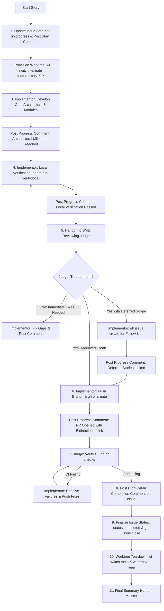

# Story Implementation & SME Judge Feedback Loop Skill

This skill defines the mandatory, end-to-end protocol for implementing, reviewing, documenting, and cleaning up user stories across the **ChrisShop** monorepo. It enforces:

1. **Strict Isolation**: Implementation in dedicated Git worktrees via `wt` (worktrunk).
2. **Issue Status Tracking**: Real-time status transitions (`status:in-progress` ➔ `status:completed`, Project v2 board updates).
3. **Periodic Progress Comments**: Mandatory audit comments posted on the GitHub issue across all execution milestones.
4. **Dual-Role Feedback Loop**: Rigorous collaboration between an **Implementor** and an **SME Reviewing Judge** to ensure solutions satisfy true architectural intent.
5. **Bidirectional PR-to-Issue Linking**: Standardized closing keywords (`Fixes #<IssueNumber>`) and explicit PR URLs on both sides.
6. **High-Detail Completion Updates**: Exhaustive summary comments capturing all deliverables, file modifications, verification evidence, and spawned follow-up stories before closing.
7. **Worktree Teardown & Process Cleanup**: Automated reaping of processes, removal of temporary worktrees via `wt remove`, and repository pruning.

## When to Use This Skill

Use this skill whenever:

- Tackling shovel-ready user stories across any delivery phase (Phase 1 to Phase 6+).
- Isolating story implementation using `wt` git worktrees.
- Running a dual-role feedback loop between an **Implementor** agent and an **SME Reviewing Judge** agent.
- Keeping the GitHub issue audit trail updated with periodic progress comments.
- Ensuring story deliverables meet the **true architectural intent** rather than merely ticking off superficial acceptance criteria.
- Linking Pull Requests directly to issues and managing board card automation.
- Documenting comprehensive completion summaries on GitHub before closing issues.
- Cleaning up worktrees, lingering background processes, and git metadata after PR submission.

---

## 1. Story Lifecycle & Workflow Architecture



---

## 2. Story Initialization & Status Transition (`In Progress`)

Before modifying any source code for a story:

1. **Verify Tooling**: Confirm Git 2.43+ and `wt` (worktrunk) are available in `PATH` (`export PATH="/opt/homebrew/bin:$PATH"`).
2. **Transition Issue Status to `In Progress`**:
   - Apply the `status:in-progress` label to the GitHub Issue:
     ```bash
     gh issue edit <IssueNumber> --add-label "status:in-progress"
     ```
   - If a GitHub Project v2 board is active, ensure the issue card moves from `Backlog` to `In Progress`.
3. **Post Start-of-Work Comment**: Post an explicit initialization comment on the GitHub Issue:
   ```bash
   gh issue comment <IssueNumber> --body "🚀 **Status**: In Progress

   - **Worktree**: \`feature/story-<X>-<Y>-<shortname>\`
   - **Implementor**: AI Agent
   - **Technical Strategy**: <Brief breakdown of architectural approach, components to create/modify, and design decisions>
   - **Target Acceptance Criteria**: <Specific checklist items and intent objectives being addressed>"
   ```
4. **Provision Isolated Worktree**: Create and switch to a dedicated isolated worktree and branch for the story using `wt`:
   ```bash
   wt switch --create feature/story-<X>-<Y>-<short-description>
   ```
5. **Verify Clean Workspace**: Confirm clean worktree state before beginning code modifications (`git status`).

---

## 3. Periodic Progress Comments Protocol (Issue Audit Trail)

To maintain total transparency for team members and stakeholders, **periodic comments MUST be posted on the GitHub issue** as work moves through each major stage. Do not wait until the story is finished to communicate progress.

Post comments upon reaching the following milestones:

### 3.1 Milestone 1: Start-of-Work & Initial Technical Strategy

_(Posted during Story Initialization as shown in Section 2)._

### 3.2 Milestone 2: Major Component / Implementation Milestone

When significant structural progress is made (e.g., scaffolding completed, data models defined, core business logic implemented, or third-party service integrated):

```bash
gh issue comment <IssueNumber> --body "🔨 **Progress Update**: Core Implementation Milestone Reached

- **Completed**: <Specific components/modules implemented, e.g., D1 database client scaffolding and Shopify webhook HMAC verification>
- **Files Modified/Created**: <Key file paths touched>
- **Current Technical Decision**: <Key architectural choice or pattern applied>
- **Next Step**: <Unit test authoring and monorepo verification>"
```

### 3.3 Milestone 3: Local Verification & Test Suite Execution

When local monorepo validation via the turnkey pipeline (`pnpm run verify:local`) passes:

```bash
gh issue comment <IssueNumber> --body "🔄 **Progress Update**: Local Verification Succeeded

- **Pre-PR Verification Pipeline**: Passed (\`pnpm run verify:local\`)
  - **Runtime & Engines**: Node.js 22+, pnpm 9+ verified
  - **Typecheck & Lint**: Passed (\`pnpm run check\`)
  - **Unit Tests**: Passed (\`pnpm run test:unit\`) — <X tests passed, 0 failures across all packages>
  - **Ephemeral Integration Tests**: Passed (\`pnpm run test:integration\`) — In-memory D1 SQLite, Workers KV, and Shopify client verified
  - **Build Validation**: Passed (\`pnpm run build\`)
  - **Secret Hygiene & Worktree State**: Clean, zero credential leaks
- **Next Step**: Handoff to SME Reviewing Judge for architectural intent evaluation"
```

### 3.4 Milestone 4: SME Judge Review Findings & Scope Decisions

When the SME Reviewing Judge inspects the work against the high-level design and architectural intent:

```bash
gh issue comment <IssueNumber> --body "🔍 **SME Judge Review Findings**

- **Intent Alignment**: <Pass / Adjustments Required>
- **Architectural Notes**: <Observations on maintainability, edge cases, error resilience>
- **Scope Findings**:
  - *Immediate Adjustments*: <None / Specific fixes required before PR>
  - *Deferred Scope*: <None / Items identified for follow-up stories>
- **Action Taken**: <Refactoring in progress / Creating follow-up issues / Proceeding to PR creation>"
```

### 3.5 Milestone 5: Deferred Scope & Follow-Up Stories Created

If the Judge identifies scope expansion that should be tracked separately:

```bash
gh issue comment <IssueNumber> --body "📌 **Scope Expansion Update**: Follow-Up Stories Created

The following deferred scope items have been formalized as new user stories:
- #<FollowUpIssueNumber1>: <Title of new issue> — <Rationale for deferral>
- #<FollowUpIssueNumber2>: <Title of new issue> — <Rationale for deferral>"
```

### 3.6 Milestone 6: Pull Request Opened & Linked

When the Pull Request is created on GitHub:

```bash
gh issue comment <IssueNumber> --body "🔀 **Pull Request Opened**

- **PR Link**: https://github.com/jacobmiller22/chrishop/pull/<PR_NUMBER>
- **Branch**: \`feature/story-<X>-<Y>-<shortname>\`
- **Issue Association**: \`Fixes #<IssueNumber>\`
- **CI Status**: Triggered and monitoring..."
```

### 3.7 Milestone 7: CI Verification Passed / Troubleshooting Updates

If CI fails or succeeds:

```bash
# On CI Success:
gh issue comment <IssueNumber> --body "🟢 **CI Verification Passed**

- All automated checks on PR https://github.com/jacobmiller22/chrishop/pull/<PR_NUMBER> passed successfully.
- Ready for completion documentation and story finalization."

# On CI Failure / Resolution:
gh issue comment <IssueNumber> --body "⚠️ **CI Troubleshooting Update**

- **Failing Check**: <Check name, e.g., lint / test>
- **Root Cause**: <Brief description of error in CI environment>
- **Remediation**: <Fix applied and pushed in commit SHA>
- **Status**: Rerunning CI checks..."
```

---

## 4. Dual-Role Feedback Loop Protocol

Each story requires two distinct operational roles: **Implementor** and **SME Reviewing Judge**.

### 4.1 Role 1: Implementor Execution Protocol

1. **Implementation**:
   - Write clean, modular, and maintainable code inside the dedicated `wt` worktree.
   - Maintain consistency with existing architecture, conventions, and design patterns.
2. **Periodic Updates**:
   - Post progress comments at major component milestones (Milestone 2).
3. **Local Monorepo Verification**:
   - Run the turnkey verification pipeline: `pnpm run verify:local`
   - Ensure all 6 verification stages pass:
     1. Runtime & engine verification (Node.js 22+, pnpm 9+).
     2. Workspace package graph & lockfile integrity.
     3. Typecheck & linting (`pnpm run check`).
     4. Ephemeral integration test suites (`pnpm run test:integration` covering in-memory D1 SQLite, Workers KV, and Shopify client).
     5. Production build validation (`pnpm run build`).
     6. Secret hygiene scan & clean worktree state.
   - **Never rely solely on compilation (`tsc` or `build`)**: Runtime behavior and service connectivity must be proven locally via `pnpm run test:integration` and `pnpm run verify:local` before opening a PR.
   - Post local verification comment (Milestone 3).
4. **Handoff to SME Judge**:
   - Present completed code and verification outputs to the SME Judge for review.
5. **Iteration / Follow-Up Creation**:
   - If immediate fixes are requested, implement them and re-verify via `pnpm run verify:local`.
   - If deferred scope is approved, create new GitHub issues via `gh issue create` with appropriate `epic:*` labels and cross-references, then post Milestone 5 comment.
6. **PR Creation & Linking**:
   - Push branch: `git push -u origin feature/story-<X>-<Y>-<shortname>`
   - Open PR via `gh pr create` with `Fixes #<IssueNumber>` in the body (see Section 5).
   - Post PR link comment on the issue (Milestone 6).
7. **Worktree Cleanup**:
   - After PR submission and CI verification, execute worktree teardown (see Section 6).

### 4.2 Role 2: SME Reviewing Judge Protocol

The SME Judge is an architectural authority who ensures stories do not merely check off surface-level criteria, but genuinely advance the platform's stability, security, and developer ergonomics.

1. **Intent & Verification Evaluation**:
   - Review code against `docs/HIGH_LEVEL_DESIGN.md` and related architecture specs.
   - Verify that the Implementor ran and passed `pnpm run verify:local` (including ephemeral integration tests).
   - Guard against "compilation-only" solutions: ensure database queries, D1 SQLite operations, KV interactions, and Shopify API calls are backed by concrete tests, not just type signatures.
   - Check error resilience, edge-case coverage, security practices, and code hygiene.
2. **Scope Adjudication**:
   - **Immediate Scope**: Reject changes if missing elements compromise the story's core purpose or introduce technical debt.
   - **Deferred Scope**: Guide the Implementor to file clean follow-up issues for non-blocking enhancements.
3. **CI Monitoring**:
   - Monitor CI status: `gh pr checks <PR_NUMBER>`.
   - If CI fails, work iteratively with the Implementor to diagnose and resolve issues.
4. **Audit Review & Signoff**:
   - Ensure all periodic comments have been posted to the issue audit trail.
   - Post the comprehensive completion comment (see Section 7).
   - Finalize issue status and close the issue.

---

## 5. Bidirectional PR-to-Issue Linking Protocol

To guarantee end-to-end traceability, Pull Requests and GitHub Issues **MUST** be explicitly and bidirectionally linked.

### 5.1 PR Requirements (Linking PR to Issue)

1. **Closing Keyword in PR Body**: The Pull Request description MUST include standard GitHub closing syntax on its own line:

   ```markdown
   Fixes #<IssueNumber>
   ```

   _(Acceptable keywords: `Fixes #<IssueNumber>`, `Closes #<IssueNumber>`, `Resolves #<IssueNumber>`)_. This links the PR in GitHub's native Development sidebar and automates board transitions.

2. **PR Title Format**: Include the story number and issue reference:

   ```text
   feat(<scope>): Story <X>.<Y> <Short Title> (#<IssueNumber>)
   ```

3. **PR Creation Command Example**:
   ```bash
   gh pr create \
     --title "feat(storefront): Story 2.3 Product Filter Component (#42)" \
     --body "## Summary of Changes
   - Implemented reactive category and price filter drawer.
   - Integrated client state with URL query parameters.
   - Added unit test suite covering filter edge cases.

   ## Issue Reference
   Fixes #42" \
     --base main
   ```

### 5.2 Issue Requirements (Linking Issue to PR)

1. **PR Opened Comment**: The issue MUST receive a comment containing the direct PR URL (`https://github.com/jacobmiller22/chrishop/pull/<PR_NUMBER>`).
2. **Completion Summary Comment**: The final completion comment MUST list the direct PR link and commit SHA.
3. **Verification**: Verify that GitHub shows the linked PR in the issue sidebar under "Development".

---

## 6. Worktree Lifecycle & Teardown Protocol

Every story created in an isolated worktree via `wt` must be cleanly torn down upon completion to prevent disk bloat, dangling worktree metadata, and orphaned background processes.

### 6.1 Pre-Cleanup Verification

Before removing a worktree, confirm that:

1. All changes are committed: `git status` reports clean working directory.
2. The branch has been pushed to the remote: `git push -u origin <branch>`.
3. The Pull Request is open and visible on GitHub.

### 6.2 Step-by-Step Worktree Teardown

1. **Switch Context Back to the Main Monorepo Root**:
   Never attempt to delete a worktree while your active shell or command execution context is inside it.

   ```bash
   wt switch main
   ```

2. **Reap Processes and Remove Worktree via `wt remove`**:
   Use `wt remove` with the `--reap` flag. This terminates any lingering background processes (dev servers, watchers, background helpers) running inside the worktree directory before removing it:

   ```bash
   wt remove --reap feature/story-<X>-<Y>-<shortname>
   ```

   > [!NOTE]
   > If you wish to retain the local branch ref after removing the worktree directory, pass `--no-delete-branch`:
   >
   > ```bash
   > wt remove --reap --no-delete-branch feature/story-<X>-<Y>-<shortname>
   > ```

3. **Handling Dirty or Aborted Worktrees**:
   If a worktree needs to be removed after an aborted spike or dirty state:

   ```bash
   wt remove --force -D feature/story-<X>-<Y>-<shortname>
   ```

4. **Prune Git Metadata and Verify**:
   Prune stale git worktree administrative files and verify clean status:
   ```bash
   git worktree prune
   wt list
   ```
   Ensure the deleted story worktree no longer appears in `wt list`.

---

## 7. High-Detail Completion Update & Status Finalization Protocol

Upon completion of story implementation, passing CI verification, and successful worktree teardown, the SME Judge / Implementor MUST post a high-detail completion comment on the GitHub issue before closing it.

### 7.1 GitHub Issue Completion Comment Template

```bash
gh issue comment <IssueNumber> --body "✅ **Story Execution Completed**

### 📦 Summary of Accomplishments & Deliverables
<Provide an exhaustive breakdown of what was implemented, how it satisfies the architectural intent, and any key design choices made during development.>

### 📁 Detailed Breakdown of Changes
- **New Files**:
  - \`packages/shared-ui/src/components/FilterDrawer.tsx\`: Responsive filter drawer with accessible keyboard navigation.
  - \`packages/shared-ui/tests/FilterDrawer.test.tsx\`: Unit tests covering multi-select and reset behavior.
- **Modified Files**:
  - \`apps/storefront/src/app/catalog/page.tsx\`: Integrated filter state into URLSearchParams.
  - \`packages/config/tailwind/tailwind.config.ts\`: Added drawer slide-over animation presets.
- **Dependencies / Config**:
  - Added \`@radix-ui/react-dialog\` to \`packages/shared-ui\`.

### 🔗 Relevant Pull Requests & Commits
- **Pull Request**: https://github.com/jacobmiller22/chrishop/pull/<PR_NUMBER> (\`Fixes #<IssueNumber>\`)
- **Commit SHA**: \`<CommitSHA>\`
- **CI Status**: \`PASSING\` (All checks verified via \`gh pr checks <PR_NUMBER>\`)

### 🧪 Verification & Validation Results
- **Typecheck & Lint**: \`pnpm run check\` (0 errors across monorepo)
- **Build Validation**: \`pnpm run build\` (all workspace apps built successfully)
- **Automated Tests**: \`pnpm run test\` (<X> test suites passed, 100% success)
- **Manual Verification**: <Description of manual smoke tests, browser checks, or API curls performed>

### 🚀 Follow-Up Actions & Next Steps
- **Follow-Up Stories Created**:
  - #<NewIssue1>: <Title of deferred scope item>
  - #<NewIssue2>: <Title of deferred scope item>
- **Unblocked Next Stories**:
  - Story <X>.<Y+1>: <Title of next ready story>
- **Reviewer Instructions**:
  - To test locally: checkout \`feature/story-<X>-<Y>-<shortname>\`, run \`pnpm install\`, then \`pnpm dev\`."
```

### 7.2 Finalizing Story Status & Issue Closure

Once the comprehensive comment has been posted:

1. **Update Issue Labels**:
   Remove the `status:in-progress` label and add `status:completed`:

   ```bash
   gh issue edit <IssueNumber> --remove-label "status:in-progress" --add-label "status:completed"
   ```

2. **Close the GitHub Issue**:

   ```bash
   gh issue close <IssueNumber> --reason "completed"
   ```

3. **Update GitHub Project v2 Board**:
   If a GitHub Project v2 board is in use, verify that the card status is transitioned to `Done` (either through GitHub Action `board-sync.yml` automation via the linked PR or manually via `gh project item-edit`).

---

## 8. Mandatory Checklist for Story Loop Execution

Every agent executing a user story must systematically complete and verify every item on this checklist:

- [ ] **Story Initialization**:
  - [ ] Applied `status:in-progress` label to GitHub issue.
  - [ ] Moved Project v2 board card to `In Progress`.
  - [ ] Posted start-of-work comment on GitHub issue detailing technical plan and target criteria.
  - [ ] Created and switched to isolated worktree: `wt switch --create feature/story-<X>-<Y>-<shortname>`.
- [ ] **Periodic Progress Updates**:
  - [ ] Posted Milestone 2 comment upon reaching core component/scaffolding milestone.
  - [ ] Ran `pnpm run verify:local` (engine check, check, test:unit, test:integration, build, secrets hygiene) and posted Milestone 3 comment with verification outputs.
  - [ ] Verified live service integration against ephemeral Miniflare/D1 test suite (not just compilation).
  - [ ] Conducted SME Reviewing Judge intent evaluation and posted Milestone 4 comment.
  - [ ] Created GitHub issues for any deferred scope and posted Milestone 5 comment with issue links.
- [ ] **Pull Request & Bidirectional Linking**:
  - [ ] Pushed branch to remote repository.
  - [ ] Created PR with `Fixes #<IssueNumber>` in the PR body and issue reference in the title.
  - [ ] Posted Milestone 6 comment on the issue with full PR link: `https://github.com/jacobmiller22/chrishop/pull/<PR_NUMBER>`.
  - [ ] Verified that GitHub displays the PR in the issue's "Development" section.
- [ ] **CI Verification**:
  - [ ] Verified that CI checks passed on PR using `gh pr checks <PR_NUMBER>`.
  - [ ] Posted Milestone 7 comment confirming CI pass.
- [ ] **High-Detail Completion Update & Status Finalization**:
  - [ ] Posted high-detail completion comment on GitHub issue (deliverables, file list, verification results, PR link, follow-up issues).
  - [ ] Updated issue label to `status:completed` (removed `status:in-progress`).
  - [ ] Closed GitHub issue via `gh issue close <IssueNumber> --reason "completed"`.
  - [ ] Verified Project v2 card transitioned to `Done`.
- [ ] **Worktree Teardown & Cleanup**:
  - [ ] Switched back to main monorepo worktree: `wt switch main`.
  - [ ] Reaped running processes and removed worktree: `wt remove --reap feature/story-<X>-<Y>-<shortname>`.
  - [ ] Pruned git worktree metadata: `git worktree prune`.
  - [ ] Verified clean state via `wt list`.
