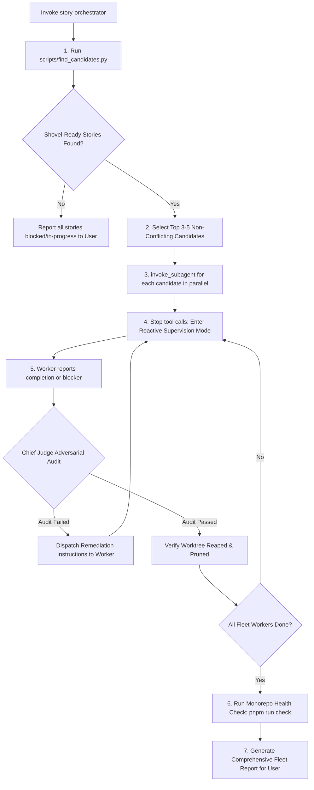

# Autonomous Story Fleet Orchestrator & Chief Judge Skill

This skill defines the end-to-end orchestration protocol for autonomously selecting, dispatching, supervising, and verifying parallel user stories across the **ChrisShop** monorepo.

It elevates the agent to a **Chief Judge & Fleet Orchestrator** who:

1. Identifies the top 3–5 shovel-ready, unblocked user stories across delivery phases.
2. Performs parallel conflict analysis to guarantee non-overlapping workspace changes.
3. Spawns dedicated worker subagents, each assigned to execute a story in an isolated `wt` worktree following [story-feedback-loop](../story-feedback-loop/SKILL.md).
4. Supervises the fleet reactively (no wasteful polling loops).
5. Conducts an adversarial final audit on each completed story (confirming PR linking, passing CI checks, comprehensive issue updates, and clean worktree teardown).
6. Compiles a high-fidelity status report detailing completed deliverables, PR URLs, unblocked dependencies, and any blocking impediments.

---

## 1. Fleet Architecture & Workflow



---

## 2. Stage 1: Candidate Identification & Conflict Analysis

When invoked, the Orchestrator MUST identify the top 3–5 shovel-ready stories that:

- Are **OPEN** and do **NOT** have `status:in-progress`, `blocked`, `needs-refinement`, or `creator-review` labels.
- Have zero unresolved blockers in their `Dependencies` section (all prerequisites must be `CLOSED` on GitHub).
- Have no active assignees.
- **Are prioritized by Priority Tier first**: `priority:critical` (P0) > `priority:high` (P1) > `priority:medium` (P2) > `priority:low` (P3). Stories without priority labels are deprioritized until groomed.

### 2.1 Execution via Helper Script

Run the automated priority-first discovery script:

```bash
# Discover top candidates prioritized by criticality and phase
python3 .agents/skills/story-orchestrator/scripts/find_candidates.py --limit 4

# Target only critical/high priority stories
python3 .agents/skills/story-orchestrator/scripts/find_candidates.py --limit 4 --min-priority high
```

To output raw JSON for programmatic subagent prompt generation:

```bash
python3 .agents/skills/story-orchestrator/scripts/find_candidates.py --limit 4 --json
```

### 2.2 Parallel Conflict Validation

Before spawning subagents, the Orchestrator MUST verify that the selected batch of stories touches **disjoint packages or directories** to avoid merge conflicts:

- **Valid Concurrent Batch Example**:
  - Worker A: `Story 1.12` (`apps/web`)
  - Worker B: `Story 2.1` (`docs/deps/`)
  - Worker C: `Story 2.11` (`packages/notifications/`)
  - Worker D: `Story 2.13` (`tests/integration/`)
- **Conflicting Batch Example**: Spawning two workers that both modify `apps/web/src/app/products/page.tsx` simultaneously. If two top-ranked candidates conflict, defer the second candidate and select the next available non-conflicting story.

---

## 3. Stage 2: Parallel Worker Dispatch Protocol

The Orchestrator dispatches worker subagents concurrently using a single `invoke_subagent` tool call.

### 3.1 Worker Configuration Standard

For each selected story, define an entry in `Subagents`:

- **Role**: `Worker: Story <X.Y> <Short Title>`
- **TypeName**: `self` (inherits tool capabilities to create files, run git, and manage issues)
- **Model**: `inherit` (or `flash` for pure documentation stories like Story 2.1)
- **Workspace**: `inherit` (the worker creates its own isolated worktree using `wt`)

### 3.2 Standard Worker System Prompt Template

Every subagent prompt MUST explicitly mandate execution of [story-feedback-loop](../story-feedback-loop/SKILL.md):

```text
You are assigned to implement and verify GitHub Issue #<ISSUE_NUMBER>: "<ISSUE_TITLE>".

Issue Details:
<PASTE FULL ISSUE BODY>

You MUST strictly follow the protocol defined in `.agents/skills/story-feedback-loop/SKILL.md`:
1. Transition Issue Status: Apply label "status:in-progress" and post an initial start-of-work comment on GitHub.
2. Provision Worktree: Create an isolated worktree using `wt switch --create feature/story-<X>-<Y>-<slug>`.
3. Implementation: Develop all deliverables matching the sub-tasks checklist.
4. Local Verification: Run `pnpm run verify:local` (validating container health, check, test:unit, live dependency probes, and build). Post local verification comment on the issue.
5. Dual-Role Adversarial Review: Evaluate your implementation against high-level architectural intent. Fix gaps immediately.
6. Pull Request & Linking: Push branch, create PR targeting `main` with `Fixes #<ISSUE_NUMBER>` in the PR body. Post PR link comment on the issue.
7. CI Verification: Verify automated checks pass via `gh pr checks <PR_NUMBER>`.
8. High-Detail Completion Documentation: Post a comprehensive completion comment on GitHub Issue #<ISSUE_NUMBER> detailing deliverables, file list, verification outputs, and PR link.
9. Finalize Status: Remove "status:in-progress", apply "status:completed", and close the issue via `gh issue close <ISSUE_NUMBER> --reason "completed"`.
10. Worktree Teardown: Switch back (`wt switch main`), reap background processes, and remove the worktree via `wt remove --reap feature/story-<X>-<Y>-<slug>`. Run `git worktree prune`.

When complete, message the Orchestrator with:
- PR URL and Commit SHA
- Ephemeral Preview Environment URLs (Storefront, Admin, API health probe)
- Issue closure confirmation
- Monorepo verification evidence (including `pnpm run verify:local` summary)
- Any unblocked next steps or deferred scope
- Any blockers encountered that prevent completion
```

---

## 4. Stage 3: Reactive Fleet Supervision Protocol

After launching worker subagents:

1. **DO NOT POLL**: Do not run loops or query task statuses repeatedly.
2. **Stop Calling Tools**: End your turn. The messaging system will automatically wake you up when a subagent sends a status update or completes.
3. **Handling Intermediate Messages**:
   - If a worker asks for technical clarification, provide immediate guidance aligned with `docs/HIGH_LEVEL_DESIGN.md`.
   - If a worker encounters an external blocker (e.g. missing API key or credential), record the blocker in your fleet tracking state.

---

## 5. Stage 4: Chief Judge Adversarial Audit Protocol

When a worker reports completion, the Orchestrator MUST NOT take its word at face value. The Orchestrator conducts an **Adversarial Audit** across 7 criteria before accepting the deliverable:

```markdown
### Chief Judge Audit Checklist

- [ ] 1. **Issue State**: Is Issue #<N> closed on GitHub (`gh issue view <N> --json state`)? Does it have `status:completed`?
- [ ] 2. **Audit Trail**: Were progress comments posted on the issue? Does the final comment include a full breakdown of deliverables, modified files, verification evidence, PR URL, and live ephemeral preview links?
- [ ] 3. **PR & Linking**: Is the PR open/merged on GitHub? Does the PR description include `Fixes #<N>`? Did CI checks pass (`gh pr checks <PR_NUMBER>`)?
- [ ] 4. **Live Preview Verification**: Did the ephemeral preview deploy successfully? Are the preview URL (`https://pr-<N>-chrishop.jacobmiller22.com`) and admin route accessible and verified?
- [ ] 5. **Worktree Hygiene**: Did the worker clean up after itself? Run `wt list` — verify that `feature/story-X-Y` is NOT lingering in the active worktree list.
- [ ] 6. **Monorepo Integrity**: Run `pnpm run check && pnpm run test:unit` at repository root to ensure zero cross-workspace TypeScript errors or test regressions.
- [ ] 7. **Local Runtime Verification**: Did the worker provide evidence of passing `pnpm run verify:local` (ephemeral D1/KV integration tests, unit tests, build, and secrets hygiene)? Reject any deliverables that only rely on compilation without runtime validation.
```

### Remediation Protocol

If an audit item fails:

1. Send a message to the worker subagent specifying the exact deficiency (e.g. _"Worktree was not reaped; please run `wt switch main && wt remove --reap ...`"_ or _"Completion comment missing file breakdown or live preview links"_).
2. Allow the worker to remedy the deficiency and report back.

---

## 6. Stage 5: Final Fleet Report & Handoff

Once all workers have completed and passed audit (or reported insurmountable blockers):

1. **Verify Root Monorepo State**:
   - Ensure local `main` is updated: `git checkout main && git pull origin main`.
   - Verify monorepo typecheck: `pnpm run check`.
   - Prune git metadata: `git worktree prune`.
2. **Generate Final Fleet Completion Report**:
   Present a structured report to the user formatted as:

```markdown
# 🚀 Story Fleet Execution Report

### 📦 Completed Stories

| Story | PR | Staging & Ephemeral Preview Environments | Commit | Issue | Status |
| --- | --- | --- | --- | --- | --- |
| **Story X.Y: Title** | [#100](https://github.com/...) | [Staging](https://staging-chrishop.jacobmiller22.com) · [Admin](https://staging-chrishop.jacobmiller22.com/admin)<br/>[PR Preview](https://pr-100-chrishop.jacobmiller22.com) | `abc1234` | [#42](https://github.com/...) | Closed & Verified ✅ |

### 🔍 Chief Judge Audit Findings

- **PR & Issue Linking**: All PRs explicitly linked via `Fixes #...` and validated.
- **CI Status**: All PR checks green.
- **Worktree Hygiene**: All feature worktrees cleanly reaped and removed (`wt list` clean).
- **Monorepo Integrity**: `pnpm run check` passing cleanly across all workspaces.

### ⚠️ Blocked Items & Impairments (if any)

- **Story A.B (#N)**: Blocked by <Reason / Missing Credentials>. Recommended next action: <Action>.

### 🔮 Unblocked Next Stories

The completion of this fleet unblocks the following candidates for the next fleet run:

1. **Story C.D (#M)**: Title
2. **Story E.F (#K)**: Title
```

---

## 7. Invoking This Skill

To trigger an autonomous run, the user can simply say:

- _"Orchestrate the next batch of stories"_
- _"Run story-orchestrator"_
- _"Find and execute the top shovel-ready stories"_
