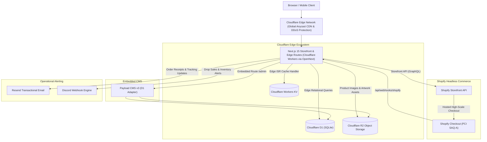

# ChrisShop — Cloudflare-Native Headless Commerce Platform

A high-performance, resilient monorepo architecture for Chris's limited-edition art and physical goods drop platform. Built on **Cloudflare Workers**, **Next.js 15 App Router**, **Payload CMS v3**, **Shopify Headless** (Storefront API & Checkout), **Cloudflare D1** (SQLite at the edge), **Cloudflare R2** object storage, **Workers KV**, **Resend** transactional email, and **Discord** operational alerts.

---

## Architecture Overview



---

## Tech Stack

| Layer | Technology | Rationale |
| :--- | :--- | :--- |
| **Monorepo** | `pnpm` + `Turborepo` | Cached builds, strict dependency boundaries, fast CI/CD pipelines |
| **Storefront & Edge** | Next.js 15 (App Router, React 19) on Cloudflare Workers | Sub-millisecond global cold starts, edge rendering, zero container management |
| **Content Management** | Payload CMS v3 | Embedded TypeScript CMS at `/admin`, native SQLite/D1 database adapter |
| **Edge Database** | Cloudflare D1 (SQLite) | Distributed SQL at the edge, ACID transactions, sub-5ms read latency |
| **Edge Caching** | Cloudflare Workers KV | Ultra-fast key-value store for Next.js incremental static revalidation (ISR) |
| **Object Storage** | Cloudflare R2 | High-speed S3-compatible media storage with zero egress bandwidth fees |
| **Commerce & Checkout** | Shopify Headless | Battle-tested inventory reservation, PCI SAQ-A compliance, multi-currency checkout |
| **Styling & UI** | Tailwind CSS v4 + Radix UI Primitives (`@chrishop/ui`) | WCAG 2.1 AA accessible, unstyled primitives with high aesthetic finish |
| **Notifications** | Resend & Discord (`@chrishop/notifications`) | Pluggable providers for customer email delivery and real-time operational ops |

---

## Monorepo Workspace Structure

```text
chrishop/
├── apps/
│   └── web/                    # Next.js 15 App Router storefront & embedded Payload CMS v3 (/admin)
├── packages/
│   ├── config/                 # Shared tsconfig, ESLint, Prettier, and environment variable schemas
│   ├── notifications/          # Pluggable Notification Engine (Discord Webhooks, Resend Email)
│   ├── types/                  # Canonical TypeScript domain interfaces (Product, Variation, Order, etc.)
│   └── ui/                     # Accessible component library (Tailwind CSS v4 + Radix UI)
├── migrations/
│   └── 0001_initial.sql        # Canonical D1 / SQLite schema migrations
├── scripts/
│   ├── seed-db.ts              # Local database seeder (categories, products, variations)
│   └── verify-local.ts         # Pre-PR local verification pipeline
├── docs/
│   ├── HIGH_LEVEL_DESIGN.md    # Master architectural specification
│   ├── PROJECT_SETUP.md        # GitHub milestones, labels, and board workflows
│   └── deps/                   # External dependency specifications (DEP_*.md)
├── wrangler.toml               # Cloudflare Workers environment bindings (D1, KV, R2, routes)
├── pnpm-workspace.yaml
└── turbo.json
```

---

## Quick Start (Local Development)

### 1. Prerequisites

- **Node.js**: `v20.x` or higher
- **pnpm**: `v9.x` or higher (`corepack enable && pnpm --version`)
- **Cloudflare Wrangler CLI**: Installed locally via workspace dev dependencies

### 2. Environment Setup

```bash
# Clone the repository
git clone git@github.com:jacobmiller22/chrishop.git
cd chrishop

# Install monorepo dependencies
pnpm install

# Copy environment variables template
cp .env.example .env
cp .env.example apps/web/.dev.vars
```

### 3. Seed Local Database

```bash
# Seed local SQLite / D1 database with sample categories, products, and variations
pnpm seed
```

### 4. Start Next.js Development Server

```bash
# Launch Next.js storefront on http://localhost:3000
pnpm dev
```

- **Storefront**: [http://localhost:3000](http://localhost:3000)
- **Payload CMS Admin**: [http://localhost:3000/admin](http://localhost:3000/admin)
- **Health Check**: [http://localhost:3000/api/health](http://localhost:3000/api/health)

For full local development, testing, and troubleshooting instructions, see [LOCAL_DEVELOPMENT.md](LOCAL_DEVELOPMENT.md).

---

## Verification & Testing

```bash
# Run monorepo typecheck
pnpm run check

# Run unit tests across all packages
pnpm run test:unit

# Run integration tests (D1, R2, Shopify client, Payload CMS, Wrangler)
pnpm run test:integration

# Run full pre-PR verification pipeline
pnpm run verify:local
```

---

## Documentation Directory

- [High Level Design](docs/HIGH_LEVEL_DESIGN.md) — Architectural invariants and system decisions
- [Local Development Guide](LOCAL_DEVELOPMENT.md) — Local environment setup and workflows
- [Project Setup & Issue Management](docs/PROJECT_SETUP.md) — Delivery phases and story specifications
- [External Dependencies](docs/deps/README.md) — Technical specifications for Cloudflare, Shopify, Resend, Discord

---

## License & Team

Private repository. All rights reserved.
