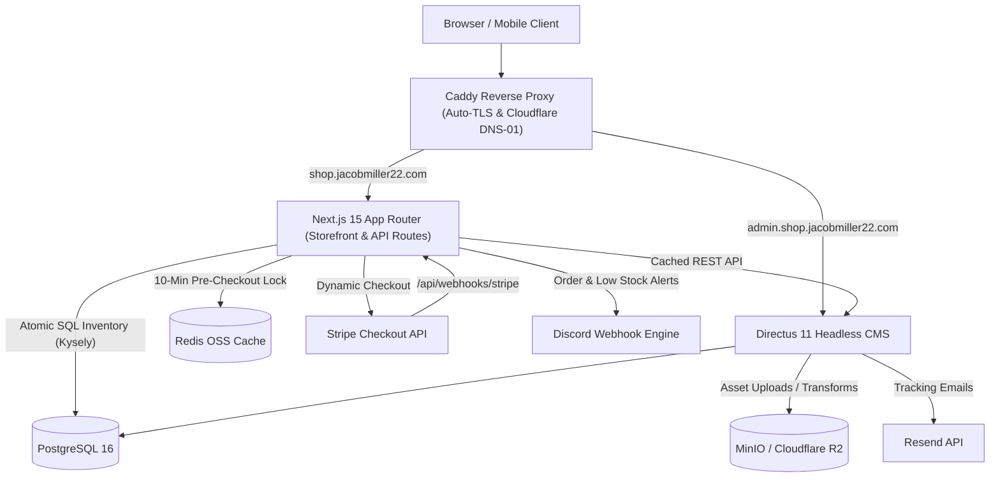

# ChrisShop — E-Commerce Drop Platform

A high-performance, resilient monorepo architecture for Chris's limited-edition art and physical goods drop platform. Engineered for high-concurrency drops, dynamic Stripe Checkout, atomic SQL stock locks, and headlessly managed content via Directus CMS.

---

## Architecture Overview



---

## Tech Stack

| Layer               | Technology                               | Rationale                                                                            |
| ------------------- | ---------------------------------------- | ------------------------------------------------------------------------------------ |
| **Monorepo**        | `pnpm` + `Turborepo`                     | Ultra-fast cached builds, isolated workspace packages                                |
| **Storefront**      | Next.js 15 (App Router, React 19)        | Server components, ISR caching (`revalidate=60`), dynamic metadata                   |
| **Styling & UI**    | Tailwind CSS v4 + Radix UI Primitives    | Accessible (WCAG 2.1 AA compliant), unstyled primitives with high aesthetic finish   |
| **CMS**             | Directus 11 (Headless Node.js CMS)       | Flexible relational content modeling, revision history, granular RBAC & TOTP 2FA     |
| **Database**        | PostgreSQL 16 + Kysely                   | ACID transactions for atomic stock decrement, strict foreign keys                    |
| **Caching & Locks** | Redis 7 OSS (AOF persistence)            | 10-minute pre-checkout stock reservations to prevent overselling                     |
| **Payments**        | Stripe Checkout (dynamic `price_data`)   | Zero-catalog sync, SAQ-A PCI compliance, automatic tax calculation                   |
| **Object Storage**  | MinIO (Dev) / Cloudflare R2 (Prod)       | S3-compatible API, zero egress bandwidth costs                                       |
| **Notifications**   | Pluggable Provider (`Discord`, `Resend`) | Extensible alert engine for orders, low-stock, and tracking notifications            |
| **Hosting & Proxy** | Hetzner Cloud VPS + Caddy 2              | Wildcard TLS certificates via Cloudflare DNS-01 challenge, Docker Compose deployment |

---

## Monorepo Workspace Structure

```text
chrishop/
├── apps/
│   ├── web/                    # Next.js App Router storefront & API routes (/api/checkout, /api/webhooks/stripe, /api/health)
│   └── cms/                    # Directus custom hooks, extensions, snapshots & seed scripts
├── packages/
│   ├── config/                 # Shared tsconfig, ESLint, and Prettier configurations
│   ├── notifications/          # Pluggable Notification Engine (Discord Webhook Provider, Console fallback)
│   ├── types/                  # Canonical TypeScript domain interfaces (Product, Variation, Order, etc.)
│   └── ui/                     # Accessible component library (Tailwind CSS v4 + Radix UI)
├── infra/
│   ├── caddy/                  # Caddyfile & xcaddy Dockerfile with Cloudflare DNS plugin
│   ├── directus/               # Schema snapshot version-controlled backup
│   ├── docker/                 # docker-compose configurations (dev, staging, preview, prod)
│   ├── scripts/                # Backup, restore, and branch protection automation
│   └── vps/                    # Hetzner Cloud provisioning (cloud-init, Ansible playbook)
├── docs/
│   ├── HIGH_LEVEL_DESIGN.md    # Master architectural specification
│   ├── LOCAL_DEVELOPMENT.md    # Step-by-step local development workflow
│   └── deps/                   # External dependency specifications (DEP_*.md)
├── .github/
│   └── workflows/              # CI/CD pipelines (Lint, Test, Deploy, Previews, Rollback)
├── pnpm-workspace.yaml
└── turbo.json
```

---

## Quick Start (Local Development)

### 1. Prerequisites

- Node.js 20+ and `pnpm` 9+
- Docker Engine 24+ and Docker Compose v2+
- Git 2.43+

### 2. Environment Setup

```bash
# Clone the repository
git clone git@github.com:jacobmiller22/chrishop.git
cd chrishop

# Install monorepo dependencies
pnpm install

# Copy environment variables template
cp .env.example .env
```

### 3. Start Local Infrastructure

```bash
# Boot Postgres, Redis, MinIO, and Directus
docker compose -f infra/docker/docker-compose.dev.yml up -d

# Seed the database with sample products, categories, and test orders
pnpm seed
```

### 4. Start Next.js Development Server

```bash
# Launch Next.js storefront on http://localhost:3000
pnpm dev
```

- **Storefront**: [http://localhost:3000](http://localhost:3000)
- **Directus Admin**: [http://localhost:8055](http://localhost:8055) (`admin@chrishop.com` / `admin12345`)
- **MinIO Console**: [http://localhost:9001](http://localhost:9001) (`minioadmin` / `minioadmin`)

For full local development, testing, and troubleshooting instructions, see [LOCAL_DEVELOPMENT.md](LOCAL_DEVELOPMENT.md).

---

## Documentation Directory

- [High Level Design](docs/HIGH_LEVEL_DESIGN.md) — Comprehensive architecture and security specifications
- [Local Development Guide](LOCAL_DEVELOPMENT.md) — Environment setup, commands, and troubleshooting
- [Project Setup & Issue Management](docs/PROJECT_SETUP.md) — GitHub Milestones, Labels, and Board workflows
- [External Dependencies](docs/deps/) — Technical specifications for Hetzner, Directus, Stripe, Cloudflare, etc.

---

## License & Team

Private repository. All rights reserved.
