# Storefront Design System & Layout Architecture Guide
**BankBeaters Adventure Gear** · *"Curiosity > Fear"*

> [!NOTE]
> **Document Status**: Approved Living Specification (Story 1.17 / Story 1.16 Architecture Anchor)  
> **Target Audience**: Designers, Frontend Engineers, and Content Creators  
> **Brand Identity**: Hand-sewn, technical outdoor and adventure fishing gear crafted in small batches in Colorado.

---

## 1. Executive Summary & Brand Ethos

### 1.1 The Shift: From Generic E-Commerce to Utilitarian Maker Digital Retail
ChrisShop has evolved from a generic e-commerce demo into **BankBeaters Adventure Gear** (`bankbeatersadventuregear.com`), an authentic outdoor maker brand founded by Chris. BankBeaters produces Patagonia-grade technical apparel, convertible carry packs, and field tools built for bushwhackers and fly-anglers who hike remote river banks on foot.

Chris does not operate an industrial mass-production line. He cuts, patterns, and single-needle lockstitches gear in small runs, frequently crafting **micro-batches** (2–3 one-off pieces using deadstock fabrics, custom camo pockets, or prototype hardware).

### 1.2 Core Aesthetic Tenets
1. **Curiosity > Fear**: The brand motto reflects exploration, durability, and raw field utility. Layouts must balance high-impact visual storytelling with technical clarity.
2. **Layout Over Surface Polish**: Redesigning the site is **not** merely changing hex codes or fonts. It requires restructuring section pacing, whitespace rhythm, information density, and card architecture to convey rugged craftsmanship.
3. **Tactile Provenance**: Every silhouette has a story—where the fabric came from, how it was sewn, what field conditions it withstands, and its edition serial.
4. **Zero Generic Tech Bloat**: Eliminate all residual SaaS badges ("Payload CMS & SQLite"), synthetic glowing borders, and artificial corporate ecommerce framing.

---

## 2. Mandatory Brand Hero Asset Strategy (Cloudflare R2)

The authentic brand photography captured in Colorado (`bank-beaters-hero.jpg` / `473A3191.jpg`), already hosted on Cloudflare R2 and mirrored locally at `apps/web/public/media/hero/bank-beaters-hero.jpg`, is our primary visual brand asset.

### 2.1 Asset Utilization Rules Across All Design Concepts
Regardless of the layout archetype selected, this asset **must be integrated at least somewhere**:

- **Rule A (Hero-Driven Archetypes)**: If the homepage utilizes a prominent visual hero (e.g. Options A and B below), the R2 hero asset serves as the primary above-the-fold visual anchor, framed by subtle hairline stone borders (`border-stone-800/80`) and paired with the *"Curiosity > Fear"* brand manifesto.
- **Rule B (Non-Hero / High-Density Archetypes)**: If an archetype opts for a dense modular grid or catalog-first layout without a large homepage hero (e.g. Option C below), the site **must provide a dedicated "About Us / The Maker's Workshop" page (`/about`) and narrative section** that prominently showcases this R2 hero photograph alongside Chris's workbench story and workshop philosophy.
- **Rule C (Responsive Aspect Ratios)**:
  - Mobile (< 768px): Centered 4:5 or 1:1 portrait crop highlighting the angler silhouette and gear in action.
  - Desktop (≥ 1024px): Panoramic 16:9 or 21:9 letterbox framing with subtle dark gradient scrim for contrast against typography.

---

## 3. Vibe & Layout Exploration: 3 Distinct Archetypes

To rethink the entire vibe and layout of the store, we have analyzed three contrasting architectural paradigms.

```mermaid
graph TD
    subgraph Option_A ["Option A: Field Workshop & Maker Archive"]
        A1["Split-Screen Editorial Hero"] --> A2["Asymmetric Drop Roster"]
        A2 --> A3["Workbench Provenance Module"]
        A3 --> A4["Archival Field Tags"]
    end

    subgraph Option_B ["Option B: Technical Alpine Minimal"]
        B1["Full-Bleed R2 Panoramic Hero"] --> B2["Monospace Spec Matrix"]
        B2 --> B3["Edge-to-Edge Media Rail"]
        B3 --> B4["Floating Sticky Action Bar"]
    end

    subgraph Option_C ["Option C: Hardware Vault & Micro-Drops"]
        C1["Dense Modular Grid & Live Stock"] --> C2["Blueprint Wireframes & Dimensions"]
        C2 --> C3["Slide-Over Gear Roll Drawer"]
        C3 --> C4["Dedicated '/about' R2 Story Vault"]
    end
```



### 3.1 Option A: "Field Workshop & Maker Archive" (Rugged Utility & Editorial Craft)
*Reference Moods: Filson, Topo Designs, Mystery Ranch, Tanner Goods.*

- **The Vibe**: Earthy, durable, archival, and deeply rooted in the craftsman’s workshop. Feels like thumbing through a high-end field equipment logbook.
- **Layout Architecture**:
  - **Homepage**: Split-screen asymmetric hero. Left: The *"Curiosity > Fear"* manifesto, drop status, and CTA. Right: Framed R2 photography with a maker's workbench tag overlay.
  - **Drop Roster**: Alternating staggered cards (1-col large feature followed by 2-col compact cards) breaking standard e-commerce grid monotony.
  - **Product Detail Page (PDP)**: Split layout where Chris’s sewing bench notes, fabric origin, and edition stamp take equal visual prominence with the purchase button.
  - **Surface Treatment**: Sailcloth Ecru (`#E7E4DC`) typography over Deep Slate (`#15191E`) and River Olive (`#2C362B`) surfaces with hairline stone borders.
- **Hero Asset Role**: Primary above-the-fold hero image, displayed in a textured deckled-border card container.
- **Strengths**: Maximum authenticity; directly highlights Chris's one-man workshop in Leadville.
- **Trade-offs**: Slightly lower initial product density above the fold compared to a standard grid.

#### Option A Layout Blueprint
```text
+-------------------------------------------------------------------------+
| [LOGO] BANKBEATERS         GEAR ROSTER   DROPS   ABOUT   WORKSHOP   [CART (0)]|
+-------------------------------------------------------------------------+
|                                                                         |
|  [SMALL-BATCH DROP LIVE]                                                |
|  BANKBEATERS ADVENTURE GEAR            +-----------------------------+  |
|  CURIOSITY > FEAR.                     |                             |  |
|                                        |   [R2 HERO IMAGE]           |  |
|  Patagonia-grade technical outerwear,  |   Angler working the bank   |  |
|  convertible carry rigs, and field     |                             |  |
|  tools hand-sewn in Leadville, CO.     |   [ARCHIVAL SERIAL #01/24]  |  |
|                                        +-----------------------------+  |
|  [EXPLORE FIELD GEAR]  [MAKER'S STORY]                                  |
|                                                                         |
+-------------------------------------------------------------------------+
| ACTIVE DROPS & SMALL RUNS (STAGGERED ASYMMETRIC GRID)                   |
| +------------------------------------+  +-----------------------------+ |
| | [FEATURED BUILD: STORM ANORAK]     |  | [CUTBANK SLING PACK]        | |
| | Toray 3-Layer Waterproof · $385    |  | 500D Cordura / X-Pac · $175 | |
| +------------------------------------+  +-----------------------------+ |
+-------------------------------------------------------------------------+
| THE MAKER'S BENCH: SINGLE-NEEDLE LOCKSTITCHING · LIFETIME REPAIR GUARANTEE |
+-------------------------------------------------------------------------+
```

---

### 3.2 Option B: "Technical Alpine Minimal" (Precision Digital Retail)
*Reference Moods: Arc'teryx Veilance, Hyperlite Mountain Gear, Houdini Sportswear.*

- **The Vibe**: Ultra-modern, hyper-functional, architectural, and austere. Focuses on technical materials, water-column ratings, and weight in grams.
- **Layout Architecture**:
  - **Homepage**: Full-bleed edge-to-edge panoramic hero using the R2 hero image with a minimal dark scrim. Text is strictly left-aligned with a single monospace status ticker at the top right.
  - **Catalog**: Strict, rhythmic 3-column grid with generous 32px negative space gaps. Cards have zero rounded corners (`rounded-none` or `rounded-sm`) with hairline borders (`border-stone-800`).
  - **PDP**: Clean dual-column layout. Left: Vertical scrolling media feed (lifestyle shot ➔ workbench detail ➔ fabric close-up). Right: Sticky purchase pane with tabular technical specs (grams, hydrostatic head, breathability, denier).
  - **Surface Treatment**: Monochromatic obsidian base (`#0F1215`) punctuated exclusively by high-visibility Signal Orange (`#E55B24`) buttons and indicators.
- **Hero Asset Role**: Cinematic full-bleed responsive background/hero banner.
- **Strengths**: Premium high-end feel; commands high retail pricing ($300–$500 range).
- **Trade-offs**: Can feel cold or aloof if maker personality is suppressed.

#### Option B Layout Blueprint
```text
+-------------------------------------------------------------------------+
| BANKBEATERS // FIELD UTILITY                        [STATUS: DROP ACTIVE] [CART] |
+-------------------------------------------------------------------------+
|                                                                         |
|                                                                         |
|                       [FULL-BLEED R2 HERO BANNER]                       |
|                                                                         |
|  CURIOSITY > FEAR                                                       |
|  PRECISION FIELD TEXTILES // LEADVILLE ELEVATION 10,152 FT              |
|  [DEVIATE FROM THE TRAIL ->]                                            |
|                                                                         |
+-------------------------------------------------------------------------+
| TECHNICAL ROSTER                                        [FILTER: ALL / M / F] |
| +---------------------+  +---------------------+  +---------------------+ |
| | [4:5 RATIO IMAGE]   |  | [4:5 RATIO IMAGE]   |  | [4:5 RATIO IMAGE]   | |
| | BUSHWHACK ANORAK    |  | GUIDE PANT          |  | CHEST RIG           | |
| | 462g · 20k/20k      |  | 380g · DWR Ripstop  |  | 210g · X-Pac VX21   | |
| | $385.00             |  | $225.00             |  | $145.00             | |
| +---------------------+  +---------------------+  +---------------------+ |
+-------------------------------------------------------------------------+
```

---

### 3.3 Option C: "Hardware Vault & Micro-Batch Drops" (Industrial Experimental)
*Reference Moods: Vollebak, Acronym, Teenage Engineering.*

- **The Vibe**: Utilitarian, blueprint-driven, drop-centric, experimental hardware. Everything is numbered, metered, and treated like an industrial prototype.
- **Layout Architecture**:
  - **Homepage**: High-density hardware grid. Above the fold immediately displays the live small-batch inventory status counter, countdown to the next cut run, and quick-filter pills.
  - **No Large Homepage Hero**: Deliberately foregoes the traditional hero banner on the index page to maximize catalog density and immediacy.
  - **Mandatory "About Us" Experience (`/about`)**: Because the index page has no hero, the Cloudflare R2 hero photograph acts as the visual centerpiece of a dedicated, high-impact `/about` (or `/workshop`) page that chronicles Chris’s philosophy, the bank-fishing test grounds, and equipment teardowns.
  - **Product Card**: Features blueprint wireframe line-art toggles, dimension schematics, and live remaining batch meters (e.g. `[|||..] 3 of 5 Remaining`).
  - **Cart**: Slide-over "Gear Roll" drawer detailing order weight and carbon-neutral Colorado shipping schedule.
- **Strengths**: Extreme visual distinctiveness; creates immediate drop urgency.
- **Trade-offs**: Requires dedicated user navigation to `/about` to appreciate the brand's human story.

#### Option C Layout Blueprint
```text
+-------------------------------------------------------------------------+
| [BB-01] BANKBEATERS HARDWARE VAULT               [DROP 24.1: LIVE] [ROLL (0)] |
+-------------------------------------------------------------------------+
| [SYS STATUS: SEWING ACTIVE] [NEXT DROP: 04d 12h] [DISPATCH: 48H GUARANTEE] |
+-------------------------------------------------------------------------+
| BROWSE VAULT: [ALL SILHOUETTES] [OUTERWEAR] [MODULAR CARRY] [ACCESSORIES] |
+-------------------------------------------------------------------------+
| +---------------------------+ +---------------------------+ +-----------+ |
| | SPEC 01: STORM ANORAK     | | SPEC 02: LUMBAR SLING     | | SPEC 03   | |
| | [BATCH 01 · 3 CRAFTED]    | | [BATCH 02 · 6 CRAFTED]    | | [PROTOTYPE| |
| | +-----------------------+ | | +-----------------------+ | | +-------+ | |
| | | [PRODUCT IMAGE]       | | | | [PRODUCT IMAGE]       | | | | [IMAGE] | | |
| | +-----------------------+ | | +-----------------------+ | | +-------+ | |
| | DIMENSIONS: 72x48x12cm   | | VOL: 8.5L · WT: 310g      | | WT: 180g  | |
| | REMAINING: [||...] 2/5   | | REMAINING: [|||||.] 5/6   | | [1-OF-1]  | |
| | $385.00 [INSPECT SPEC]   | | $175.00 [INSPECT SPEC]   | | $145.00   | |
| +---------------------------+ +---------------------------+ +-----------+ |
+-------------------------------------------------------------------------+
| LINK -> VISIT THE MAKER'S WORKSHOP & FIELD PROVENANCE [/about]           |
| (Houses the Full R2 Hero Visual & Chris's Colorado River Manifesto)     |
+-------------------------------------------------------------------------+
```

---

### 3.4 Comparative Archetype Matrix

| Architectural Criterion | Option A: Field Workshop | Option B: Alpine Minimal | Option C: Hardware Vault |
| :--- | :--- | :--- | :--- |
| **Brand Resonance** | ⭐⭐⭐⭐⭐ *Authentic maker craft* | ⭐⭐⭐⭐ *High-end technical* | ⭐⭐⭐⭐ *Drop & cult appeal* |
| **Layout Distinctiveness** | High (Asymmetric, editorial) | High (Architectural negative space) | Extreme (Blueprint modularity) |
| **R2 Hero Placement** | Split-screen above fold | Panoramic full-bleed banner | Dedicated `/about` centerpiece |
| **Conversion Focus** | Emotional & craft connection | Premium aesthetic desirability | Scarcity & drop speed |
| **Micro-Batch Fit** | Excellent (Workshop tags) | Good (Monospace badges) | Superior (Live stock meters) |
| **Mobile Ergonomics** | Smooth card stacking | Sticky minimal drawer | Dense accordion modules |

### 3.5 Synthesis Recommendation (The Winning Blueprint)
The ideal storefront architecture for BankBeaters is an **editorial-technical hybrid of Option A and Option B**:
- Use the **tactile storytelling, workshop tags, and split hero of Option A** to establish Chris’s human craftsmanship and Leadville heritage.
- Integrate the **precision technical spec matrices, monospace typography, and full-bleed R2 hero capabilities of Option B**.
- Feature a dedicated **"About Us / The Maker's Story" (`/about`)** route that provides a permanent editorial home for brand photography, repair policies, and Colorado field stories.

---

## 4. Comprehensive Layout Blueprints

### 4.1 Homepage Blueprint (`/`)
1. **Site Header**:
   - Left: Wordmark `BANKBEATERS` + Sub-mark `ADVENTURE GEAR · LEADVILLE, CO`.
   - Center: Primary navigation (`Field Gear`, `Micro-Batches`, `The Maker's Story`, `Workshop`).
   - Right: Small-batch drop status badge (`⚡ Drop Live`) + Cart drawer toggle (`Gear Roll [0]`).
2. **Hero Section (Split-Screen / Visual Anchor)**:
   - Left Column: Micro-badge `⚡ Hand-Sewn in Small Batches` + Headline `Curiosity > Fear.` in bold uppercase + Manifesto subhead + Dual CTAs (`[Explore Gear Roster]` / `[The Maker's Story]`).
   - Right Column: High-resolution **Cloudflare R2 Hero Image** (`bank-beaters-hero.jpg`) inside an elevated card (`#15191E`) with subtle hairline border (`border-stone-800/80`) and an archival edition badge overlay (`Leadville Workshop · Batch 01`).
3. **Active Drops & Micro-Batch Roster**:
   - Section header with countdown timer and batch counter.
   - 3-column responsive card grid highlighting active limited-run variations (`Deadstock Duck Camo`, `1-of-1 Prototype`).
4. **The Maker's Bench Module**:
   - Story panel with photography of the Juki lockstitch machine, hand patterning, and the BankBeaters Lifetime Stitch Guarantee.
5. **Visual Category Pathways**:
   - Three distinct image tiles: *Technical Outerwear*, *Packs & Carry Systems*, *Field Accessories*.

### 4.2 "About Us / The Maker's Story" Blueprint (`/about`)
Designed specifically to house the comprehensive brand narrative and hero photography:
1. **Hero Header**: Wide cinematic banner featuring `bank-beaters-hero.jpg` with a warm dark vignette and typography overlay: *"Built for the Miles Off-Trail"*.
2. **The Origin Story**: Chris’s narrative on why off-the-shelf fishing and outdoor gear failed during bushwhacking in Colorado canyon country.
3. **Materials Philosophy**: Explanation of why BankBeaters pairs 500D Cordura, Toray 3-layer waterproof membranes, and Martexin waxed canvas.
4. **Micro-Batch Promise**: Why Chris produces small runs of 2–3 pieces rather than container loads from overseas.
5. **The Lifetime Repair Guarantee**: Our pledge to patch, re-stitch, and keep gear in the field forever.

### 4.3 Catalog / Collection Blueprint (`/products`)
1. **Filter & Hierarchy Bar**:
   - Depth-2 Category pills: `All` ➔ `Apparel` (`Outerwear`, `Pants`) ➔ `Packs & Carry` (`Slings`, `Chest Rigs`) ➔ `Accessories`.
   - Real-time stock filter: `Show Available Batches Only`.
2. **Product Card Architecture (4:5 Portrait Aspect Ratio)**:
   - Primary Viewport: Clean product silhouette on neutral dark ground (`#101317`).
   - Hover State: Smooth crossfade to workbench detail shot or in-the-field action photo.
   - Top Badges: Category pill (top left) + Edition badge e.g. `Only 3 Crafted` (top right).
   - Bottom Pane: Product Title (`font-sans font-bold`) + Technical spec subtitle (`Toray 20k/20k · 462g`) + Price ($ USD) with small-batch override indicator.
   - Quick Variant Dots: Colorway swatches for instant visual feedback.

### 4.4 Product Detail Page (PDP) Blueprint (`/products/[slug]`)
1. **Two-Column Responsive Workspace**:
   - **Left Column (Media Gallery)**:
     - Desktop: Sticky vertical thumbnail rail on the left + large viewport with zoom.
     - Mobile: Fluid horizontal swipe carousel with active dot/fraction counter (`1/4`).
     - Dynamic Variation Switching: When a user selects a micro-batch (e.g. `Deadstock Camo`), variation-specific workbench shots automatically prepend to the gallery.
   - **Right Column (Specs & Purchase Module)**:
     - Category breadcrumb + edition availability badge.
     - Product title (`text-3xl sm:text-4xl font-black uppercase tracking-tight`).
     - Effective price display (dynamically updating with variation overrides).
     - Variation Selector: Interactive cards showing edition count (`Batch 01/24`, `Standard Production`).
     - Maker's Field Note banner: Archival note with Chris's signature stamp.
     - Primary CTA: High-visibility Signal Orange button (`[DEPLOY GEAR / ADD TO ROLL]`).
     - Tabular Technical Specification Matrix:
       - Fabric / Membrane rating
       - Finished garment weight in grams & ounces
       - Zippers & Hardware (YKK AquaGuard, Duraflex)
       - Origin (Hand-sewn in Leadville, CO)
2. **Mobile Sticky Action Bar**:
   - When the user scrolls past the main buy module on mobile viewports (< 768px), a persistent bottom drawer docks to the bottom edge displaying thumbnail, active price, edition tag, and compact `[ADD TO ROLL]` button.

---

## 5. Design System Tokens (`@chrishop/ui`)

### 5.1 Color Palette & Surface Hierarchy

```text
SURFACE ELEVATION TIERS:
+-----------------------------------------------------------------+
| Tier 3: Overlays & Modals       [#1A2026] + shadow-2xl          |
| +-------------------------------------------------------------+ |
| | Tier 2: Inset Wells & Fields  [#101317] + inner-shadow      | |
| | +---------------------------------------------------------+ | |
| | | Tier 1: Cards & Containers  [#15191E] + border-stone-800| | |
| | | +-----------------------------------------------------+ | | |
| | | | Tier 0: Canvas Base       [#0F1215] (Base Background)| | | |
| | | +-----------------------------------------------------+ | | |
| | +---------------------------------------------------------+ | |
| +-------------------------------------------------------------+ |
+-----------------------------------------------------------------+
```

- **Canvas Base**: `#0F1215` (Deep charcoal canvas, prevents stark pitch-black eye fatigue).
- **Surface Card**: `#15191E` (Raised container background).
- **Surface Inset**: `#101317` (Image wells, spec tables, input fields).
- **Surface Elevated / Modal**: `#1A2026` (Cart drawer, lightbox modals, tooltips).
- **Hairline Border**: `rgba(255, 255, 255, 0.08)` or `border-stone-800/80` (Defines crisp geometry without heavy visual weight).
- **Brand Accent 1 (Signal Hazard Orange)**: `#E55B24` (Used for primary CTAs, urgent badges, active focus rings).
- **Brand Accent 2 (River Olive)**: `#2C362B` (Used for secondary utility buttons and badge backgrounds).
- **Brand Accent 3 (Forest Moss)**: `#3F4F3D` (Used for category tags and field note highlights).
- **Text Primary (Sailcloth Ecru)**: `#E7E4DC` (Warm off-white for crisp, readable headlines and text).
- **Text Muted (River Silt)**: `#9EA3A9` (Subtitles, metadata labels, secondary info).
- **Text Monospace (Technical Spec)**: `#F38A57` (SKUs, weights, batch ratios, coordinates).

### 5.2 Typography Scale & Hierarchy

| Role | Font Family | Size (Desktop) | Size (Mobile) | Weight | Tracking | Usage |
| :--- | :--- | :--- | :--- | :--- | :--- | :--- |
| **Display Hero** | Sans / Grotesk | `text-5xl` to `text-7xl` | `text-3xl` to `text-4xl` | Black (900) | Tight | Homepage Hero, Manifesto |
| **H1 (Page Title)**| Sans / Grotesk | `text-3xl` to `text-4xl` | `text-2xl` to `text-3xl` | ExtraBold (800) | Tight | PDP Title, About Title |
| **H2 (Section)** | Sans / Grotesk | `text-2xl` | `text-xl` | Bold (700) | Normal | Section headings, Module titles |
| **H3 (Card Title)**| Sans / Grotesk | `text-lg` to `text-xl` | `text-base` to `text-lg` | Bold (700) | Normal | Product cards, Drop roster |
| **Body Lead** | Sans | `text-lg` | `text-base` | Regular (400) | Normal | Hero intro paragraphs |
| **Body Standard**| Sans | `text-base` | `text-sm` | Regular (400) | Normal | Descriptions, field notes |
| **Body Small** | Sans | `text-sm` | `text-xs` | Regular (400) | Normal | Footnotes, shipping details |
| **Spec Monospace**| Monospace | `text-xs` to `text-sm` | `text-xs` | Medium (500) | Widest | SKUs, weights, edition numbers |
| **Badge / Tag** | Monospace / Sans | `text-[11px]` | `text-[10px]` | Bold (700) | Wider | `⚡ Batch Live`, Category pill |

### 5.3 Component Standards (`packages/ui`)

1. **Button (`Button.tsx`)**:
   - `primary`: Background `#E55B24`, hover `#D04A15`, text white, uppercase tracking-wider, `shadow-lg shadow-orange-950/40`.
   - `secondary`: Background `#2C362B`, hover `#374336`, text `#E7E4DC`, border `border-stone-700/60`.
   - `outline`: Background transparent, border `border-stone-700`, hover `bg-stone-800/50`, text `#E7E4DC`.
   - `ghost`: Background transparent, text `#E55B24`, hover `text-orange-400`.
   - Accessibility: Visible focus outline (`focus-visible:ring-2 focus-visible:ring-[#E55B24]`).
2. **Badge (`Badge.tsx`)**:
   - `warning` / `alert`: Deep orange background with `#FDE68A` text.
   - `olive`: River olive background with `#E7E4DC` text.
   - `neutral`: Slate-900 background with stone-300 text and hairline border.
3. **Card (`Card.tsx`)**:
   - Tier 1 background `#15191E`, rounded-2xl, border `border-stone-800/80`, subtle hover translateY (-2px) and shadow transition.

---

## 6. Page Design Decision Rubric (Checklist for Engineers & Designers)

When creating or modifying any page or component in ChrisShop, verify conformance against this 10-point checklist:

- [ ] **1. Ethos Check**: Does the copy and layout reflect BankBeaters Adventure Gear (*"Curiosity > Fear"*), hand-sewn craft, and field utility?
- [ ] **2. Zero Tech Leaks**: Are developer terms, database names, and generic SaaS patterns completely absent?
- [ ] **3. Hero Image Protocol**: Is the Cloudflare R2 hero asset (`bank-beaters-hero.jpg`) utilized in the homepage hero or on the dedicated `/about` page?
- [ ] **4. Layout Diversity**: Does the page employ intentional whitespace rhythm, varied column pacing, and structured hierarchy rather than a flat, monotonous card repeating grid?
- [ ] **5. Surface Elevation**: Are components placed on distinct surface tiers (Canvas Base `#0F1215`, Card `#15191E`, Inset Well `#101317`) with hairline borders?
- [ ] **6. Micro-Batch Presentation**: Are limited runs, edition badges, and maker notes scannable and prominently highlighted?
- [ ] **7. Technical Clarity**: Are weights (grams/ounces), fabric deniers, and water ratings displayed in precision monospace?
- [ ] **8. Mobile-First Ergonomics**: Are touch targets at least 44x44px, carousels swipeable, and is the sticky action bar enabled on mobile PDP?
- [ ] **9. Contrast & Accessibility**: Do all text elements meet WCAG 2.1 AA contrast ratio (4.5:1 for body, 3:1 for large display and UI borders)?
- [ ] **10. Performance**: Are images configured with responsive aspect ratios, `loading="lazy"`, and served via Cloudflare R2 / Next.js Image optimization?

---

## 7. Roadmap & Implementation Handoff

This guide directly unlocks **Story 1.16 (#203)** (`BankBeaters Storefront UX/UI Design Overhaul`).  
Engineers implementing Story 1.16 must:
1. Update tokens in `packages/ui` (`Button.tsx`, `Badge.tsx`, `Card.tsx`, `Header.tsx`).
2. Restructure `apps/web/src/app/(storefront)/page.tsx` according to the Section 4.1 Homepage Blueprint.
3. Wire the Cloudflare R2 hero image asset (`bank-beaters-hero.jpg`).
4. Implement the `/about` page per Section 4.2.
5. Upgrade `/products` and `/products/[slug]` per Sections 4.3 and 4.4.
