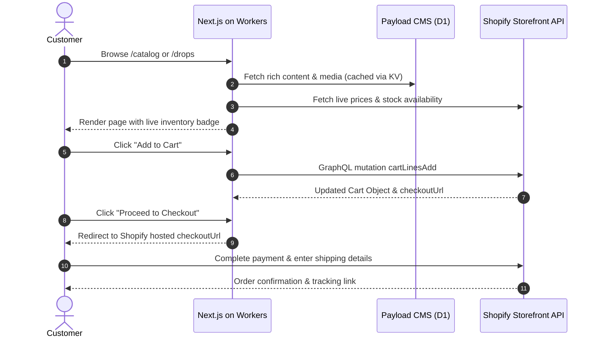
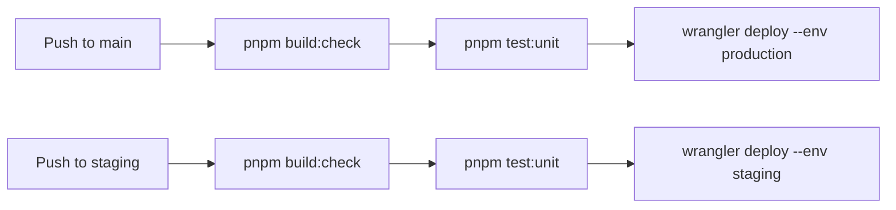

# High Level Design - Monorepo & Architecture for Chris's Shop

This document details the finalized technical, security, operational, and deployment architecture for Chris's product showcase and e-commerce platform. It establishes the Cloudflare-native and Shopify Headless architecture as the authoritative source of truth across the monorepo.

---

## 1. Executive Summary & Design Decisions

- **Monorepo Architecture**: Clean `pnpm` + `Turborepo` monorepo containing the unified storefront and administration platform (`apps/web`), shared TypeScript types (`packages/types`), shared UI design system (`packages/ui` built with **Tailwind CSS v4 + Radix UI Primitives**), pluggable event notifications engine (`packages/notifications`), shared environment configuration (`packages/config`), and platform infrastructure (`infra/`).
- **Edge Application Runtime**: **Cloudflare Workers** utilizing `nodejs_compat` via the `@opennextjs/cloudflare` adapter. Next.js App Router and the content management engine run co-located within a single globally distributed edge deployment.
- **Embedded Content Management Engine**: **Payload CMS v3** co-located inside `apps/web`. Administrative controls are served directly under `/admin/*` routes within the same edge application deployment, defined natively in TypeScript without separate server processes.
- **Serverless Relational Database**: **Cloudflare D1** as the sole database for content models and editorial metadata. Built on SQLite with strong consistency, regional edge query replication, and automatic Point-in-Time Recovery (PITR).
- **Edge Cache Layer**: **Workers KV** utilized strictly as a high-speed read cache for Incremental Static Regeneration (ISR) and D1 query memoization. Workers KV is never used as a primary relational database.
- **Object Storage**: **Cloudflare R2** (S3-compatible API, zero egress fees) for high-resolution product photography, artwork galleries, and downloadable certificates.
- **Headless Commerce Engine**: **Shopify Headless** via the **Storefront API**. Shopify natively manages cart creation, line additions, inventory levels, PCI-compliant checkout redirect URLs, payments, currency conversion, taxes, and shipping rates.
- **Content-to-Commerce Synchronization**: Payload CMS lifecycle hooks (`afterChange`) synchronize product publishing events directly with the **Shopify Admin API**, creating and updating product variants, stock levels, and SKUs while maintaining Payload as the source of truth for rich storytelling.
- **Order Notifications & Operational Pipeline**: Shopify order webhooks emit events to the storefront API, triggering notifications via the pluggable `packages/notifications` engine defaulting to transactional email via **Resend** (customer receipts, merchant order and low-stock alerts) and configurable generic **Webhooks** (Slack, Zapier, or HTTP endpoints) for operational alerts.
- **Security & Access Controls**: Payload CMS role-based access control (RBAC) with **Mandatory TOTP Two-Factor Authentication (2FA)** for administrative accounts, Shopify HMAC-SHA256 webhook signature verification, Cloudflare Web Application Firewall (WAF), and Cloudflare Turnstile anti-bot protection.
- **CI/CD & Operational Simplicity**: `wrangler deploy` automates continuous deployment on pushes to `staging` and `main` branches. Pull request branches receive automated Cloudflare preview deployments.
- **Local Developer Ergonomics**: Local development is powered by `wrangler dev` with Miniflare emulating D1 and KV locally, paired with `@shopify/cli` for dev store connectivity—requiring zero virtual machines or background container engines.
- **Observability**: **Sentry** for client and edge error tracking, **Better Stack** for edge `/api/health` heartbeat checks, and configurable operational webhooks for real-time drop and ops telemetry.

---

## 2. Monorepo Architecture & Package Structure

```
chrishop/
├── apps/
│   └── web/                    # Next.js App Router storefront + Payload CMS v3 (/admin) & edge routes
│       ├── src/
│       │   ├── app/            # App Router pages, layout, and edge API route handlers
│       │   ├── collections/    # Payload CMS collection schemas (Products, Categories, Variations)
│       │   └── lib/            # Shopify client, D1 bindings, and utility functions
│       ├── payload.config.ts   # Payload CMS configuration with D1 and R2 adapters
│       └── open-next.config.ts # OpenNext Cloudflare adapter configuration
├── packages/
│   ├── types/                  # Shared TypeScript models for storefront, Payload, and Shopify
│   ├── ui/                     # Accessible (WCAG 2.1 AA) UI system (Tailwind CSS v4 + Radix UI)
│   ├── notifications/          # Pluggable Notification Engine (Resend Email, Generic Webhooks, Legacy Discord)
│   └── config/                 # Shared environment schemas (Zod), tsconfig, and lint presets
├── infra/
│   ├── r2/                     # R2 CORS configuration and bucket definitions
│   └── scripts/                # Database migration and developer utility scripts
├── wrangler.toml               # Cloudflare Workers configuration (D1, KV, R2 bindings)
├── .github/
│   └── workflows/              # CI/CD pipelines (check, test, preview, wrangler deploy)
├── pnpm-workspace.yaml
└── turbo.json
```

---

## 3. Data Architecture & Content-Commerce Split

### 3.1 Division of Responsibilities

To combine boutique creative presentation with robust, PCI-compliant transactional reliability, the platform maintains a strict separation of concerns:

| Data Domain                       | Authority                       | Rationale                                                |
| :-------------------------------- | :------------------------------ | :------------------------------------------------------- |
| **Product Title & Story**         | Payload CMS (synced to Shopify) | Rich editorial content originates in the CMS             |
| **Rich Description & Statements** | Payload CMS                     | Extended artist statements and provenance data           |
| **High-Res Artwork & Gallery**    | Payload CMS (Cloudflare R2)     | Uncompressed imagery stored with zero egress fees        |
| **Limited Edition Metadata**      | Payload CMS                     | Edition run numbers, certificate info, drop countdowns   |
| **Price & SKU**                   | Shopify                         | Authoritative pricing for cart and payment execution     |
| **Real-time Inventory Levels**    | Shopify                         | Native stock decrement and oversell prevention           |
| **Cart & Checkout Sessions**      | Shopify                         | Managed, PCI-compliant checkout workflow                 |
| **Orders & Fulfillment**          | Shopify                         | Centralized merchant dashboard for shipping and labels   |
| **Tax & Shipping Rules**          | Shopify                         | Configured once in Shopify Admin; calculated dynamically |

### 3.2 Content Schema (Cloudflare D1 via Payload CMS)

1. **`categories` (Collection)**
   - `id` (Text / UUID, Primary Key)
   - `name` (Text, Required: e.g., "Original Sculptures", "Fine Art Prints")
   - `slug` (Text, Unique Index)
   - `description` (Text)
   - `image` (Upload relationship -> Cloudflare R2)

2. **`products` (Collection)**
   - `id` (Text / UUID, Primary Key)
   - `shopify_product_id` (Text, Unique Index: Linked Shopify Product GID)
   - `title` (Text, Required)
   - `slug` (Text, Unique Index)
   - `description` (Rich Text / Lexical)
   - `artist_statement` (Text: Extended provenance and inspiration)
   - `category_id` (Relationship -> `categories`)
   - `featured_image` (Upload relationship -> Cloudflare R2)
   - `gallery` (Array of Upload relationships -> Cloudflare R2)
   - `base_price` (Number: Synchronized to default Shopify variant)
   - `status` (Select: `draft`, `scheduled`, `active`, `archived`)

3. **`product_variations` (Collection)**
   - `id` (Text / UUID, Primary Key)
   - `product_id` (Relationship -> `products`)
   - `shopify_variant_id` (Text, Unique Index: Linked Shopify ProductVariant GID)
   - `variation_name` (Text: e.g., "Obsidian Cast Edition")
   - `sku` (Text, Unique Index)
   - `price_override` (Number, Optional: Falls back to product base price)
   - `is_limited_edition` (Boolean, Default: true)
   - `total_edition_count` (Number: Total serialized prints/casts created)
   - `stock_quantity` (Number: Synced to Shopify inventory level)
   - `release_date` (DateTime, Optional: Controls drop countdown timers)
   - `status` (Select: `coming_soon`, `active`, `sold_out`, `archived`)

### 3.3 Price Resolution Formula

The storefront computes effective display prices consistently:
$$\text{Effective Price} = \text{COALESCE}(\text{product\_variations.price\_override}, \text{products.base\_price})$$

At checkout time, Shopify Storefront API acts as the authoritative price validator, ensuring zero client-side tampering.

### 3.4 Synchronization Bridge (Payload to Shopify Admin API)

When Chris creates or modifies a product in Payload CMS:

1. **Hook Execution**: Payload's `afterChange` collection hook inspects the update payload.
2. **Shopify Admin API Call**:
   - If `shopify_product_id` is null, an automated GraphQL mutation (`productCreate`) provisions the product and variants in Shopify, storing returned GIDs into D1.
   - If `shopify_product_id` exists, a `productUpdate` mutation syncs title, price, SKU, and initial inventory quantities.
3. **Drop Mechanics**: When `status` transitions to `active`, the hook marks the Shopify product status as `ACTIVE` across the Headless sales channel.

---

## 4. Headless Commerce & Checkout Architecture

### 4.1 Shopify Storefront API Integration

The Next.js storefront communicates directly with Shopify via the official `@shopify/storefront-api-client`:



### 4.2 Native Inventory Protection & Zero Overselling

- Shopify's checkout engine natively reserves stock when buyers initiate payment.
- If concurrent buyers attempt to purchase the final unit of a limited drop, Shopify automatically blocks checkout completion for the second buyer, completely preventing oversell conditions without requiring custom reservation code or transactional locking databases.
- Sold out status is reflected instantly across the Storefront API.

---

## 5. Shipping & Order Fulfillment Workflow

### Phase 1 Fulfillment Strategy:

1. **Order Creation Event**: When a customer completes checkout on Shopify, Shopify emits an `orders/create` webhook to `/api/webhooks/shopify`.
2. **Signature Verification**: The edge route verifies the payload's HMAC-SHA256 header using `SHOPIFY_WEBHOOK_SECRET`.
3. **Operational & Merchant Notification**: The webhook invokes `packages/notifications`, transmitting transactional order alerts to the merchant (`MERCHANT_ALERT_EMAIL`) via **Resend** and operational event payloads to configured webhook sinks (`OPS_ALERT_WEBHOOK_URL`):
   - _"🛒 New Order Placed: #1042 — $350.00 USD (Jane Doe)"_
   - Customer shipping destination and edition details.
4. **Order Packaging & Dispatch**: Chris accesses the standard Shopify Admin portal (`admin.shopify.com`), marks the order fulfilled, and inputs carrier tracking details.
5. **Customer Tracking Email**: Shopify automatically transmits branded shipment confirmation and tracking updates to the customer. Supplementary transactional receipts and shipping tracking notifications are dispatched via **Resend**.

### Phase 2 Scale Readiness:

- Shopify seamlessly integrates with 1-click label generators (e.g., Shopify Shipping or Shippo apps), allowing Chris to print thermal shipping labels directly inside Shopify Admin without custom code maintenance.

---

## 6. Event Notification Engine (`packages/notifications`)

The platform utilizes a modular, provider-agnostic notification engine that decouples application domain events from concrete delivery channels:

```typescript
export interface NotificationPayload {
  title: string;
  message: string;
  fields?: Record<string, string>;
  severity?: 'info' | 'success' | 'warning' | 'error';
}

export interface NotificationProvider {
  send(payload: NotificationPayload): Promise<void>;
  notifyOrderCreated?(order: Order): Promise<void>;
  notifyLowStock?(
    productTitle: string,
    variationName: string,
    remainingStock: number,
    sku?: string
  ): Promise<any>;
}
```

### Supported Channels & Providers:

1. **Transactional Email (`ResendNotificationProvider`) [Default]**:
   - **Customer Receipts**: Sends branded HTML and plain-text order confirmation receipts (`notifyOrderReceipt`).
   - **Customer Shipping Updates**: Sends carrier tracking links and parcel updates (`notifyShippingUpdate`).
   - **Merchant Purchase Alerts**: Dispatches instant new order notifications to `MERCHANT_ALERT_EMAIL` (`notifyMerchantOrderAlert`).
   - **Inventory Threshold Warnings**: Dispatches low-stock and sold-out alerts to `MERCHANT_ALERT_EMAIL` (`notifyLowStock`).
   - Configured via authoritative environment variables: `RESEND_API_KEY`, `RESEND_FROM_EMAIL`, and `MERCHANT_ALERT_EMAIL`.

2. **Generic Webhooks (`WebhookNotificationProvider`)**:
   - Dispatches standard structured JSON payloads to arbitrary endpoints (`OPS_ALERT_WEBHOOK_URL`).
   - Supports configurable HTTP headers (e.g., `Authorization`, `X-Webhook-Secret`).
   - Native compatibility with Slack incoming webhooks (via top-level `text` field), Zapier, PagerDuty, and custom HTTP ingestors.
   - Built-in automatic retry with exponential backoff on HTTP 429 and 5xx responses.

3. **Composite Dispatch (`CompositeNotificationProvider`)**:
   - Fans out domain events (orders, low-stock warnings, system alerts) simultaneously across multiple channels (e.g., Resend email + Slack webhook).

4. **Legacy Discord (`DiscordNotificationProvider`) [Deprecated]**:
   - Retained strictly for backward compatibility. Discord-specific embed schemas are segregated from core domain interfaces.

### Notification Extension Points:
New notification sinks (e.g., SMS alerts via Twilio, native Slack App bots, Pushover mobile push) can be plugged in by implementing the `NotificationProvider` interface and registering them with `CompositeNotificationProvider`.

---

## 7. Security Architecture & Secrets Management

- **Administrative Authentication**: Mandatory TOTP Two-Factor Authentication (2FA) enforced on all Payload CMS admin users under `/admin`.
- **Edge Secrets Management**:
  - Local Development: Local `.dev.vars` (git-ignored, emulated by Wrangler).
  - Continuous Integration: GitHub Actions encrypted repository secrets.
  - Edge Environments: Managed via Cloudflare Workers Secrets (`wrangler secret put SHOPIFY_ADMIN_TOKEN --env production`).
- **Webhook Security**: Raw-body HMAC-SHA256 signature verification on all incoming Shopify webhooks to prevent spoofing or tampering.
- **PCI DSS Compliance**: Level 1 PCI DSS compliance fully offloaded to Shopify Checkout. The custom storefront application never touches, transmits, or stores cardholder data.
- **Edge Protection**: Cloudflare global WAF rules, automated DDoS mitigation, Turnstile bot challenges, and TLS 1.3 termination at edge nodes worldwide.
- **Automated Dependency Security Scanning**: Continuous dependency vulnerability auditing enforcing `pnpm audit --audit-level=high` in CI/CD pipelines (`deploy.yml` and `ci.yml`), GitHub Actions Dependency Review on pull requests, and automated Dependabot scanning across all monorepo packages, blocking builds and pull requests on high or critical severity vulnerabilities.

---

## 8. Multi-Environment Architecture & Deployment Pipeline

### 8.1 Environments Matrix

1. **Local Development**: `wrangler dev` running on Miniflare, locally binding emulated D1 databases, KV namespaces, and local R2 buckets. Connects to a Shopify Development Store via `@shopify/cli`.
2. **Cloudflare Preview Deployments**: Automated preview environments generated on every pull request via Cloudflare deployment previews.
3. **Staging (`staging-chrishop.jacobmiller22.com`)**: Staging Workers deployment linked to `chrishop-staging-db` D1 database and staging Shopify environment.
4. **Production (`chrishop.jacobmiller22.com`)**: Production Workers deployment linked to `chrishop-prod-db` D1 database and live Shopify production store.

### 8.2 CI/CD Deployment Flow (GitHub Actions)



### 8.3 Database Migrations & Point-in-Time Recovery (PITR)

- **D1 Migrations**: Schema alterations are expressed in standard SQL migration files (`migrations/xxxx_name.sql`) executed using `wrangler d1 migrations apply chrishop-prod-db`.
- **Automated Disaster Recovery**: Cloudflare D1 provides continuous replication and Point-in-Time Recovery (PITR), allowing restoration to any minute within the preceding 30 days via the Cloudflare dashboard or CLI.
- **Instant Rollbacks**: Edge worker code deployments support zero-downtime instant rollbacks via `wrangler rollback <deployment-id>`.

---

## 9. Observability & Monitoring Matrix

| Component               | Metric / Health Probe       | Frequency / Trigger | Target Channel                       | Corrective Action              |
| :---------------------- | :-------------------------- | :------------------ | :----------------------------------- | :----------------------------- |
| **Edge Health**         | HTTP GET `/api/health`      | Every 60 seconds    | Better Stack & Discord `#dev-alerts` | Automated edge retry & alert   |
| **Application Errors**  | Unhandled JS Exceptions     | Event-driven        | Sentry & Discord `#dev-alerts`       | Triage error stack trace       |
| **New Purchases**       | Shopify `orders/create`     | Event-driven        | Discord `#store-orders`              | Fulfillment review             |
| **Low Stock Telemetry** | Product stock $\le 2$ units | Event-driven        | Discord `#store-orders`              | Prepare post-drop announcement |

---

## 10. Performance, Edge Caching, SEO & Accessibility

- **Cloudflare Edge CDN**: Instant global delivery of HTML and static chunks from 300+ edge data centers.
- **Next.js Incremental Static Regeneration (ISR)**: Catalog pages statically rendered and cached at the edge via Workers KV (`revalidate = 60`).
- **Cloudflare R2 Asset Optimization**: Media cached and served with zero egress bandwidth charges.
- **Search Engine Optimization (SEO)**: Dynamic OpenGraph images, Twitter Card tags, canonical URLs, dynamic `sitemap.xml`, and JSON-LD `Product` / `Offer` structured data.
- **Accessibility**: Full **WCAG 2.1 AA Compliance** with visible focus indicators, screen reader ARIA labels, semantic markup, and keyboard-navigable drawers.

---

## 11. Local Development Environment & Workflow

- **Local Stack**:
  - Run `pnpm dev` which invokes `wrangler dev` with Miniflare.
  - Miniflare transparently emulates Cloudflare D1 (local SQLite), Workers KV, and R2 without external daemon services.
- **Commerce Emulation**:
  - Use Shopify Development Store credentials in local `.dev.vars`.
  - Webhook testing conducted via Shopify CLI: `shopify app webhook trigger --topic orders/create --address http://localhost:3000/api/webhooks/shopify`.
- **Database Seeding**:
  - `pnpm seed` applies initial collections and sample art catalog directly to the local D1 instance.

---

## 12. Verification & Validation Protocol

### Automated Verification

1. **Monorepo Quality Gate**: `pnpm run check` (TypeScript typecheck and linting across all packages).
2. **Unit Test Suite**: `pnpm run test:unit` (tests for UI components, catalog price fallbacks, Shopify client mutations, notification formatters).
3. **Turnkey Local Verification Pipeline**: `pnpm run verify:local` executing full pre-PR validation without external virtual machine or container dependencies.
4. **Cloudflare Deployment Verification**: Automated CI verification confirming valid `wrangler.toml` bindings and worker compilation.

### Manual Verification

1. **Shopify Checkout Dry Run**: Navigate storefront, add limited edition art to cart, verify redirect to Shopify Checkout with exact price, and verify order confirmation.
2. **Payload Admin Walkthrough**: Log into `/admin` with TOTP 2FA, publish a new art edition, and confirm automated sync to the Shopify Admin catalog.
3. **Event Notification Test**: Complete a simulated test purchase and verify transactional customer receipt and merchant alert dispatch via `ResendNotificationProvider` and JSON payload dispatch via `WebhookNotificationProvider`.
