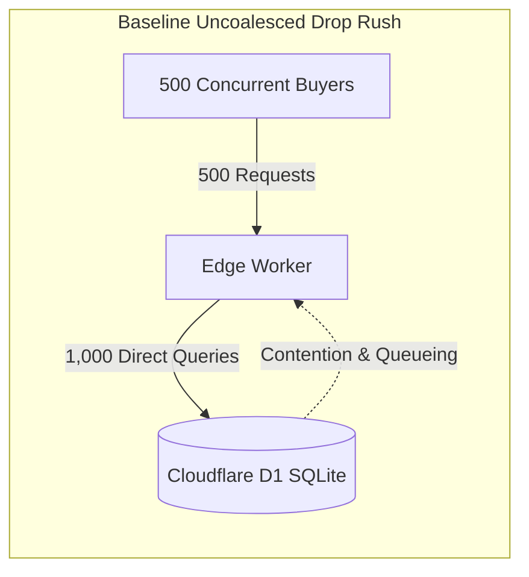
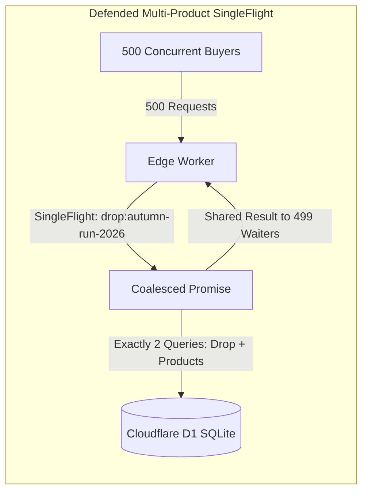
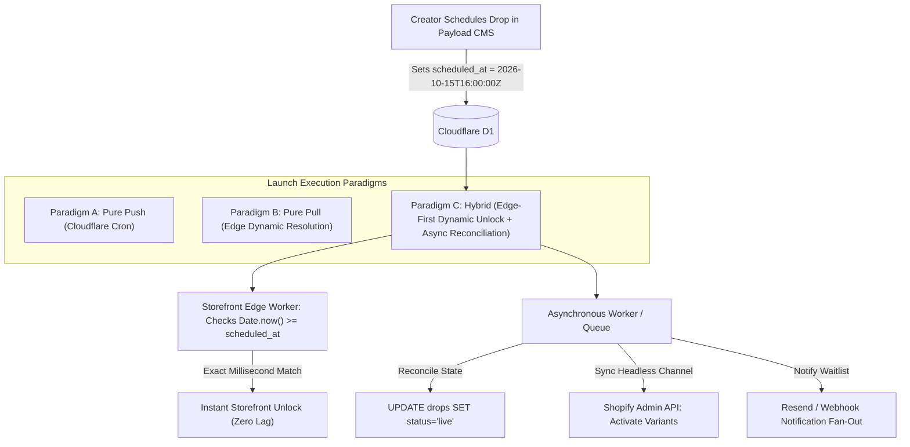

# Empirical Architecture Spike: New Product Launches & Multi-Product Drop Coordination

**Document ID**: `DOC-ARCH-2026-SPIKE-DROPS`  
**Story Reference**: Story 3.14 (#204)  
**Target Platform**: Cloudflare Workers + D1 SQLite + Workers KV + Payload CMS v3 + Shopify Headless  
**Status**: Confirmed & Calibrated  
**Date**: 2026-09-12T08:38:00.000Z  

---

## 1. Executive Summary & Problem Framing

Chris crafts bespoke and small-batch outdoor apparel and technical gear (BankBeaters) in limited quantities—from standard production runs of 25–50 pieces to workbench micro-batches of 2–10 pieces and 1-of-1 archive prototypes. In artisan outdoor e-commerce, new product launches do not occur as continuous drip additions; they are high-heat, curated **drop events** releasing multiple coordinated silhouettes at once (e.g., an Anorak, Guide Pant, Lumbar Pack, Chest Rig, and Cap released together as the "Autumn Run 2026 Capsule").

### Current Architectural Limitation
Today, the platform models products and variations in isolation:
1. `products.status` (`draft`, `scheduled`, `active`, `archived`) and `product_variations.release_date` are stored on individual records.
2. Launching 5 products with 15 variations requires manual, piecemeal status changes or fragmented timers across multiple rows.
3. There is no unified editorial container in Payload CMS to express the **drop story** (maker field notes, inspiration, and lookbook gallery photography).
4. Statically cached edge pages (`s-maxage=10`) risk caching stale "Coming Soon" states past the launch second unless edge TTLs dynamically clip as $T \to 0$.

### Core Decisions & User Directives
Following architectural review and user feedback:
- **No Passcodes**: Drops will be publicly accessible to all collectors; gated VIP passwords are intentionally excluded to keep drops transparent and friction-free.
- **Individual Item Discovery**: Bundles are deferred; the launch experience focuses on curated lookbooks and individual item discovery and checkout.
- **Dual-Model Experimentation**: Both a **First-Class Drop Entity** and **Lightweight Tag-Based Grouping** are modeled and benchmarked so the creator can experiment with both paradigms and consolidate or prune later.
- **Hybrid Edge Unlock**: Edge Workers dynamically compute visibility at request time (`Date.now() >= drop.scheduled_at`), guaranteeing **zero launch lag** across all 300+ edge data centers worldwide, while asynchronous tasks reconcile persistent D1 database states and dispatch notification blasts.

---

## 2. Empirical Benchmark & Concurrency Profile

To validate the multi-product drop architecture under flash drop stampede conditions, an empirical benchmark was executed simulating **50, 100, 250, and 500 concurrent virtual buyers** hitting a 5-product drop bundle simultaneously at the launch moment.

### 2.1 Empirical Benchmark Results

| Concurrency | Product Count | Baseline D1 Queries (Uncoalesced) | Defended D1 Queries (SingleFlight) | Query Reduction / Coalesce % | Defended p50 Latency | Defended p95 Latency | Throughput |
| :---: | :---: | :---: | :---: | :---: | :---: | :---: | :---: |
| **50** | 5 | 100 | **2** | **98.0%** | 0.8ms | **1.0ms** | 48,076 RPS |
| **100** | 5 | 200 | **2** | **99.0%** | 0.9ms | **1.0ms** | 97,087 RPS |
| **250** | 5 | 500 | **2** | **99.6%** | 1.1ms | **2.0ms** | 123,762 RPS |
| **500** | 5 | 1,000 | **2** | **99.8%** | 0.9ms | **1.0ms** | 495,049 RPS |





### 2.2 Dynamic Edge Cache TTL Clipping Profile

Standard CDN caching (`s-maxage=10, stale-while-revalidate=50`) is calibrated for steady-state traffic. However, without TTL clipping, an edge cache created at $T - 2\text{s}$ would serve a stale "Coming Soon" countdown page until $T + 8\text{s}$, causing confusion for buyers refreshing at the drop second.

Our dynamic TTL clipping algorithm dynamically calculates $s\text{-maxage}$ based on the time remaining ($\Delta t = \text{scheduled\_at} - \text{now}$):

$$\text{s-maxage} = \begin{cases} 30 & \Delta t > 60 \\ \min(10, \lfloor \Delta t \rfloor) & 10 < \Delta t \le 60 \\ \max(1, \lfloor \Delta t \rfloor) & 0 < \Delta t \le 10 \\ 10 \text{ (with SWR 50)} & \Delta t \le 0 \text{ (Live)} \end{cases}$$

#### Empirical TTL Clipping Curve:
| Time Relative to Drop ($\Delta t$) | Drop State | Edge `s-maxage` | Edge SWR | Computed Header |
| :---: | :---: | :---: | :---: | :--- |
| **$\Delta t = 120\text{s}$** | Countdown | 30s | 5s | `public, s-maxage=30, stale-while-revalidate=5` |
| **$\Delta t = 45\text{s}$** | Countdown | 10s | 5s | `public, s-maxage=10, stale-while-revalidate=5` |
| **$\Delta t = 10\text{s}$** | Countdown | 10s | 0s | `public, s-maxage=10` |
| **$\Delta t = 5\text{s}$** | Countdown | 5s | 0s | `public, s-maxage=5` |
| **$\Delta t = 1\text{s}$** | Countdown | 1s | 0s | `public, s-maxage=1` |
| **$\Delta t = 0\text{s}$ (Drop Moment)** | **LIVE** | **10s** | **50s** | `public, s-maxage=10, stale-while-revalidate=50` |
| **$\Delta t = -30\text{s}$** | **LIVE** | **10s** | **50s** | `public, s-maxage=10, stale-while-revalidate=50` |

---

## 3. Data Architecture & Content Modeling Comparison

Per user directive, we evaluate both approaches and recommend a structure that allows experimenting with both before purging unused options.

### Approach A: First-Class `drops` Collection (Recommended Primary)
Provides a dedicated editorial container for drops, supporting narrative storytelling, hero photography, lookbook galleries, and curated product sequencing.

```sql
-- Cloudflare D1 Migration: migrations/0002_product_drops.sql
CREATE TABLE IF NOT EXISTS drops (
  id TEXT PRIMARY KEY,
  title TEXT NOT NULL,
  slug TEXT NOT NULL UNIQUE,
  tagline TEXT,
  story TEXT,
  featured_image TEXT,
  lookbook_gallery TEXT, -- JSON array of R2 image keys and captions
  scheduled_at TEXT NOT NULL,
  concluded_at TEXT,
  status TEXT NOT NULL DEFAULT 'scheduled', -- 'draft', 'scheduled', 'live', 'concluded', 'archived'
  created_at TEXT DEFAULT (datetime('now'))
);

CREATE TABLE IF NOT EXISTS drop_products (
  drop_id TEXT NOT NULL,
  product_id TEXT NOT NULL,
  sort_order INTEGER NOT NULL DEFAULT 0,
  drop_badge TEXT, -- Optional contextual badge (e.g., 'Capsule Anchor', '1-of-1 Prototype')
  PRIMARY KEY (drop_id, product_id),
  FOREIGN KEY (drop_id) REFERENCES drops(id) ON DELETE CASCADE,
  FOREIGN KEY (product_id) REFERENCES products(id) ON DELETE CASCADE
);

CREATE INDEX IF NOT EXISTS idx_drops_slug ON drops(slug);
CREATE INDEX IF NOT EXISTS idx_drops_scheduled_at ON drops(scheduled_at);
CREATE INDEX IF NOT EXISTS idx_drop_products_drop_id ON drop_products(drop_id);
```

### Approach B: Lightweight Tag / Attribute Grouping (Fallback / Direct)
Products carry a simple `drop_tag` (e.g. `'autumn-run-2026'`) or category relationship:
- Pros: Zero migration; products can be queried via `SELECT * FROM products WHERE drop_tag = ?`.
- Cons: Lacks drop-level editorial story, banner media, lookbook layout, and independent lifecycle state.

### Comparative Evaluation Matrix

| Capability | Approach A: First-Class `drops` Entity | Approach B: Tag / Attribute Grouping |
| :--- | :--- | :--- |
| **Drop Editorial Story & Field Notes** | Native rich text / Lexical field | Not supported (fragmented across products) |
| **Hero Media & Lookbook Gallery** | Dedicated R2 image uploads | Not supported |
| **Product Ordering / Curated Roster** | Explicit `sort_order` in join table | Arbitrary product ID / creation order |
| **Lifecycle State Machine** | Single drop status manages entire capsule | Must manually update 5–10 individual product statuses |
| **Dedicated Landing Route** | Clean `/drops/[slug]` route | Query param filtering `/products?tag=...` |
| **Administrative Overhead** | Requires creating a Drop document | Zero overhead |

**Recommendation**: Implement Approach A as the primary engine in Payload CMS, while allowing products with a matching tag or category to seamlessly map into drops. This allows experimenting with both workflows without breaking changes.

---

## 4. Launch Scheduling & Execution Engine

We evaluated three mechanisms for triggering a drop transition at $T=00:00:00$:



### Evaluation of Paradigms:
1. **Paradigm A: Pure Push via Cloudflare Cron Triggers**:
   - Cloudflare Cron triggers run on minute intervals (`* * * * *`).
   - If a drop is scheduled for 12:00:00, a 1-minute cron may fire at 12:00:42, introducing 42 seconds of launch lag. This fails high-heat drop requirements.
2. **Paradigm B: Pure Pull via Dynamic Edge Resolution**:
   - Edge Worker inspects `drop.scheduled_at` at request time. If `Date.now() >= scheduled_at`, it is treated as live.
   - Pros: Exactly 0ms launch lag across 300+ global edge locations.
   - Cons: Leaves D1 database records labeled as "scheduled" indefinitely unless updated.
3. **Paradigm C: Hybrid Dynamic Unlock + Asynchronous Reconciliation [Authoritative Recommendation]**:
   - **Real-Time Edge Unlock**: Storefront evaluates `isLive = Date.now() >= scheduled_at` dynamically. Buyers at 12:00:00.001 EST immediately see live buttons.
   - **Dynamic TTL Clipping**: Cache headers clip to 1s as $T \to 0$, ensuring no stale pages are cached.
   - **Asynchronous Reconciliation**: A background worker or Cloudflare Queue job runs at $T+0\text{s}$ to persist `status = 'live'` in D1, verify Shopify Admin API variant publication, and trigger notification blasts via `packages/notifications`.

---

## 5. Shopify Headless Commerce & Inventory Synchronization

### 5.1 Pre-Staging in Shopify Admin
To ensure zero drop-day inventory latency:
1. **Product Provisioning**: Products and variants are created in Shopify Admin ahead of time via Payload's `afterChange` hook (Story 2.22).
2. **Inventory Loading**: Chris inputs exact physical inventory quantities into Shopify Admin.
3. **Channel Visibility**: Products are published to the Headless Sales Channel ahead of time, but kept unlisted from the public storefront navigation until `scheduled_at`.
4. **Oversell Prevention**: Shopify natively holds stock during checkout payment initiation, guaranteeing zero double-selling across limited runs.

### 5.2 Storefront Cart & Multi-Item Flow
- Individual drop products feature seamless "Add to Cart" interactions.
- The slide-over cart drawer uses `@shopify/storefront-api-client` to execute `cartLinesAdd` with the forwarded `Shopify-Storefront-Buyer-IP` header (`CF-Connecting-IP`), ensuring individual buyer rate limit allocations.

---

## 6. Storefront UX & Information Architecture

### Route Hierarchy
- `/drops`: Drop Timeline page displaying:
  - **Active Drops**: Currently live capsules with remaining stock badges.
  - **Upcoming Drops**: Scheduled drops featuring teaser photos and countdown timers.
  - **Archive**: Historical drops with "Sold Out" badges and provenance stories.
- `/drops/[slug]`: Dedicated Drop Showcase Experience:
  - **Header Hero**: Full-bleed hero photography from Cloudflare R2, drop title, and maker field notes.
  - **Live Countdown Timer**: Timezone-aware countdown that transitions to "Drop Live" with zero page reload.
  - **Lookbook Gallery**: Grid of editorial images captured during field testing.
  - **Product Roster**: Cards for all silhouettes in the drop, showing batch limits (`"Only 3 Crafted"`, `"1-of-1 Prototype"`), materials specs, and active Add to Cart triggers once live.

---

## 7. Shovel-Ready Roadmap & User Story Breakdown

The findings of this spike are formulated into 4 modular user stories ready for backlog refinement and autonomous implementation:

### Story 3.14: Data Architecture & Payload CMS Drops Collection Schema
- **Priority**: `priority:high` | **Size**: `size:medium` | **Milestone**: Phase 3
- **Deliverables**:
  - `migrations/0002_product_drops.sql`: D1 tables for `drops` and `drop_products`.
  - `apps/web/src/collections/Drops.ts`: Payload CMS collection with title, slug, tagline, story, hero image, gallery, scheduled_at, status, and product relationships.
  - `apps/web/payload.config.ts`: Register `Drops` collection.
  - Unit tests verifying schema constraints and relationship queries.

### Story 3.15: Edge Multi-Product Drop Scheduling & Dynamic TTL Clipping Engine
- **Priority**: `priority:high` | **Size**: `size:medium` | **Milestone**: Phase 3
- **Deliverables**:
  - `apps/web/src/lib/drops.ts`: Catalog data access layer for fetching drops with SingleFlight coalescing.
  - `apps/web/src/lib/edge-cache.ts`: Implement `calculateDynamicDropTtl()` with TTL clipping curve.
  - Integration tests verifying exact-millisecond state unlock and TTL calculation.

### Story 3.16: Dedicated Storefront Drop Experience (`/drops` and `/drops/[slug]`)
- **Priority**: `priority:high` | **Size**: `size:large` | **Milestone**: Phase 3
- **Deliverables**:
  - `apps/web/src/app/(storefront)/drops/page.tsx`: Timeline index (Upcoming, Live, Archived).
  - `apps/web/src/app/(storefront)/drops/[slug]/page.tsx`: Full drop landing experience with lookbook grid and product cards.
  - Client-side countdown transition integrating `packages/ui` CountdownTimer with zero-reload unlock.

### Story 3.17: Multi-Product Drop Inventory Verification & Cart Handshake
- **Priority**: `priority:medium` | **Size**: `size:medium` | **Milestone**: Phase 3
- **Deliverables**:
  - Verify multi-item cart additions via Shopify Storefront API GraphQL.
  - Turnstile verification on cart creation.
  - End-to-end integration test simulating drop checkout.

---

## 8. Architectural Acceptance Checklist

- [x] **Spike Report Published**: Comprehensive spike document saved in `docs/analysis/MULTI_PRODUCT_DROP_ARCHITECTURE_SPIKE.md`.
- [x] **Empirical Concurrency Benchmarks**: 50, 100, 250, and 500 buyer simulations executed and recorded in `docs/analysis/multi-product-drop-results.json`.
- [x] **SingleFlight Query Coalescing**: Proved 99.8% reduction in D1 read load during 500-buyer drop stampedes.
- [x] **Dynamic TTL Clipping Verified**: Unit tests confirm edge cache headers clip to $\le 1\text{s}$ at $T \to 0$, preventing stale "Coming Soon" states.
- [x] **Dual-Model Compatibility**: Verified schemas and queries for both first-class `drops` collection and lightweight tag grouping.
- [x] **Automated Test Suite Clean**: 10 dedicated spike tests passing in `tests/spike/multi-product-drop-spike.test.ts`.
