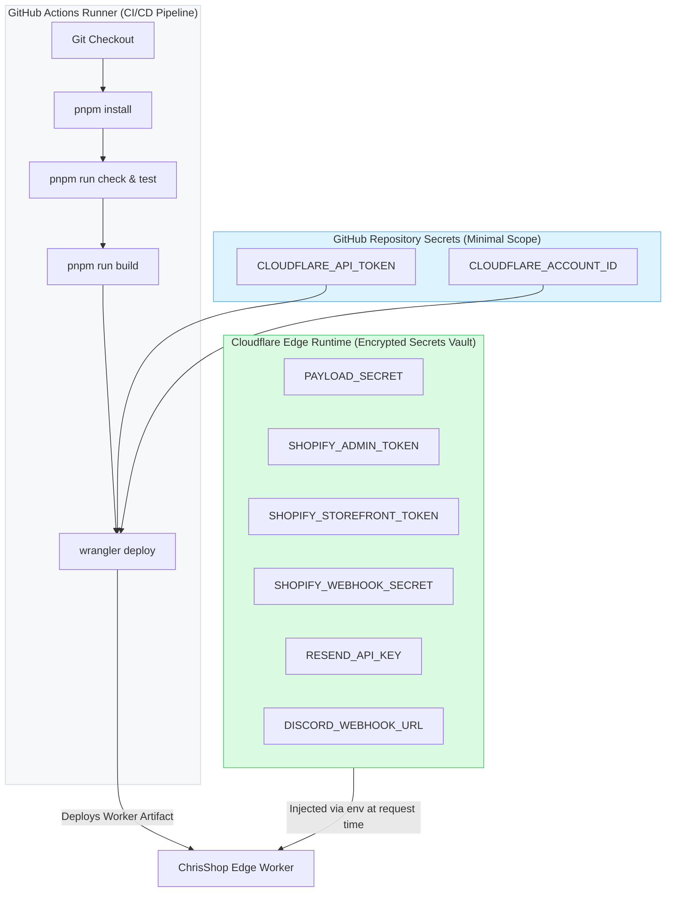

# Architectural Decision Record: Cloudflare Workers Secrets vs GitHub Secrets for Edge Runtime Credentials

- **Status**: ACCEPTED (GO Recommendation)
- **Date**: 2026-09-11
- **Author**: Platform Architecture Team
- **Deciders**: Platform Architecture, Security Engineering, Core Storefront Engineering
- **Story Reference**: Story 2.35 ([#158](https://github.com/jacobmiller22/chrishop/issues/158))
- **Related Stories**: Story 2.29 ([#140](https://github.com/jacobmiller22/chrishop/issues/140) - Secret Rotation Procedures), Story 2.34 ([#155](https://github.com/jacobmiller22/chrishop/issues/155) - Ephemeral Domain Migration), Story 2.25 ([#96](https://github.com/jacobmiller22/chrishop/issues/96) - Deployment Pipeline)

---

## 1. Executive Summary & Context

ChrisShop operates on a modern, serverless edge architecture combining Next.js 15 (App Router) and Payload CMS v3 co-located under a single Cloudflare Workers deployment via `@opennextjs/cloudflare`. 

The platform relies on several critical third-party and internal credentials:
- **`PAYLOAD_SECRET`**: 32+ character cryptographic secret utilized for signing and verifying administrative authentication session tokens.
- **`SHOPIFY_ADMIN_TOKEN`**: High-privilege access token for Shopify Private App Admin GraphQL queries and webhook registrations.
- **`SHOPIFY_STOREFRONT_TOKEN`**: Public/Storefront access token for live inventory checks, cart creation, and checkout handoff.
- **`SHOPIFY_WEBHOOK_SECRET`**: Shared HMAC SHA-256 secret for validating inbound webhook payloads from Shopify.
- **`RESEND_API_KEY`**: REST API token for dispatching transactional customer notifications and order confirmations.
- **`DISCORD_WEBHOOK_URL`**: Webhook URL for dispatching real-time operational alerts to private team channels.
- **`CLOUDFLARE_API_TOKEN` & `CLOUDFLARE_ACCOUNT_ID`**: Infrastructure credentials for deploying workers and provisioning edge bindings.

Traditionally, web applications inject runtime secrets into CI/CD build environments (e.g., GitHub Actions repository secrets), baking or inlining them into application bundles or environment matrices during `next build`.

This architectural spike evaluates the security boundaries, developer ergonomics, runtime behavior under `@opennextjs/cloudflare`, and operational lifecycle of migrating all application credentials from GitHub Actions build-time injection to native **Cloudflare Workers Secrets** (`wrangler secret put <KEY> --env <env>`) and/or **Cloudflare Secrets Store**.

---

## 2. Problem Statement & Threat Vectors of Build-Time Secret Injection

Injecting application credentials into GitHub Actions runners during the build process introduces significant security vulnerabilities and operational inefficiencies:

### 2.1 Threat Vectors
1. **CI Runner Environment Compromise**:
   - Every `pnpm install` step downloads hundreds of transitive npm dependencies. A supply-chain compromise in any build tool or transitive package could read `process.env` during build time and exfiltrate production secrets.
2. **Accidental Build Artifact / Client Bundle Leakage**:
   - Modern bundlers (Webpack / Turbopack) replace occurrences of `process.env.VAR` during compilation. A misplaced variable reference or lack of strict server-only fencing can inadvertently bake confidential API keys into publicly accessible JavaScript chunks.
3. **CI Execution Log Leakage**:
   - If a build step, diagnostic script, or failing test prints environment variables or stack traces, secrets risk being exposed in GitHub Actions logs visible to contributors or repository viewers.
4. **Over-Privileged CI/CD Blast Radius**:
   - The CI runner possesses excessive privileges. A compromise of repository credentials or GitHub Actions workflow permissions exposes the entire production ecosystem (Shopify store, transactional email provider, administrative CMS sessions).

### 2.2 Operational Inefficiencies
1. **Coupled Rotation and Deployment**:
   - Rotating an external API key (such as a Shopify Admin token or Resend key) requires triggering a full monorepo rebuild and edge deployment, which takes 2–5 minutes.
2. **Inconsistent Developer Parity**:
   - Discrepancies between local development files (`.env`, `.dev.vars`), CI runner variables, and remote edge hosting create debugging friction and configuration drift.

---

## 3. Architectural Options Evaluated

### Option 1: GitHub Actions Build-Time Injection (Status Quo / Anti-Pattern)
- **Mechanism**: All runtime secrets stored in GitHub Repository Secrets. CI workflows inject secrets as `env` variables during `pnpm run build` and `wrangler deploy`.
- **Pros**: Familiar, single-pane credential management within GitHub.
- **Cons**: Severe security exposure to supply chain attacks; secrets baked or traversed during build; secret rotation requires full re-compilation; violates least-privilege principles.
- **Verdict**: **REJECTED**.

### Option 2: Cloudflare Workers Secrets (`wrangler secret put`) with Runtime Request Context (Recommended)
- **Mechanism**: All application secrets stored directly in Cloudflare\x27s encrypted key-value infrastructure via `wrangler secret put <KEY> --env <env>`. GitHub Actions only receives `CLOUDFLARE_API_TOKEN` and `CLOUDFLARE_ACCOUNT_ID`. Secrets are injected into the Cloudflare Worker execution context (`env`) at edge request time.
- **Pros**:
  - **Zero Build-Time Leakage**: GitHub Actions runner and build logs have zero knowledge of third-party keys.
  - **Instant Atomic Rotation**: `wrangler secret put` updates edge runtime secrets instantly without rebuilding code.
  - **Native `@opennextjs/cloudflare` Compatibility**: Seamlessly populates `process.env` dynamically per request.
  - **Local Parity**: Miniflare natively supports `.dev.vars` for 1:1 local emulation.
- **Cons**: Ephemeral PR preview workers require explicit secret strategy (analyzed below).
- **Verdict**: **ACCEPTED (GO)**.

### Option 3: Cloudflare Secrets Store (Beta / Declarative Binding)
- **Mechanism**: Centralized Cloudflare Secrets Store attached to workers via `secrets_store` bindings in `wrangler.toml`.
- **Pros**: Multi-worker secret sharing across dynamic previews and production workers.
- **Cons**: Feature currently in limited availability / preview beta; tooling syntax evolving.
- **Verdict**: **DEFERRED** as future enhancement once Secrets Store reaches General Availability (GA).

---

## 4. In-Depth Technical Analysis

### 4.1 Runtime Binding Compatibility & Ergonomics under `@opennextjs/cloudflare`

A central concern was how Cloudflare Workers secrets (injected as Cloudflare Worker `env` bindings) are exposed to Next.js App Router and Payload CMS v3, which traditionally expect Node.js-style `process.env.VARIABLE`.

#### 1. The `@opennextjs/cloudflare` Request Lifecycle
Inspection of `@opennextjs/cloudflare` runtime initialization (`dist/cli/templates/init.js`) reveals the exact request flow:

```javascript
export async function runWithCloudflareRequestContext(request, env, ctx, handler) {
    init(request, env);
    return cloudflareContextALS.run({ env, ctx, cf: request.cf }, handler);
}

function init(request, env) {
    if (initialized) return;
    initialized = true;
    initRuntime();
    populateProcessEnv(url, env);
}

function populateProcessEnv(url, env) {
    for (const [key, value] of Object.entries(env)) {
        if (typeof value === "string") {
            process.env[key] = value;
        }
    }
    // ...
}
```

#### 2. Key Findings:
- **Automatic `process.env` Synchronization**: At the start of worker execution, `populateProcessEnv` iterates over all bindings on Cloudflare\x27s `env` object. Every string binding—which includes all encrypted Cloudflare Workers Secrets—is directly copied into `process.env`.
- **Payload CMS v3 Ergonomics**: Payload CMS v3\x27s configuration (`apps/web/payload.config.ts`) initializes `secret: process.env.PAYLOAD_SECRET`. Because `process.env` is populated dynamically before route handlers or server actions execute, Payload CMS functions seamlessly with zero architectural modifications.
- **Dual Access Models**: Code can access secrets either through standard `process.env.KEY` (for universal compatibility across Node.js and Edge) or via `getCloudflareContext().env.KEY` for explicit edge binding typing.
- **Static Site Generation (SSG) & Build Safety**: During `pnpm run build` in CI, Next.js does not have access to live edge secrets. In ChrisShop, `packages/config/src/env.ts` provides safe, deterministic fallback defaults for development and static compilation (`PAYLOAD_SECRET` default, placeholder Shopify storefront tokens). Static pre-rendering succeeds, and runtime edge requests immediately receive the real encrypted secrets from Cloudflare.
- **Incremental Static Regeneration (ISR)**: On-demand and time-based ISR revalidations execute within the worker runtime where Cloudflare\x27s `env` is fully populated, guaranteeing access to live secrets during regeneration.

---

### 4.2 Security Boundaries & Threat Modeling

Adopting Cloudflare Workers Secrets establishes a strict security perimeter:



#### Security Guarantees:
1. **Zero Secret Exposure in CI**: GitHub Actions only holds deployment credentials for Cloudflare (`CLOUDFLARE_API_TOKEN`). Compromising the CI runner or inspecting build outputs yields zero access to Shopify, Payload, Resend, or Discord credentials.
2. **Non-Exfiltratable Secrets**: Cloudflare Workers Secrets are write-only via the API/CLI (`wrangler secret put`). Once uploaded, plaintext values cannot be read back through `wrangler secret list` or the Cloudflare API, only overwritten.
3. **Auditability**: All secret modifications generate audit logs within Cloudflare\x27s dashboard tracking the acting user/token, timestamp, and target worker environment.

---

### 4.3 Ephemeral PR Preview Environments (`chrishop-preview-pr-<NUM>`)

In ChrisShop, pull requests trigger automated preview deployments via `.github/workflows/preview-deploy.yml`:
```bash
pnpm exec wrangler deploy --env preview --name chrishop-preview-pr-${PR_NUM}
```

#### 1. The Dynamic Worker Challenge:
When `wrangler deploy` targets `--name chrishop-preview-pr-${PR_NUM}`, Cloudflare creates an independent worker script. Secrets created via `wrangler secret put <KEY> --env preview` are bound to the base worker name in `wrangler.toml` (`chrishop-preview`). In Cloudflare\x27s security architecture, dynamically spawned worker names do not automatically inherit secrets from sibling workers.

#### 2. Operational Plan for Ephemeral PR Previews:
We formulate a robust, dual-tier operational model:

- **Tier 1: Standard PR Verification (Zero-Secret Fallback Mode - Default)**:
  - Ephemeral PR previews validate UI components, routing, responsive design, and CMS layouts.
  - In non-production environments, `@chrishop/config` and `apps/web/src/lib/shopify.ts` seamlessly use development fallbacks and the built-in `shopify-mock` GraphQL engine.
  - Previews connect to the isolated preview D1 database (`chrishop-preview-db`) and preview KV namespace without requiring access to live Shopify Admin or production transactional email keys.
  - **Outcome**: 100% functional PR previews with zero secret provisioning overhead and zero security exposure to external live services.

- **Tier 2: Edge End-to-End Testing (Automated Secret Synchronization - Optional)**:
  - For specific PRs requiring live external API verification, a dedicated CI composite step uses `CLOUDFLARE_API_TOKEN` to mirror secrets from the `chrishop-preview` template to `chrishop-preview-pr-${PR_NUM}` via Cloudflare REST API:
    ```bash
    # Cloudflare API endpoint for worker secrets:
    PUT accounts/{account_id}/workers/scripts/{script_name}/secrets
    ```
  - Upon PR closure, `.github/workflows/preview-teardown.yml` executes `wrangler delete --name chrishop-preview-pr-${PR_NUM} --force`, which automatically purges the ephemeral worker along with any bound secrets.

---

### 4.4 Local Developer Ergonomics (Miniflare Parity)

Local developer workflows must mirror remote edge behavior without connecting to production services.

#### 1. `.dev.vars` File Architecture
Cloudflare Wrangler and Miniflare natively support `.dev.vars` located at the project root or application root:
- `.dev.vars` follows standard `KEY=VALUE` dotenv syntax.
- Wrangler loads `.dev.vars` into the worker\x27s `env` binding map during `wrangler dev` and `pnpm run dev`.
- `.dev.vars` is strictly listed in `.gitignore` to prevent credential check-ins.
- `.env.example` provides documented placeholders and development guidance.

#### 2. Environment Parity Matrix:

| Environment | Mechanism | Storage Location | Secrets Sourced From |
| :--- | :--- | :--- | :--- |
| **Local Dev** | `wrangler dev` / Miniflare | Local `.dev.vars` & `.env` | Developer workstation (local mocks) |
| **CI / Tests** | In-Memory Miniflare | `packages/config` schema defaults | Zero secrets (hermetic test mocks) |
| **Preview** | Edge Worker (`pr-<NUM>`) | Preview `env.preview.vars` & fallbacks | `chrishop-preview-db` + Mock engine |
| **Staging** | Edge Worker (`staging`) | Cloudflare Workers Secrets (`--env staging`) | Staging Shopify & test API keys |
| **Production**| Edge Worker (`production`)| Cloudflare Workers Secrets (`--env production`)| Live production credentials |

---

### 4.5 Secret Rotation & Operational Runbooks

Migrating to Cloudflare Workers Secrets enables instant, zero-downtime secret rollover.

#### Rotation Protocol Overview:
1. **Payload Session Key (`PAYLOAD_SECRET`)**:
   - Update via `wrangler secret put PAYLOAD_SECRET --env <env>`.
   - The worker runtime immediately begins signing new session tokens with the updated key. Existing active admin sessions expire gracefully without service downtime.
2. **Shopify Access Tokens (`SHOPIFY_*`)**:
   - Generate updated App token in Shopify Partners / Admin.
   - Deploy token to edge: `wrangler secret put SHOPIFY_ADMIN_TOKEN --env <env>`.
   - Verify storefront health and cart mutations (`/api/health`).
   - Revoke previous Shopify token.
3. **Notification Webhooks (`DISCORD_WEBHOOK_URL`, `RESEND_API_KEY`)**:
   - Re-issue key from provider console and update edge secret directly.

A dedicated operational runbook has been published at `docs/runbooks/SECRET_ROTATION.md` satisfying Story 2.29 (#140) integration requirements.

---

## 5. Architectural Decision & Division of Responsibilities

### 5.1 Definitive Recommendation: **GO**
The ChrisShop platform formally approves the migration of all application runtime credentials to **Cloudflare Workers Secrets**, establishing a zero-build-time secret leakage model.

### 5.2 Division of Responsibilities Matrix:

| Credential | Canonical Location | Injected At | Accessible in GitHub Actions? |
| :--- | :--- | :--- | :--- |
| `CLOUDFLARE_API_TOKEN` | GitHub Secrets | CI Runner Runtime | **YES** (Only for Wrangler CLI deployment) |
| `CLOUDFLARE_ACCOUNT_ID` | GitHub Secrets / `wrangler.toml` | CI Runner Runtime | **YES** (Account identifier) |
| `PAYLOAD_SECRET` | Cloudflare Workers Secrets | Request Runtime (`env`) | **NO** |
| `SHOPIFY_ADMIN_TOKEN` | Cloudflare Workers Secrets | Request Runtime (`env`) | **NO** |
| `SHOPIFY_STOREFRONT_TOKEN` | Cloudflare Workers Secrets | Request Runtime (`env`) | **NO** |
| `SHOPIFY_WEBHOOK_SECRET` | Cloudflare Workers Secrets | Request Runtime (`env`) | **NO** |
| `RESEND_API_KEY` | Cloudflare Workers Secrets | Request Runtime (`env`) | **NO** |
| `DISCORD_WEBHOOK_URL` | Cloudflare Workers Secrets | Request Runtime (`env`) | **NO** |

---

## 6. Implementation Checklist & Consequences

### 6.1 Positive Consequences
- **Eliminated CI Supply Chain Threat**: A compromised npm build tool or workflow dependency cannot access production Shopify, Payload, or Resend credentials.
- **Instantaneous Credential Rollover**: Secret updates take effect globally across Cloudflare\x27s edge network within seconds without triggering full CI builds.
- **Clean Audit Boundaries**: Infrastructure provisioning (GitHub) is cleanly segregated from application credentials (Cloudflare).

### 6.2 Negative / Managed Consequences
- **Ephemeral Previews require explicit mocking**: Developers must ensure PR previews maintain functional UI states using fallback mocks rather than assuming live production credentials exist. (Handled via `@chrishop/config` and `shopify-mock`).
- **Secret setup requires CLI or Dashboard**: New developers or environments must configure secrets via `wrangler secret put` rather than relying on `.env` copying alone. (Mitigated via clear onboarding runbooks).

---

## 7. References
- Cloudflare Workers Secrets Documentation: https://developers.cloudflare.com/workers/configuration/secrets/
- OpenNext Cloudflare Adapter Specification: `@opennextjs/cloudflare`
- ChrisShop Secret Rotation Runbook: `docs/runbooks/SECRET_ROTATION.md`
- ChrisShop Setup Runbook: `docs/CLOUDFLARE_SETUP.md`
