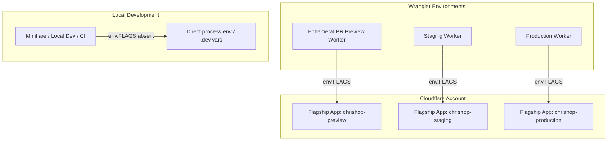

# ADR-001: Cloudflare Flagship Architecture & Multi-Environment Isolation Strategy

- **Status**: Accepted (Revised & Simplified)
- **Date**: 2026-09-12
- **Deciders**: Principal Systems Architect, Edge Platform Lead, ChrisShop Core Engineering
- **Consulted**: E-Commerce Operations, Security & Compliance Lead
- **Related Issues / PRs**: Story 2.45 (#191), Story 2.31 (#143), Story 2.34 (#155), Story 3.12 (#185)

---

## 1. Executive Summary & Context

As ChrisShop advances from foundational infrastructure towards headless commerce and high-velocity flash drop operations, code deployments must be strictly decoupled from feature releases. Managing sneaker drops, limited artwork releases, and post-launch rollouts requires granular runtime control:
- Instant emergency kill-switches (< 15s global propagation)
- Drop countdown and maintenance mode holding screens
- VIP early access gating
- Progressive canary rollouts (e.g. 10% → 50% → 100%)

### Initial Spike Clarification
In the initial spike investigation, our analysis evaluated **Flagship by AB Tasty** (a commercial third-party SaaS), incorrectly conflating it with Cloudflare's native first-party product: **Cloudflare Flagship** (launched in public beta in May 2026). In response to AB Tasty's high HTTP egress latency (40–150ms) and commercial MAU pricing penalties, an over-engineered 5-tier fallback stack was prototyped (L0 request overrides, L1 in-isolate cache, L2 Workers KV namespace, L3 env vars, L4 hardcoded defaults, and custom FNV-1a hashing).

### Revised Architectural Decision
We **dismantle the over-engineered 5-tier hybrid engine** and adopt **Cloudflare Flagship** as our official edge feature flagging platform, combined with a dead-simple 2-tier architecture:

1. **Cloud Edge Runtime (Production, Staging, Ephemeral Previews)**:
   Evaluate feature flags directly via Cloudflare Flagship's native Workers binding (`env.FLAGS`). Zero outbound HTTP calls, sub-millisecond evaluation, backed by Cloudflare's globally distributed Workers KV and Durable Objects.
2. **Local Development & Testing (Miniflare / CI Unit Tests)**:
   Evaluate feature flags directly from standard environment variables (`process.env.FLAG_*` / `.dev.vars` / `.env.local`) with clear static defaults. No complex multi-layer fallback chains.

---

## 2. Why We Rejected the 5-Layer Hybrid Architecture

The initial prototype introduced a 5-layer hierarchy:
`Level 0 (Request Override) ➔ Level 1 (In-Memory LRU) ➔ Level 2 (Workers KV Binding) ➔ Level 3 (Env Vars) ➔ Level 4 (Tier Defaults)` along with a custom 32-bit FNV-1a hash bucketing algorithm.

While technically functional, this design suffered from severe architectural deficiencies:
1. **High Cognitive Overhead & Opaque Debugging**: Determining *why* a flag was active required tracing through 5 separate layers across memory, KV, and environment variables. If an operator toggled a KV key, an in-memory isolate cache with a 10-second TTL created inconsistent responses across edge PoPs.
2. **Redundancy with Cloudflare Primitives**: Cloudflare Flagship already handles global edge distribution, targeting rules, and deterministic percentage rollouts natively. Implementing our own FNV-1a hashing and KV parsing duplicated functionality Cloudflare provides out of the box.
3. **Maintenance & Testing Burden**: Hundreds of lines of bespoke caching, override maps, and mock KV wrappers had to be maintained and tested.

---

## 3. Deep Dive: Cloudflare Flagship Capabilities

Cloudflare Flagship is Cloudflare's first-party feature flagging service built specifically for Cloudflare Workers:

| Dimension | Cloudflare Flagship (First-Party Native) | Third-Party SaaS (e.g. AB Tasty) | Bespoke 5-Tier Hybrid |
| :--- | :--- | :--- | :--- |
| **Runtime Integration** | 🟢 Native Worker binding (`env.FLAGS`) | 🔴 Outbound HTTP POST (`fetch`) | 🟡 Custom wrapper around KV + memory |
| **Decision Latency** | 🟢 **< 0.05ms (in-isolate evaluation)** | 🔴 40–150ms HTTP egress penalty | 🟢 < 0.05ms (L1) / 2–4ms (L2) |
| **Network Egress** | 🟢 **0 bytes (Internal V8 runtime)** | 🔴 Outbound HTTPS on every request | 🟢 0 bytes |
| **Rollout Engine** | 🟢 Native percentage rollouts & rules | 🟢 Native rules engine | 🔴 Custom FNV-1a code to maintain |
| **Standard Compliance** | 🟢 CNCF OpenFeature (`@cloudflare/flagship`) | 🔴 Proprietary SDK | 🟡 Bespoke interface |
| **CLI & Automation** | 🟢 First-class `wrangler flagship` commands | 🔴 Vendor REST API / web UI only | 🔴 Manual KV CLI scripts |
| **Cost Model** | 🟢 Included in Workers Paid tier ($0 extra) | 🔴 $500–$2,500+/mo MAU penalties | 🟢 $0 extra |
| **Local Dev Support** | 🟡 Connects to live app (`app_id`) | 🔴 Requires internet & SaaS token | 🟢 Env var / `.dev.vars` fallback |

### Core Native Features
- **Zero-Latency In-Isolate Evaluation**: Flags are synchronized to the edge and evaluated in-memory without blocking I/O.
- **Native Worker Binding**: Declared in `wrangler.toml` via `[[flagship]]` and accessible via `env.FLAGS`.
- **Targeting Rules**: Dynamic rule evaluation on incoming request context (e.g., `when country equals US`, `when user_id in VIP_LIST`, `when customer_tags contains 'artist'`).
- **Percentage-Based Rollouts**: Built-in sticky percentage distribution (`wrangler flagship flags rollout <APP_ID> <KEY> --percentage 25 --by user_id`).
- **App-Scoped API Security**: Fine-grained Cloudflare API tokens scoped specifically to individual Flagship applications.

---

## 4. Formal Architectural Recommendation

### 🏆 Recommendation: Dedicated Flagship App Per Environment (Strategy A)

We formally adopt **Strategy A: A Dedicated Flagship App per Environment** (`chrishop-preview`, `chrishop-staging`, `chrishop-production`):



#### Rationale & Key Advantages:
1. **Strict Blast Radius Isolation**: A toggle or experiment tested in `chrishop-preview` or `chrishop-staging` physically cannot leak into or compromise `chrishop-production`. During high-stakes drops, operational safety is absolute.
2. **App-Scoped RBAC & Token Security**:
   - PR Preview CI pipelines and junior developers can be issued Cloudflare API tokens scoped strictly to `chrishop-preview` with `Write` permissions.
   - Staging automated tests can be granted write access to `chrishop-staging`.
   - Production (`chrishop-production`) write permissions are restricted strictly to authorized release managers and incident response automation.
3. **Native Wrangler Multi-Environment Mapping**: Wrangler's configuration format natively supports per-environment bindings:
   ```toml
   # Default / Preview Environment
   [[flagship]]
   binding = "FLAGS"
   app_id = "<PREVIEW_FLAGSHIP_APP_ID>"

   [env.staging]
   [[env.staging.flagship]]
   binding = "FLAGS"
   app_id = "<STAGING_FLAGSHIP_APP_ID>"

   [env.production]
   [[env.production.flagship]]
   binding = "FLAGS"
   app_id = "<PRODUCTION_FLAGSHIP_APP_ID>"
   ```
4. **Clean Targeting Rules**: Rule definitions in Production do not require repetitive `if (environment === 'production')` guards. Rules describe user targeting purely (e.g. VIP drop access, 10% canary), while Preview environments can default features to `true` across the board for immediate testing.

---

## 5. Local Development Best Practice: Clean 2-Tier Resolution

To address the constraint that Cloudflare Flagship has no offline local emulator, we implement a transparent 2-path evaluation flow:

```typescript
export async function evaluateFlag<T extends boolean | string | number>(
  key: string,
  defaultValue: T,
  context?: EvaluationContext,
  env?: Record<string, unknown>
): Promise<T> {
  // Path 1: Cloudflare Flagship Native Binding (Deployed Worker)
  const flagship = (env?.FLAGS || (globalThis as any).FLAGS) as CloudflareFlagshipBinding | undefined;
  if (flagship && typeof flagship.getBooleanValue === 'function') {
    if (typeof defaultValue === 'boolean') {
      return (await flagship.getBooleanValue(key, defaultValue, context)) as T;
    }
    if (typeof defaultValue === 'string') {
      return (await flagship.getStringValue(key, defaultValue, context)) as T;
    }
    if (typeof defaultValue === 'number') {
      return (await flagship.getNumberValue(key, defaultValue, context)) as T;
    }
  }

  // Path 2: Local Development / CI Unit Test Fallback (Direct Environment Variables)
  const envVal = process.env[key] ?? (env as Record<string, string>)?.[key];
  if (envVal !== undefined) {
    if (typeof defaultValue === 'boolean') {
      return (envVal === 'true' || envVal === '1') as T;
    }
    if (typeof defaultValue === 'number') {
      const num = Number(envVal);
      return (isNaN(num) ? defaultValue : num) as T;
    }
    return envVal as T;
  }

  return defaultValue;
}
```

### Why this local pattern is superior:
- **Zero Configuration**: Developers can toggle any feature in local development simply by adding `FLAG_IS_DROP_ACTIVE=true` to `.env.local` or `.dev.vars`.
- **Zero Flake in CI**: Automated unit and integration tests run offline without network connectivity, rate limits, or external dependencies.
- **Total Transparency**: There are no hidden caching layers or LRU maps causing stale reads.

---

## 6. Flag Naming Conventions & Standard Catalog

All ChrisShop feature flags adhere to standard conventions:
- Must begin with `FLAG_`.
- Booleans must use active affirmative verbs (`FLAG_IS_DROP_ACTIVE`, `FLAG_ENABLE_WIREMOCK`).
- Flags exposed to the client browser must be prefixed with `NEXT_PUBLIC_FLAG_`.

### Standard ChrisShop Flags

| Feature Flag Key | Type | Production Default | Staging Default | Preview Default | Purpose & Description |
| :--- | :--- | :--- | :--- | :--- | :--- |
| `FLAG_IS_DROP_ACTIVE` | `boolean` | `false` | `true` | `true` | Controls drop catalog visibility and active purchase access. |
| `FLAG_ENABLE_WIREMOCK` | `boolean` | `false` | `false` | `true` | Forces Shopify Storefront API client through local WireMock bridge. |
| `FLAG_MAINTENANCE_MODE` | `boolean` | `false` | `false` | `false` | Catalog lockdown; displays countdown holding screen. |
| `FLAG_EMERGENCY_KILL_SWITCH`| `boolean` | `false` | `false` | `false` | Master circuit breaker: halts cart mutations and checkout redirects. |
| `FLAG_DISABLE_CHECKOUT` | `boolean` | `false` | `false` | `false` | Granular circuit breaker: blocks checkout while keeping catalog browsing active. |
| `FLAG_VIP_EARLY_ACCESS` | `boolean` | `false` | `true` | `true` | Enables VIP gating evaluation for early access before drop zero-hour. |
| `FLAG_PHASE_6_CANARY_PERCENT` | `number` | `0` | `50` | `100` | Percentage rollout gate for Phase 6 features (Shippo labels, waitlists). |

---

## 7. Operational Runbook: Managing Flags with Wrangler CLI

With Wrangler v4+, operators can control flags directly from the terminal or GitHub Actions workflows:

```bash
# 1. Create flags in the production app
wrangler flagship flags create $PROD_APP_ID FLAG_IS_DROP_ACTIVE
wrangler flagship flags create $PROD_APP_ID FLAG_EMERGENCY_KILL_SWITCH

# 2. Instant Emergency Kill-Switch Activation (< 15s global propagation)
wrangler flagship flags enable $PROD_APP_ID FLAG_EMERGENCY_KILL_SWITCH

# 3. Resume Normal Operations
wrangler flagship flags disable $PROD_APP_ID FLAG_EMERGENCY_KILL_SWITCH

# 4. Progressive Canary Rollout (Phase 6 features to 25% of sessions)
wrangler flagship flags rollout $PROD_APP_ID FLAG_PHASE_6_CANARY_PERCENT \
  --to on \
  --percentage 25 \
  --by user_id

# 5. Inspect active flags
wrangler flagship flags list $PROD_APP_ID
```

---

## 8. Summary of Migration Actions
1. Replaced `EdgeFeatureFlagEngine` (360 lines) in `@chrishop/config/flags` with lightweight `evaluateFlag` (under 80 lines).
2. Removed obsolete FNV-1a hashing and mock KV storage engines.
3. Added `[[flagship]]` binding blocks to `wrangler.toml` for preview, staging, and production environments.
4. Preserved existing circuit-breaker hooks in `apps/web/src/lib/shopify.ts`.
5. Updated test suites to validate both Cloudflare Flagship binding execution and local environment variable fallback.
