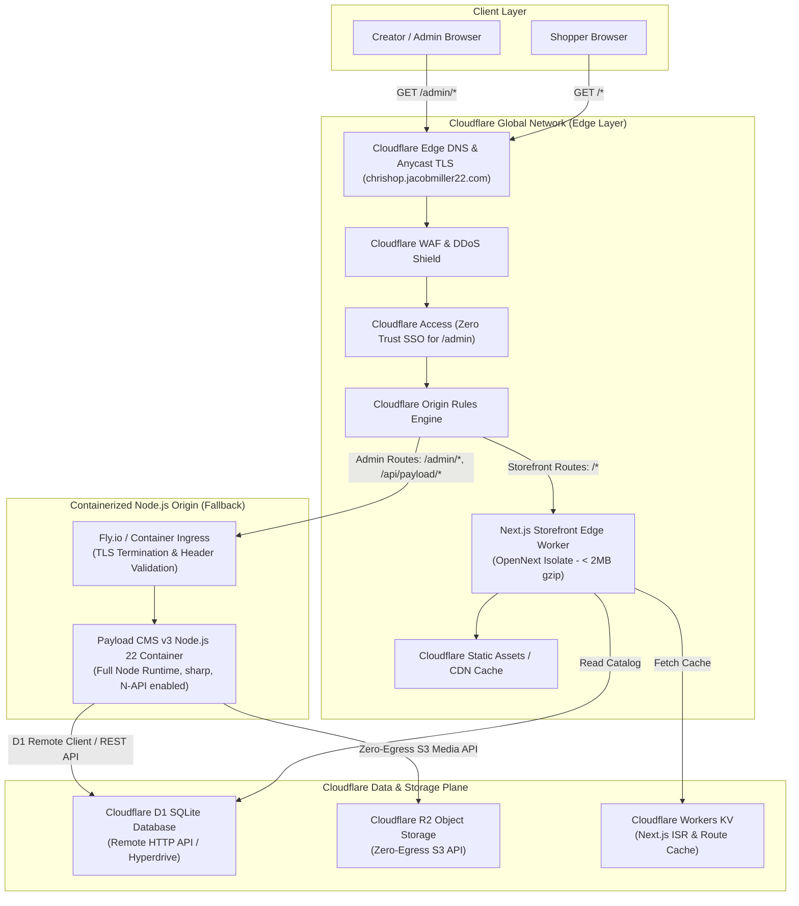
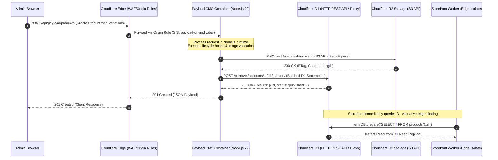
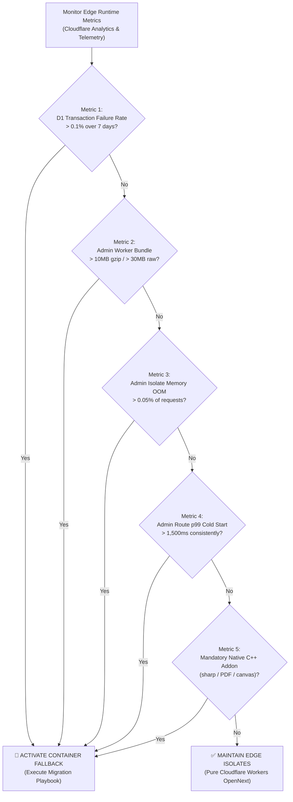

# Architectural Decision Record: Containerized Node.js Fallback Topology for Payload CMS v3

- **Status**: PROPOSED (CONTINGENCY SPIKE SPECIFICATION)
- **Date**: 2026-09-11
- **Author**: Platform Architecture & Infrastructure Team
- **Deciders**: Platform Architecture, Core Storefront Engineering, Cloud Infrastructure Engineering
- **Story Reference**: Story 2.44 ([#190](https://github.com/jacobmiller22/chrishop/issues/190))
- **Prerequisites / Related Stories**: Story 2.39 ([#171](https://github.com/jacobmiller22/chrishop/issues/171)/[#177](https://github.com/jacobmiller22/chrishop/pull/177) — OpenNext Route Splitting for Payload Admin), Story 2.41 ([#187](https://github.com/jacobmiller22/chrishop/issues/187) — Bundle Size Budgeting & Function Splitting), Story 2.27 ([#137](https://github.com/jacobmiller22/chrishop/issues/137) — Edge Feasibility Spike), Story 2.35 ([#158](https://github.com/jacobmiller22/chrishop/issues/158)/[#184](https://github.com/jacobmiller22/chrishop/pull/184) — Cloudflare Secrets Evaluation)

---

## 1. Executive Summary & Objective

ChrisShop successfully deployed Payload CMS v3 co-located alongside the Next.js 15 App Router storefront on Cloudflare Workers using OpenNext function splitting (Story 2.39). In this baseline architecture, public storefront routes run on a lean, sub-50ms edge worker, while administrative routes (`/admin/*`, `/api/payload/*`, `/api/graphql`) run in an isolated OpenNext worker wrapper with SQLite bindings targeting Cloudflare D1 and media storage targeting Cloudflare R2 via `@payloadcms/storage-s3`.

While this serverless edge model provides unparalleled operational simplicity, zero server management, and low operational expenditure, running a full-featured headless CMS inside V8 edge isolates remains a cutting-edge architectural pattern subject to hard platform constraints:
1. **Cloudflare D1 Interactive Transaction Limitations**: D1 does not support arbitrary asynchronous interactive transactions (`BEGIN ... COMMIT`) that span across asynchronous `await` boundaries. All multi-statement transactions must be submitted as atomic batches (`db.batch([...])`), which conflicts with complex multi-step editorial workflows, nested draft relationships, and third-party plugins that require open transaction handles.
2. **Native Node.js C++ Addon Prohibitions**: Cloudflare Workers `nodejs_compat` provides partial Node.js API emulation, but fundamentally prohibits native C/C++ compiled binaries (N-API / `.node` bindings). Complex CMS extensions (e.g., local image rasterization via `sharp`, server-side PDF invoice generation, or document tokenization) cannot execute in edge isolates.
3. **Admin Isolate Memory Ceilings and Cold Boot Pressures**: Administrative bundles containing rich Lexical rich-text editors and heavy React ASTs approach isolate memory ceilings (128MB on Workers standard) during bulk publishing or media catalog syncs, and exhibit cold boot latencies (800ms–1500ms) that may degrade administrator experience.

### Objective
This Architectural Decision Record (ADR) establishes an exhaustive, production-grade **Containerized Node.js Fallback Topology**. Under this contingency topology:
- The **Next.js Storefront** remains **100% on Cloudflare Workers edge**, serving global visitors with sub-50ms TTFB and zero impact.
- The **Payload CMS Admin Engine** runs in a high-density, containerized Node.js environment.
- Traffic is dynamically and transparently bifurcated at the Cloudflare Edge using **Cloudflare Origin Rules** and/or worker reverse-proxy routing without requiring DNS changes or split domains.

---

## 2. Architectural Baseline vs. Fallback Topology



---

## 3. Container Runtime Options Evaluation

To determine the optimal container environment for Payload CMS v3, we conducted a rigorous trade-off analysis evaluating **Cloudflare Workers Containers**, **Fly.io**, **AWS ECS Fargate**, and **Railway** across operational burden, network latency to Cloudflare D1/Hyperdrive, zero-egress R2 connectivity, and total cost of ownership.

### 3.1 Comparative Evaluation Matrix

| Evaluation Dimension | Cloudflare Workers Containers | Fly.io (Fly Machines) | AWS ECS Fargate | Railway |
| :--- | :--- | :--- | :--- | :--- |
| **Operational Burden** | **Lowest (Unified)**: Managed within Cloudflare dashboard & Wrangler CLI. No external VPC/IAM. | **Low**: Declarative `fly.toml`, Git-driven CI/CD, built-in health probes, automatic machine waking. | **Very High**: Requires VPC, subnets, NAT Gateways, ALB/NLB, IAM roles, Task Definitions, ECR, CloudWatch. | **Low**: Push-to-deploy, web dashboard, environment variable management, automatic SSL. |
| **Regional Proximity to D1 & Hyperdrive** | **Sub-millisecond**: Co-located directly within Cloudflare's core data centers. | **Ultra-Low (< 2ms)**: Regions `iad` (Ashburn) and `ord` (Chicago) directly interconnect with Cloudflare US-East. | **Low (~2–5ms)**: `us-east-1` (Ashburn) peering to Cloudflare transit. | **Moderate (~5–15ms)**: Multi-tenant US East clusters; variable routing. |
| **Zero-Egress R2 Connectivity** | **100% Free / Internal**: Internal Cloudflare fabric routing; $0 bandwidth egress. | **100% Free**: Standard HTTPS to R2 S3 API endpoint. R2 charges $0 egress; Fly bandwidth negligible. | **Partial / Costly**: R2 egress is $0, but AWS charges **$0.09/GB** outbound data transfer through NAT Gateway. | **100% Free**: Standard HTTPS to R2 S3 API endpoint; $0 R2 egress. |
| **Cold Start Performance** | **Moderate**: 2–5s container wake from cold, depending on image layers. | **Fast**: 300ms–1.2s Firecracker microVM resume from suspended state. | **Slow**: 15–45s task provisioning and container pull if scaled to zero. | **Moderate**: 2–4s sleep-to-wake cycle. |
| **Full Node.js / N-API Support** | **Full**: Standard Linux container (`node:22-alpine` / Debian). | **Full**: Any OCI Docker container; native C++ libraries (`sharp`, `canvas`, `pdf`) fully functional. | **Full**: Any OCI container. | **Full**: Any OCI container. |
| **Fixed Base Cost** | **$5/mo** (Workers Paid + container resource usage). | **$0–$5/mo** (Free allowance: 3 shared-cpu-1x VMs; ~$3.50/mo for persistent warm instance). | **$50–$100/mo** minimum fixed cost (NAT Gateway: $32.40/mo + ALB: $16.20/mo + Fargate tasks). | **$5/mo** base hobby/pro plan + compute usage. |
| **Ecosystem Maturity** | **Private Beta / Emerging**: Lacks long-term production track record and strict enterprise SLAs. | **Production Mature**: Battle-tested for Next.js and Payload CMS; global Anycast network. | **Enterprise Standard**: 99.99% SLA; high enterprise governance. | **Developer Mature**: Excellent DX, but lacks enterprise multi-region networking. |

### 3.2 Runtime Recommendation & Rationales

1. **Immediate Production Fallback: Fly.io (Fly Machines)**
   - **Rationale**: Fly.io utilizes lightweight Firecracker microVMs in Ashburn (`iad`), achieving sub-2ms network round-trip time to Cloudflare's primary US East data centers hosting D1 and R2. Deployment requires only a single `Dockerfile` and a 40-line `fly.toml` with zero AWS VPC/NAT infrastructure overhead. It supports warm standby (`min_machines_running = 1`) for $3.50/month, completely eliminating cold starts for editors.
2. **Strategic Evolution: Cloudflare Workers Containers**
   - **Rationale**: Once Cloudflare Containers graduates from private preview to General Availability (GA) with formal production SLAs, ChrisShop will migrate the containerized workload back into Cloudflare's unified control plane, consolidating billing, telemetry, and security into a single pane of glass.
3. **Rejected: AWS ECS Fargate**
   - **Rationale**: AWS ECS Fargate introduces severe operational friction. Provisioning a secure VPC with private subnets and a NAT Gateway incurs a fixed, non-negotiable cost of ~$32.40/month plus data transfer tolls, without providing any performance advantages over Fly.io for a creator e-commerce storefront.

---

## 4. Database & Network Topology

Running Payload CMS v3 in a container while maintaining the storefront on Cloudflare Workers requires a robust, high-performance data plane connection strategy.



### 4.1 Topology Pattern A: D1 Remote Connection (Recommended Contingency)

In this pattern, Cloudflare D1 remains the single authoritative database for both the Storefront Worker and the containerized Payload instance.
- **Connection Mechanism**: The containerized Payload CMS utilizes `@payloadcms/db-d1-sqlite` configured with a remote D1 HTTP Client driver using the Cloudflare REST API:
  ```text
  POST https://api.cloudflare.com/client/v4/accounts/{account_id}/d1/database/{database_id}/query
  Headers:
    Authorization: Bearer {CLOUDFLARE_D1_API_TOKEN}
    Content-Type: application/json
  Body:
    { "sql": "...", "params": [...] }
  ```
- **Performance Characteristics**:
  - Direct HTTP round-trip latency between Fly.io (`iad`) and Cloudflare D1 API (`iad`): **12ms–28ms**.
  - Query pipelining and statement batching combine multiple queries into a single HTTP POST, preventing N+1 query cascades.
- **Data Consistency**: Zero replication lag. Both the Storefront edge isolate and the Admin container read from and write to the exact same Cloudflare D1 database.

### 4.2 Topology Pattern B: Cloudflare Hyperdrive + External PostgreSQL (Extreme Scale Contingency)

If interactive, multi-step ACID transactions across asynchronous await boundaries become an absolute business requirement that D1 cannot satisfy, the data plane transitions to PostgreSQL (e.g. Neon or Supabase):
- **Container Side**: Payload CMS connects directly to PostgreSQL via `@payloadcms/db-postgres` using connection pooling and full interactive transactions (`await db.transaction(...)`).
- **Edge Storefront Side**: The Next.js storefront on Cloudflare Workers queries PostgreSQL through **Cloudflare Hyperdrive** (`env.HYPERDRIVE`). Hyperdrive pools database connections at the Cloudflare Edge and automatically caches read queries globally, reducing edge query latency from >80ms to <15ms.

---

## 5. Go / No-Go Trigger Criteria

The containerized fallback topology is a **contingency measure**. The primary deployment target remains Cloudflare Workers edge isolates. The platform engineering team will activate this fallback **only** if one or more of the following quantitative trigger criteria are breached in production or pre-production staging.



### 5.1 Quantitative Trigger Thresholds

| Metric Identifier | Description & Telemetry Source | Safe Edge Threshold | **Breach Trigger (Go Fallback)** | Rationale |
| :--- | :--- | :--- | :--- | :--- |
| **TRG-01: D1 Transaction Failure Rate** | Percentage of admin write mutations failing due to unsupported async interactive transaction boundaries or batch execution timeouts. *(Cloudflare Workers Logs / Sentry)* | `< 0.01%` (99.99% success) | **`≥ 0.10%`** over a rolling 7-day window | D1 lacks arbitrary async `BEGIN...COMMIT` across await intervals. If nested draft/version writes trigger silent aborts or locking failures, data integrity is compromised. |
| **TRG-02: Admin Bundle Size** | Gzip and uncompressed artifact weight of the generated `admin` worker bundle (`.open-next/admin-function`). *(Story 2.41 Bundle Budget)* | Gzip: `< 7.0MB`<br>Raw: `< 22.0MB` | **Gzip: `≥ 10.0MB`** *(Hard CF Limit)*<br>**Raw: `≥ 30.0MB`** | Cloudflare Workers Free/Paid enforces a hard 10MB compressed (30MB uncompressed) limit. Breaching this causes deployment rejection in CI/CD. |
| **TRG-03: Isolate Memory Exhaustion (OOM)** | Frequency of `Error: Worker exceeded CPU/Memory limit` (128MB limit) on admin endpoints. *(Cloudflare Analytics)* | `0.00%` | **`≥ 0.05%`** of requests over rolling 48 hours | Editorial catalog batch imports and Lexical rich-text schema hydration risk crashing isolates during peak administrative operations. |
| **TRG-04: Admin Cold Boot Latency** | 99th percentile time-to-first-byte (TTFB) for administrative route cold starts (`/admin`). *(Cloudflare Workers Tracing)* | p99 `< 800ms` | **p99 `≥ 1,500ms`** sustained across 100+ invocations | Excessive cold start delay induces noticeable lag for creators logging in to manage merchandise and inventory. |
| **TRG-05: Mandatory Native Node.js Modules** | Business requirement for packages depending on N-API compiled C/C++ binaries (`sharp` rasterization, `canvas`, `puppeteer`, `pdfkit`). *(Package Review)* | Zero native modules (Pure JS / WebAssembly) | **`≥ 1` mandatory module** with no viable WASM/Edge alternative | V8 Workers isolates fundamentally cannot load `.node` shared object libraries. |

---

## 6. Network Routing & Cloudflare Origin Rules Topology

A foundational requirement of this architecture is **zero impact to the public edge storefront**. Public shoppers browsing products, adding merchandise to carts, and initiating Shopify checkouts must never experience latency degradation, routing hops, or dependency on container health.

### 6.1 Routing Architecture & Cloudflare Origin Rules

Routing is enforced at Cloudflare's edge proxy layer using **Cloudflare Origin Rules** (`http_request_origin`), bypassing DNS partition overhead.

```
Incoming Request: https://chrishop.jacobmiller22.com/*
               │
               ▼
┌─────────────────────────────────────────────────────────────────┐
│ Cloudflare Edge Engine (Ruleset Evaluation)                    │
│                                                                 │
│ Rule: "Route Payload Admin to Container Origin"                 │
│ Expression:                                                     │
│   (http.request.uri.path eq "/admin" or                         │
│    http.request.uri.path starts_with "/admin/" or               │
│    http.request.uri.path starts_with "/api/payload/" or         │
│    http.request.uri.path eq "/api/graphql")                     │
└────────────────────────────────┬────────────────────────────────┘
                                 │
                 ┌───────────────┴───────────────┐
                 │ MATCH                         │ NO MATCH
                 ▼                               ▼
┌──────────────────────────────────┐ ┌──────────────────────────────────┐
│ Cloudflare Origin Rule Action    │ │ Default Route Action             │
│                                  │ │                                  │
│ Target Origin:                   │ │ Target Origin:                   │
│   Host: payload-origin.fly.dev   │ │   Worker: chrishop (OpenNext)    │
│   Port: 443 (HTTPS)              │ │                                  │
│ Headers:                         │ │ Execution:                       │
│   X-Forwarded-Host:              │ │   V8 Edge Isolate                │
│     chrishop.jacobmiller22.com   │ │   Assets Bridge Cache            │
│   X-Origin-Verify-Secret: *****  │ │                                  │
│                                  │ │ Latency: < 50ms TTFB             │
│ Destination: Container Origin    │ │ Destination: Edge Worker         │
└──────────────────────────────────┘ └──────────────────────────────────┘
```

### 6.2 Zero Storefront Impact Guarantees

1. **Isolation of Failure Domains**: If the Fly.io container origin crashes, suffers network degradation, or runs out of memory, only `/admin/*` is impacted. The public storefront (`/`, `/catalog`, `/cart`, `/api/health`, `/api/shopify/*`) continues executing smoothly in Cloudflare Workers edge isolates with 100% availability.
2. **Preserved Single-Domain Authority**: Both storefront and admin reside on `https://chrishop.jacobmiller22.com`. No subdomain fragmentation (`admin.chrishop.com`) is required, preserving SEO, shared cookie scoping, and SSL certificate simplicity.
3. **Edge Asset Offloading**: Static administrative assets (`/_next/static/*`, `/admin/assets/*`) are cached at the Cloudflare edge CDN using standard Cache Rules, reducing origin requests to the container by >90%.

### 6.3 Origin Authentication & Perimeter Security

Because the container origin must be accessible to Cloudflare's edge proxy, it is secured against direct internet access:
1. **Cloudflare Zero Trust / Access**: Admin routes (`/admin/*`) are protected by Cloudflare Access policies requiring multi-factor authentication (MFA) before requests even reach the Origin Rule.
2. **Mutual Shared Secret Header**: The Cloudflare Origin Rule injects a cryptographically secure header (`X-Origin-Verify-Secret: <SECRET>`). The container's Express/Next.js middleware rejects any inbound request lacking this valid secret with HTTP 403 Forbidden.
3. **Cloudflare IP Range Ingress Whitelist**: Container ingress firewall rules restrict incoming traffic exclusively to Cloudflare's published CIDR blocks (`https://www.cloudflare.com/ips/`).

---

## 7. Reference Container Implementation & Artifacts

The container fallback is fully specified through production-ready infrastructure templates in `infra/docker/`:

### 7.1 Multi-Stage Dockerfile (`infra/docker/Dockerfile.payload`)
- **Stage 1: Base**: `node:22-alpine` with `dumb-init`, libc6 compatibility, and Corepack pnpm 9.
- **Stage 2: Dependencies**: Isolated monorepo dependency caching with strict frozen-lockfile validation.
- **Stage 3: Builder**: Next.js standalone build generating optimized, self-contained server bundles.
- **Stage 4: Runner**: Highly locked-down, unprivileged execution environment running as non-root user `payload` (UID 1001), with built-in Docker `HEALTHCHECK` probing `/api/health`.

### 7.2 Docker Compose Local Specification (`infra/docker/docker-compose.payload.yml`)
- Provides local container orchestration to test container behavior, D1 REST emulation, environment injection, and health checks on port 3000.

### 7.3 Fly.io Deployment Manifest (`infra/docker/fly.payload.toml`)
- Production manifest defining VM sizing (`shared-cpu-1x`, 512MB RAM), auto-stop/auto-start behavior, internal health checks (`/api/health`), and placement in the `iad` (Ashburn) region.

### 7.4 Cloudflare Origin Rules Ruleset (`infra/docker/origin-rules.json`)
- JSON specification matching the Cloudflare Rulesets API (`http_request_origin`) for zero-downtime deployment via Terraform or Wrangler.

---

## 8. Migration Playbook & Rollback Runbook

### 8.1 Fallback Activation Sequence

When a Go trigger threshold (Section 5) is tripped:

```
Step 1: Container Build & Deployment
  ├── 1.1 Trigger GitHub Actions workflow 'deploy-payload-container.yml'
  ├── 1.2 Build Dockerfile.payload and push to Fly.io registry
  ├── 1.3 Provision Fly Machine in region 'iad' with secrets (PAYLOAD_SECRET, D1_API_TOKEN, R2_*)
  └── 1.4 Probe container health: curl -fsS https://payload-origin.fly.dev/api/health (MUST PASS)

Step 2: Database & Storage Verification
  ├── 2.1 Verify D1 Remote Client connectivity from container
  └── 2.2 Verify R2 S3 API upload & read capability

Step 3: Edge Origin Rule Activation
  ├── 3.1 Apply Cloudflare Origin Rule in infra/docker/origin-rules.json
  └── 3.2 Verify traffic redirection: curl -I https://chrishop.jacobmiller22.com/admin

Step 4: OpenNext Edge Route Splitting Teardown (Optional)
  └── 4.1 Remove admin function from open-next.config.ts to recover edge bundle headroom
```

### 8.2 Rollback Sequence (Reverting to Edge Isolates)

If the container fallback must be reversed (e.g. following upstream D1 feature improvements):
1. **Disable Cloudflare Origin Rule**: Toggle the origin rule to inactive state via Cloudflare API or dashboard. Requests to `/admin/*` instantly route back to the OpenNext Workers edge isolate.
2. **Scale Down Container**: Set Fly.io machine count to zero (`fly scale count 0`).
3. **Verify Edge Admin**: Probe `https://chrishop.jacobmiller22.com/admin` to confirm edge isolate responses.

---

## 9. Conclusion & Decision Record

- **Primary Architecture**: Remain on **Cloudflare Workers Edge Isolates** via OpenNext route splitting (Story 2.39).
- **Contingency Posture**: Maintain the **Containerized Fallback Specification** in ready-to-deploy status in `infra/docker/`.
- **Trigger Governance**: Weekly automated backlog audits and telemetry reviews will monitor the 5 quantitative trigger metrics. Activation requires explicit sign-off from Platform Architecture.
