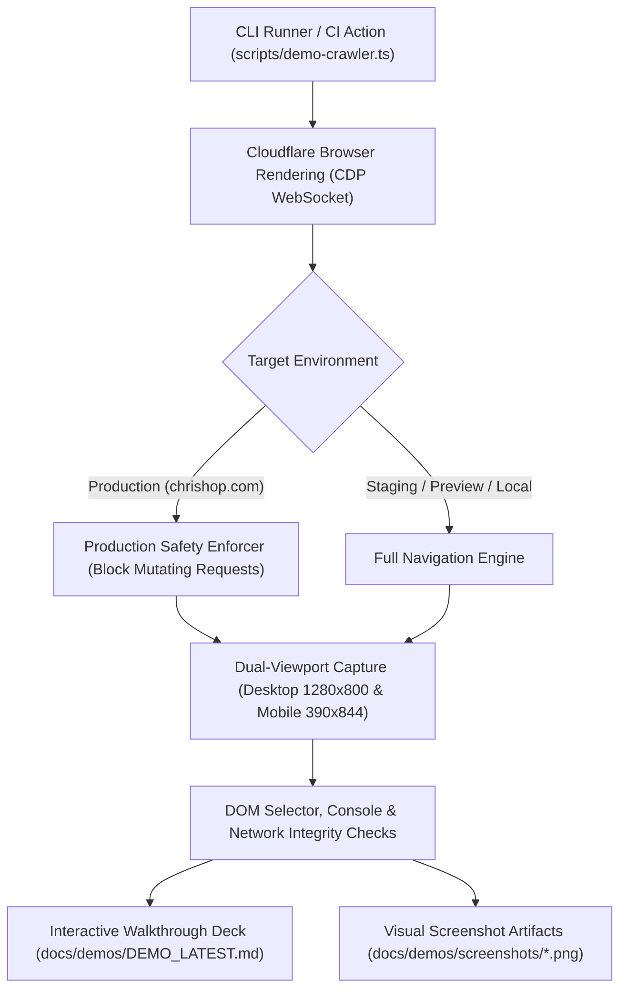

# Runbook: Automated Screen Tour Suite & Interactive Demo Walkthrough

**Story**: 4.11 (#153)  
**System**: ChrisShop Monorepo (Next.js + Cloudflare Workers + Payload CMS v3)  
**Owners**: Jacob Miller (Technical Lead), AI Agent Fleet  
**Status**: Active Production Standard  

---

## 1. Overview & Architecture

The ChrisShop Automated Screen Tour Suite provides headless visual and functional verification across all application surfaces:
1. **Storefront** (Shopper Persona): Landing hero, craft narrative, product catalog, high-conversion PDP, real-time drop countdown room, and slide-over cart.
2. **Payload CMS Admin** (Creator Persona): Admin authentication portal, product collection authoring, drop window scheduling, and Chris's zero-clutter Live Drop Room.
3. **Edge Operations** (Engineering Persona): Jacob's Edge Ops Portal and Better Stack edge health synthetic heartbeat probe.

Navigation and screen capture are powered by **Cloudflare Browser Rendering** connecting via Chrome DevTools Protocol (CDP) WebSocket endpoints (`wss://api.cloudflare.com/.../browser-rendering/devtools/browser`), bypassing Cloudflare Access Zero Trust gates with Service Tokens while capturing dual-viewport visual assets.



---

## 2. Production Safety Enforcer

To guarantee that automated walkthroughs never inadvertently corrupt production state or trigger unauthorized test orders, the suite enforces a strict **Production Safety Enforcer**:

- **Target Detection**: Any target matching `chrishop.com`, `www.chrishop.com`, or `chrishop.jacobmiller22.com` is locked into strict read-only mode.
- **Request Interception**: Playwright's `page.route('**/*')` intercepts all outgoing requests. Any method other than `GET`, `HEAD`, or `OPTIONS` is instantly aborted with `blockedbyclient` and throws a fatal `ProductionSafetyError`.
- **Manual Read-Only Flag**: Passing `--read-only` enforces this interception mode on any staging, preview, or local target.

---

## 3. Dual-Viewport Capture

Over 65% of hype drop traffic arrives via mobile devices. The screen tour suite automatically captures both responsive viewports for every audited route:

1. **Desktop Viewport**: `1280 x 800` (16:10 Laptop standard)
2. **Mobile Viewport**: `390 x 844` (Apple iPhone 14 standard)

Both viewport captures are saved to `docs/demos/screenshots/<screen-id>-desktop.png` and `docs/demos/screenshots/<screen-id>-mobile.png` and embedded side-by-side in the generated interactive Markdown report.

---

## 4. Screen Tour Manifest Registry

The 12-screen registry is defined in `apps/web/src/lib/screen-tour-manifest.ts`:

| Screen ID | Name | Route | Persona | Category | Provenance |
| :--- | :--- | :--- | :--- | :--- | :--- |
| `storefront.home` | Storefront Home | `/` | `shopper` | Storefront | Story 1.16 |
| `storefront.about` | About & Workshop Vault | `/about` | `shopper` | Storefront | Story 1.16 |
| `storefront.products` | Product Catalog Grid | `/products` | `shopper` | Storefront | Story 2.18 |
| `storefront.pdp` | Product Detail Page | `/products/leadville-fly-reel` | `shopper` | Storefront | Story 1.16 |
| `storefront.drop` | Drop Countdown & Room | `/drop` | `shopper` | Storefront | Story 3.1 |
| `storefront.cart` | Cart Overview & Drawer | `/cart` | `shopper` | Storefront | Story 3.2 |
| `admin.login` | Payload CMS Admin Portal | `/admin` | `creator` | Admin | Story 2.18 |
| `admin.collections_products` | Payload Products Collection | `/admin/collections/products` | `creator` | Admin | Story 2.18 |
| `admin.collections_drops` | Payload Drops Collection | `/admin/collections/drops` | `creator` | Admin | Story 3.1 |
| `admin.drop_room` | Creator Live Drop Room | `/admin/drop-room` | `creator` | Admin | Story 4.16 |
| `ops.portal` | Jacob Edge Ops Portal | `/ops` | `engineering` | Edge Operations | Story 4.16 |
| `ops.health` | Edge Health Synthetic Probe | `/api/health` | `engineering` | Edge Operations | Story 4.7 |

---

## 5. CLI Reference & Usage

### Execution Commands

```bash
# Run simulated screen tour on local dev server
pnpm run demo --env local --mock

# Run screen tour against staging environment focused on storefront
pnpm run demo --env staging --focus storefront

# Run screen tour against production in verified read-only mode
pnpm run demo --url https://chrishop.com --read-only

# Verify screen tour suite integrity and contracts
pnpm run demo:verify
```

### CLI Options

| Flag | Default | Description |
| :--- | :--- | :--- |
| `--url <url>` | Derived from `--env` | Explicit target URL to crawl |
| `--env <target>` | `local` | Target environment (`local`, `preview`, `staging`, `production`) |
| `--focus <area>` | `all` | Filter screens (`all`, `storefront`, `admin`, `ops`, `recent`) |
| `--read-only` | Auto on prod | Enforce strict HTTP method interception blocking mutating verbs |
| `--mock` / `--simulated` | `false` | Run simulated HTTP probes without launching browser binaries |
| `--no-screenshots` | `false` | Skip disk-write screenshot captures |
| `--out <file>` | `docs/demos/DEMO_LATEST.md` | Path to generated markdown walkthrough deck |
| `--output-dir <dir>` | `docs/demos/screenshots` | Directory where dual-viewport PNGs are saved |

---

## 6. Generated Artifacts

Upon completion, the crawler produces:
1. **Interactive Demo Deck**: `docs/demos/DEMO_LATEST.md`
   - Executive screen status table (latency, HTTP status, DOM selectors, console hygiene).
   - Side-by-side Desktop vs Mobile visual comparison gallery.
   - Production safety and edge architecture audit notes.
2. **Visual Screenshots**: `docs/demos/screenshots/<id>-<viewport>.png`
   - High-fidelity PNG renders of each target route.
