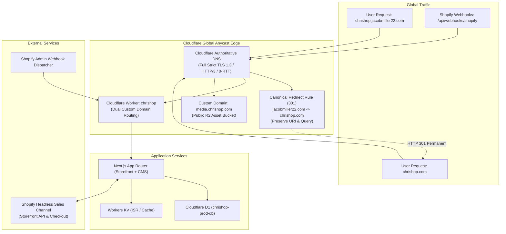

# Production Domain Migration & Zero-Downtime DNS Cutover Runbook

`docs/runbooks/DOMAIN_MIGRATION_DNS_CUTOVER.md`

This operational runbook governs the zero-downtime transition from the temporary development and staging hostnames (`chrishop.jacobmiller22.com`, `shop.jacobmiller22.com`) to the official production custom domain (`chrishop.com`, `www.chrishop.com`, `shop.chrishop.com`) for **ChrisShop**.

---

## 1. Executive Summary & Objective

- **Target Production Domain**: `chrishop.com`
- **Canonical Apex / WWW**: `https://chrishop.com` (Apex) with `https://www.chrishop.com` and `https://shop.chrishop.com` 301 redirected to apex.
- **Media Asset CDN**: `https://media.chrishop.com` mapped to Cloudflare R2 bucket (`chrishop-media-prod`).
- **Staging Tier**: `https://staging.chrishop.com` mapped to `chrishop-staging` worker.
- **RTO (Recovery Time Objective)**: < 5 minutes (via instant DNS/Worker route flip).
- **RPO (Recovery Point Objective)**: 0 seconds (zero data loss; database and Shopify state are decoupled from domain cutover).
- **Maximum Tolerable Downtime**: 0 seconds (enforced via dual-domain edge routing during global TTL decay).

---

## 2. Cutover Architecture & Traffic Flow



---

## 3. Operational Timeline & Cutover Matrix

| Phase | Time Window | Action Items | Responsible | Gate / Verification |
| :--- | :--- | :--- | :--- | :--- |
| **Phase 0** | T-48h to T-24h | Registrar unlock, DNS audit, TTL reduction to 300s on source DNS | Lead SRE | `dig +nocmd +noall +answer` returns TTL ≤ 300 |
| **Phase 1** | T-2h | Cloudflare Zone creation, Universal SSL & Advanced Edge Certificates provisioning | Cloudflare Admin | Certificate status: `Active` in dashboard |
| **Phase 2** | T-1h | Provision DNS records (AAAA `100::` proxied, CNAMEs, R2 media binding) | Terraform / SRE | `terraform plan` clean; records resolve |
| **Phase 3** | T-30m | Deploy dual-domain routing in `wrangler.toml` (`chrishop.com` + legacy) | CI/CD Deployer | `pnpm exec wrangler deploy --env production` |
| **Phase 4** | T-15m | Update Shopify Headless Sales Channel & CORS allowlists | Commerce Admin | Storefront API queries succeed with new Origin |
| **Phase 5** | T-10m | Dual-register Shopify Webhooks (`orders/create`, `orders/paid`, `orders/fulfilled`) | Commerce Admin | Synthetic webhook test returns HTTP 200 |
| **Phase 6** | T-0 (Cutover) | Nameserver delegation cutover at registrar to Cloudflare authoritative NS | Lead SRE | Zone status: `Active`; HTTPS resolves |
| **Phase 7** | T+5m | Run turnkey verification suite: `pnpm run domain:verify` | SRE / Agent | All 5 automated verification stages PASS |
| **Phase 8** | T+1h | Enable 301 canonical redirects from legacy hostnames to `chrishop.com` | Cloudflare Admin | HTTP 301 check preserves paths & query parameters |
| **Phase 9** | T+48h | Decommission legacy DNS records and old webhook endpoints after full TTL decay | Lead SRE | Zero traffic on legacy domain in Cloudflare Analytics |

---

## 4. Step-by-Step Execution Guide

### Phase 0: Pre-Migration Registrar & TTL Preparation (T-48h to T-24h)

1. **Verify Domain Ownership & Registrar Access**:
   - Confirm ownership and management access for `chrishop.com` at the domain registrar (e.g. Cloudflare Registrar, Namecheap, Google Domains/Squarespace).
   - Ensure WHOIS privacy protection is enabled and domain transfer lock is active.
2. **Lower Existing DNS Record TTLs**:
   - On existing authoritative nameservers, lower the TTL of any existing A/AAAA/CNAME records for `chrishop.com` and `*.chrishop.com` to `300 seconds` (5 minutes) or `60 seconds`.
   - **Verification**:
     ```bash
     dig chrishop.com A +nocmd +noall +answer
     ```

---

### Phase 1: Cloudflare Zone Setup & Edge SSL/TLS Provisioning (T-2h)

1. **Add Domain to Cloudflare**:
   - Add `chrishop.com` as a new zone in the dedicated Cloudflare account (Full setup).
   - Plan: Workers Paid / Pro or Free with Universal SSL.
2. **Configure Edge SSL/TLS Certificates**:
   - In Cloudflare Dashboard, navigate to **SSL/TLS → Overview**.
   - Select **Full (Strict)** encryption mode (enforces end-to-end cryptographic integrity).
   - Navigate to **SSL/TLS → Edge Certificates**:
     - Enable **Always Use HTTPS**.
     - Enable **Automatic HTTPS Rewrites**.
     - Enable **Opportunistic Encryption**.
     - Set **Minimum TLS Version** to `TLS 1.2` (Recommended: `TLS 1.3` with 0-RTT connection resumption).
     - Enable **HTTP/3 (with QUIC)**.
     - Enable **HSTS** (HTTP Strict Transport Security):
       - Max-Age: `31536000` (1 year)
       - Include Subdomains: `true`
       - Preload: `true`

---

### Phase 2: DNS Records Declarative Provisioning (T-1h)

Provision all required DNS records in the `chrishop.com` zone:

| Record Type | Hostname / Name | Target / Content | Proxy Status | Description |
| :--- | :--- | :--- | :--- | :--- |
| `AAAA` | `@` (`chrishop.com`) | `100::` | **Proxied** (Orange cloud) | Apex storefront route via Workers Custom Domains |
| `CNAME` | `www` | `chrishop.com` | **Proxied** (Orange cloud) | WWW alias (redirects canonically to apex) |
| `CNAME` | `shop` | `chrishop.com` | **Proxied** (Orange cloud) | Legacy vanity alias |
| `CNAME` | `media` | `chrishop-media-prod.r2.cloudflarestorage.com` | **Proxied** (Orange cloud) | R2 Artwork & Media Custom Domain |
| `AAAA` | `staging` | `100::` | **Proxied** (Orange cloud) | Staging environment worker custom domain |

#### Terraform Infrastructure as Code Provisioning:
In `infra/terraform/environments/production/main.tf`:
```hcl
module "production_stack" {
  source = "../../modules/cloudflare_stack"

  cloudflare_account_id = var.cloudflare_account_id
  cloudflare_zone_id    = var.cloudflare_zone_id
  zone_name             = "chrishop.com"
  environment           = "production"
  use_apex_domain       = true
  subdomain_prefix      = ""
  aliases               = ["www", "shop"]
  enable_media_cname    = true
  media_retention_days  = 90
}
```

Apply the configuration:
```bash
cd infra/terraform/environments/production
terraform init
terraform plan -out=tfplan
terraform apply tfplan
```

---

### Phase 3: Dual-Domain Worker Ingress (`wrangler.toml`) (T-30m)

To guarantee zero dropped requests during worldwide DNS propagation, `wrangler.toml` is configured with dual-routing bindings:

```toml
# Production Custom Domain Routes (Dual-routing for zero-downtime cutover)
routes = [
  { pattern = "chrishop.com/*", zone_name = "chrishop.com" },
  { pattern = "www.chrishop.com/*", zone_name = "chrishop.com" },
  { pattern = "shop.chrishop.com/*", zone_name = "chrishop.com" },
  { pattern = "chrishop.jacobmiller22.com/*", zone_name = "jacobmiller22.com" },
  { pattern = "shop.jacobmiller22.com/*", zone_name = "jacobmiller22.com" }
]

[vars]
SITE_URL = "https://chrishop.com"
NEXT_PUBLIC_SITE_URL = "https://chrishop.com"
CMS_URL = "https://chrishop.com"
PAYLOAD_PUBLIC_SERVER_URL = "https://chrishop.com"
```

Deploy the updated worker bundle:
```bash
pnpm exec wrangler deploy --env production
```

Verify that both worker domains resolve cleanly to the application:
```bash
curl -I -H "Host: chrishop.com" https://chrishop.com/api/health
curl -I -H "Host: chrishop.jacobmiller22.com" https://chrishop.jacobmiller22.com/api/health
```

---

### Phase 4: Shopify Headless Sales Channel & CORS Updating (T-15m)

1. **Log in to Shopify Admin**: Navigate to **Settings → Apps and sales channels → Headless Storefront**.
2. **Update Storefront Domain Settings**:
   - Set Primary Headless URL: `https://chrishop.com`.
   - Add allowed CORS origins:
     - `https://chrishop.com`
     - `https://www.chrishop.com`
     - `https://shop.chrishop.com`
     - `https://chrishop.jacobmiller22.com` (retain during propagation)
3. **Verify Storefront API Communication**:
   ```bash
   pnpm run verify:shopify --target live --store chrishop-prod.myshopify.com
   ```

---

### Phase 5: Shopify Webhook Dual-Registration (T-10m)

Shopify webhook deliveries must be maintained continuously without dropped events.

1. Navigate to **Shopify Admin → Settings → Notifications → Webhooks**.
2. Register the new webhook endpoints for `orders/create`, `orders/paid`, and `orders/fulfilled`:
   - Endpoint: `https://chrishop.com/api/webhooks/shopify`
   - Format: `JSON`
   - API Version: `2025-01`
3. Retain the legacy webhook endpoints (`https://chrishop.jacobmiller22.com/api/webhooks/shopify`) active during the 48-hour transition. Because the webhook receiver implements distributed idempotency via Workers KV (`order_webhook:<id>` with 24h TTL), duplicate event delivery between the two URLs is safely deduplicated with zero duplicate processing.

---

### Phase 6: Nameserver Cutover (T-0)

1. In the domain registrar for `chrishop.com`, change authoritative nameservers to Cloudflare's assigned nameservers (e.g. `ada.ns.cloudflare.com` and `bob.ns.cloudflare.com`).
2. Wait for Cloudflare zone status to transition to **Active**.
3. Verify public DNS resolution from multiple global vantage points:
   ```bash
   dig @1.1.1.1 chrishop.com AAAA +short
   dig @8.8.8.8 chrishop.com AAAA +short
   ```

---

### Phase 7: Automated Turnkey Verification (`pnpm run domain:verify`) (T+5m)

Execute the ChrisShop automated domain cutover validation tool:

```bash
# Offline simulation / CI dry run
pnpm run domain:verify --mock

# Live production verification
pnpm run domain:verify --domain chrishop.com --legacy-domain chrishop.jacobmiller22.com
```

#### Automated Checks Executed:
- [x] **DNS & Proxying**: Confirms AAAA `100::` proxied via Cloudflare Anycast.
- [x] **Edge SSL/TLS Handshake**: Confirms valid TLS 1.3 certificate issued by Cloudflare Managed CA.
- [x] **Edge Health Route**: Verifies `https://chrishop.com/api/health` returns `status: "healthy"` and HTTP 200 OK.
- [x] **Next.js Storefront & Assets**: Confirms `/_next/static/*` and `media.chrishop.com` return HTTP 200 OK with immutable cache headers.
- [x] **Shopify Cart & Checkout**: Executes `cartCreate` mutation through Storefront API on `chrishop.com` and validates `/checkouts/c/` redirection URL.
- [x] **Shopify Webhook Ingestion**: Sends HMAC-signed synthetic webhook to `https://chrishop.com/api/webhooks/shopify` and verifies HTTP 200 receipt.

---

### Phase 8: Canonical 301 Redirect Rules (T+1h)

Once `chrishop.com` is actively serving traffic, enable Cloudflare Page Rules / Redirect Rules to permanently redirect legacy traffic:

1. In Cloudflare Dashboard for `jacobmiller22.com`:
   - Navigate to **Rules → Redirect Rules**.
   - Create Rule: `ChrisShop Canonical Production Redirect`
   - Expression:
     ```text
     (http.host eq "chrishop.jacobmiller22.com" or http.host eq "shop.jacobmiller22.com") and not (http.request.uri.path starts_with "/api/webhooks")
     ```
   - Action: **Dynamic 301 Permanent Redirect**
   - Target URL Expression:
     ```text
     concat("https://chrishop.com", http.request.uri.path)
     ```
   - Preserve Query String: **Enabled**
2. In Cloudflare Dashboard for `chrishop.com`:
   - Redirect `www.chrishop.com` and `shop.chrishop.com` to `https://chrishop.com`.

---

## 5. Emergency Rollback Protocol (Instant Reversion)

### Rollback Trigger Criteria (Sev 1 / Sev 2)
- Edge HTTP 5xx error rate spikes above **1.0%** for more than 2 consecutive minutes.
- SSL/TLS certificate handshake failure (Error 525 / Error 526) affects new domain.
- Shopify checkout redirection fails to generate valid checkout sessions.
- Inability to verify Shopify webhooks due to domain mismatch or signing key failures.

### Instant Rollback Steps (RTO < 5 minutes)

1. **Revert Primary Application URL Variables**:
   In `wrangler.toml`:
   ```toml
   [vars]
   SITE_URL = "https://chrishop.jacobmiller22.com"
   NEXT_PUBLIC_SITE_URL = "https://chrishop.jacobmiller22.com"
   CMS_URL = "https://chrishop.jacobmiller22.com"
   ```
   Deploy immediate rollback:
   ```bash
   pnpm exec wrangler deploy --env production
   ```
2. **Disable Cloudflare Canonical 301 Redirect Rule**:
   - In Cloudflare Dashboard for `jacobmiller22.com`, toggle the redirect rule **OFF**.
   - Traffic arriving at `chrishop.jacobmiller22.com` immediately serves the live storefront directly without redirecting.
3. **Revert Shopify Headless Sales Channel Primary Domain**:
   - In Shopify Admin, restore Primary Headless URL to `https://chrishop.jacobmiller22.com`.
4. **Notify Incident Channel**:
   - Post incident alert to Discord `#dev-alerts` using the CLI:
     ```bash
     pnpm run rollback --reason "Domain cutover issue on chrishop.com - reverted to chrishop.jacobmiller22.com" --notify
     ```
5. **Post-Mortem**:
   - Convene post-mortem within 24 hours per [`docs/runbooks/DISASTER_RECOVERY.md`](DISASTER_RECOVERY.md) Section 5.

---

## 6. Troubleshooting & Common Pitfalls

| Symptom | Probable Cause | Remediation |
| :--- | :--- | :--- |
| **Error 525 / 526 (SSL Handshake Failed)** | SSL mode set to Full (Strict) before origin certificate or Cloudflare worker binding was provisioned | Ensure Worker custom domain is active under **Workers & Pages → Custom Domains**; verify SSL mode is Full (Strict) with Universal SSL active. |
| **Error 1000 (DNS Points to Prohibited IP)** | Apex A/AAAA record points to unauthorized IP instead of `100::` or Worker | Set AAAA record to `100::` proxied or bind domain via Cloudflare Workers Custom Domains. |
| **Shopify Webhook 401 Unauthorized** | Webhook secret was changed or Shopify app header mismatch | Verify `SHOPIFY_WEBHOOK_SECRET` matches across environments; run `pnpm run verify:shopify --mock`. |
| **CORS Error on Headless Storefront** | New domain `chrishop.com` not listed in Shopify Headless app CORS origins | Add `https://chrishop.com` to allowed origins in Shopify Admin > Apps > Headless. |
| **Images failing to load (`media.chrishop.com`)** | Next.js image domain not allowlisted in `next.config.mjs` | Ensure `media.chrishop.com` and `*.chrishop.com` are present in `images.remotePatterns`. |
