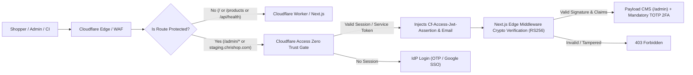

# Cloudflare Access (Zero Trust) Operational Security Runbook

**Service**: Cloudflare Zero Trust (Access)  
**Applicability**: `/admin/*` (Production), `staging.chrishop.com`, `*.preview.chrishop.com`  
**Related Issue**: [Story 5.6 (#139)](https://github.com/jacobmiller22/chrishop/issues/139)  
**Status**: Production & Staging Enforced  

---

## 1. Architectural Overview & Defense-in-Depth

ChrisShop employs an edge-level Zero Trust identity perimeter using **Cloudflare Access** to intercept, authenticate, and authorize all inbound traffic before requests reach the Next.js storefront or Payload CMS backend.



### Defense-in-Depth Layering:
1. **Layer 1 (Perimeter Gate)**: Cloudflare Access evaluates identity at the worldwide edge, blocking unauthorized requests, bot crawlers, and automated scanners before serverless compute or D1 SQLite queries execute.
2. **Layer 2 (Cryptographic Assertion)**: Next.js edge middleware validates the `Cf-Access-Jwt-Assertion` cryptographic RS256 signature using Cloudflare's public JWKS certificates (`https://<team>.cloudflareaccess.com/cdn-cgi/access/certs`), preventing header spoofing.
3. **Layer 3 (Application Authentication)**: Payload CMS authenticates administrative accounts with bcrypt-hashed credentials and enforces mandatory TOTP Two-Factor Authentication (Story 5.2 #29).

---

## 2. Protected Applications & Domain Matrix

| Application | Protected Domain / Route | Target Environment | Access Policy | Session Duration |
| :--- | :--- | :--- | :--- | :--- |
| **Payload CMS Admin** | `chrishop.com/admin*`<br>`chrishop.jacobmiller22.com/admin*` | Production | Approved team emails (`access_allowed_emails`) | 8 Hours |
| **Staging Storefront** | `staging.chrishop.com/*`<br>`staging-chrishop.jacobmiller22.com/*` | Staging | Authorized team members only | 24 Hours |
| **PR Preview Stacks** | `*.preview.chrishop.com/*` | Ephemeral Previews | Authorized team members only | 24 Hours |
| **Public Probes** | `/api/health` (All domains) | All | **Bypass** (Permitted for Better Stack uptime monitors) | N/A |

---

## 3. Team Member Onboarding & Authentication

### Identity Provider (IdP) Setup
- **Primary IdP**: One-Time PIN (OTP) dispatched via email or Google Workspace SSO.
- **Team Domain**: `chrishop.cloudflareaccess.com` (configurable via `access_team_name`).

### Adding an Authorized Administrator
1. Open `infra/terraform/modules/cloudflare_stack/variables.tf`.
2. Add the administrator's email address to `access_allowed_emails`:
   ```hcl
   variable "access_allowed_emails" {
     default = [
       "maker@bankbeaters.example",
       "admin@chrishop.com",
       "new-admin@chrishop.com"
     ]
   }
   ```
3. Commit and apply Terraform configuration via standard CI promotion pipeline.
4. When the user visits `https://chrishop.com/admin`, Cloudflare Access will prompt them for an OTP code sent to their approved email.

---

## 4. Developer CLI Tooling & `cloudflared` Workflow

### Installing `cloudflared`
To access staging environments or run CLI operations behind Cloudflare Access:
```bash
# macOS via Homebrew
brew install cloudflared

# Verify installation
cloudflared --version
```

### Logging into Staging or Admin via Browser
```bash
# Authenticate your terminal session
cloudflared access login https://staging.chrishop.com
```

### Accessing Protected Endpoints via Curl
```bash
# Using cloudflared access curl wrapper
cloudflared access curl https://staging.chrishop.com/api/debug

# Or using token helper
pnpm run access:token
```

### Local Monorepo Verification CLI
```bash
# Audit Access configuration, route matching, and cryptographic RS256 verification
pnpm run access:verify

# Generate a mock signed RS256 JWT for local unit testing
pnpm run access:token
```

---

## 5. Service Tokens (CI/CD Pipelines & Automated Probes)

### Overview
Automated systems (GitHub Actions PR previews, Playwright E2E suites, synthetic health monitors) authenticate without human intervention using **Cloudflare Access Service Tokens**.

### Required Headers
```http
CF-Access-Client-Id: <service-token-client-id>
CF-Access-Client-Secret: <service-token-client-secret>
```

### Service Token Lifecycle & Rotation
1. **Creation**: Managed declaratively via Terraform in `infra/terraform/modules/cloudflare_stack/access.tf`:
   ```hcl
   resource "cloudflare_access_service_token" "ci_probe" {
     account_id = var.cloudflare_account_id
     name       = "chrishop-${var.environment}-ci-probe"
     min_days_for_renewal = 30
   }
   ```
2. **Rotation Frequency**: Service tokens must be rotated every **90 days**.
3. **Rotation Procedure**:
   - Generate a secondary service token in Cloudflare Zero Trust dashboard or via Terraform.
   - Update repository secrets `CF_ACCESS_CLIENT_ID` and `CF_ACCESS_CLIENT_SECRET` in GitHub Actions.
   - Verify CI/CD pipeline runs pass cleanly with the new token.
   - Revoke and delete the old service token.

---

## 6. Emergency Break-Glass Procedures

> [!CAUTION]
> The break-glass procedure temporarily disables perimeter Access enforcement. Only invoke this in critical incidents when the identity provider is offline and administrative access is urgently required.

### Scenario: Identity Provider Outage (Team Locked Out)
If email delivery or Google SSO fails and administrators cannot log into `/admin`:

#### Option 1: Terraform Emergency Bypass (Recommended)
1. In `infra/terraform/modules/cloudflare_stack/variables.tf`, set:
   ```hcl
   variable "enable_cloudflare_access" {
     default = false
   }
   ```
2. Apply Terraform to remove perimeter Access policies.
3. *Note*: In-app Payload CMS TOTP 2FA remains active, ensuring the admin panel is still protected by two-factor authentication.
4. Once the IdP issue is resolved, re-enable `enable_cloudflare_access = true`.

#### Option 2: Cloudflare Dashboard Instant Bypass
1. Log into Cloudflare Dashboard > **Zero Trust** > **Access** > **Applications**.
2. Locate `ChrisShop Admin (Production)`.
3. Under **Policies**, temporarily add a high-priority policy with decision **Bypass** restricted to your specific static IP address.
4. Once emergency actions are complete, remove the bypass policy.

---

## 7. Security Auditing & Access Logs

All access attempts (both successful logins and blocked perimeter requests) are recorded in Cloudflare Zero Trust:
- **Audit Logs Location**: Cloudflare Dashboard > Zero Trust > **Logs** > **Access**.
- **Log Attributes**: Visitor IP, Geo-location, Ray ID, Authenticated Email, User-Agent, Decision (`allow`, `deny`, `bypass`), and Timestamp.
- **Session Revocation**: To instantly terminate an active user session:
  - Navigate to **Users** > Search email > Click **Revoke Sessions**.
