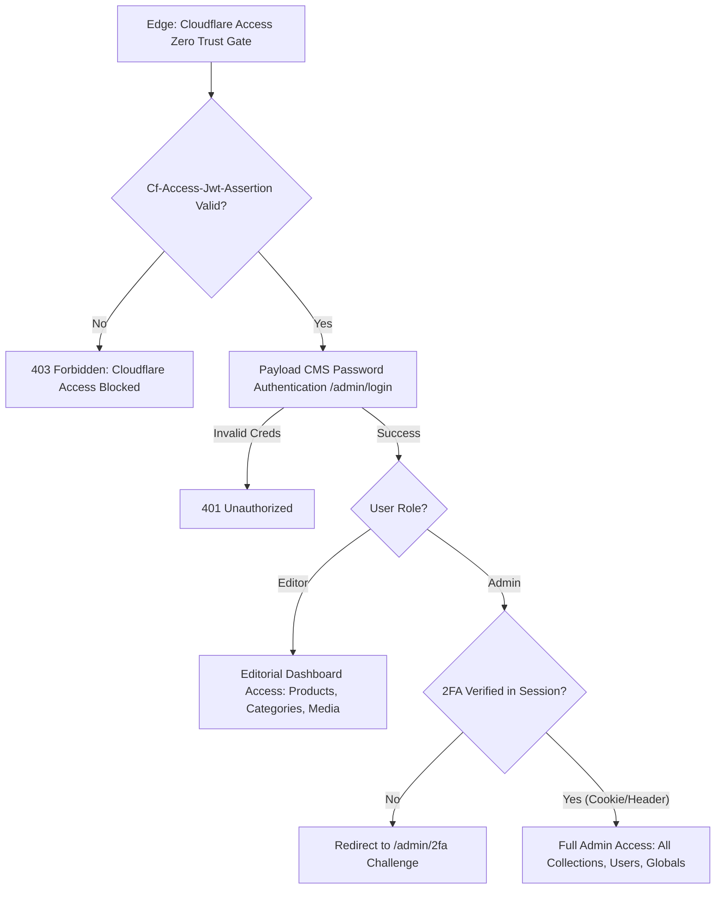

# Payload CMS Role-Based Access Control (RBAC) & Mandatory TOTP 2FA Runbook

This runbook documents the architecture, permission boundaries, onboarding workflows, authenticator pairing, and emergency break-glass recovery procedures for ChrisShop's administrative perimeter under `/admin`, conforming to `docs/HIGH_LEVEL_DESIGN.md` Section 7 and Story 5.2.

---

## 1. Security Architecture Overview

ChrisShop enforces multi-layered defense-in-depth for all administrative, catalog management, and editorial operations:



### Defense-in-Depth Tiers:
1. **Layer 1: Cloudflare Access Zero Trust Perimeter**: Validates team credentials and RS256 JWT assertion header before requests reach origin workers.
2. **Layer 2: Payload CMS Credential Authentication**: Native hashed password verification for registered staff accounts in the `users` collection.
3. **Layer 3: Mandatory TOTP Two-Factor Authentication (RFC 6238)**: Enforced for all accounts possessing the `admin` role. Access to `/admin` dashboard and administrative operations is strictly denied without verified TOTP proof.
4. **Layer 4: Granular RBAC Permissions Engine**: Strict collection and field-level access control restricting Editors from destructive actions (delete), global settings modifications, or privilege escalation.

---

## 2. RBAC Permissions Matrix

| Resource / Collection | Operation | Admin Role | Editor Role | Public / Storefront | Notes |
| :--- | :--- | :--- | :--- | :--- | :--- |
| **Catalog Products** (`products`) | Read | Allowed | Allowed | Allowed | Publicly visible on storefront |
| | Create / Update | Allowed | Allowed | Denied | Editors author new drops and edits |
| | Delete | Allowed | **Denied** | Denied | Only Admins can permanently delete products |
| **Categories** (`categories`) | Read | Allowed | Allowed | Allowed | Taxonomy public for storefront navigation |
| | Create / Update | Allowed | Allowed | Denied | Editors can manage categories |
| | Delete | Allowed | **Denied** | Denied | Only Admins can delete taxonomy |
| **Product Lines** (`product_lines`) | Read | Allowed | Allowed | Allowed | Storytelling visible on storefront |
| | Create / Update | Allowed | Allowed | Denied | Editors can manage product lines |
| | Delete | Allowed | **Denied** | Denied | Only Admins can delete product lines |
| **Variations** (`product_variations`)| Read | Allowed | Allowed | Allowed | Edition inventory visible on storefront |
| | Create / Update | Allowed | Allowed | Denied | Editors can manage edition badges |
| | Delete | Allowed | **Denied** | Denied | Only Admins can delete variations |
| **Media Library** (`media`) | Read | Allowed | Allowed | Allowed | Images served from Cloudflare R2 |
| | Create / Update | Allowed | Allowed | Denied | Uploads to R2 object storage |
| | Delete | Allowed | **Denied** | Denied | Only Admins can delete media files |
| **Pages & Blocks** (`pages`) | Read | Allowed | Allowed | Allowed | Dynamic App Router pages |
| | Create / Update | Allowed | Allowed | Denied | Editors can author layout blocks |
| | Delete | Allowed | **Denied** | Denied | Only Admins can delete pages |
| **Theme Settings** (`themeSettings`) | Read | Allowed | Allowed | Allowed | Front-end renders design tokens |
| | Update | Allowed | **Denied** | Denied | Only Admins can change theme presets |
| **User Accounts** (`users`) | Read | All Users | Self Only | Denied | Editors can only inspect own profile |
| | Create / Delete | Allowed | **Denied** | Denied | Staff user provisioning is Admin-only |
| | Update Profile | Allowed | Self Only | Denied | Editors cannot edit other accounts |
| | Role Escalation (`roles`) | Allowed | **Denied** | Denied | Field-level gate (`adminOnlyField`) |
| | 2FA Configuration | Admin-gated | Self Only | Denied | Field-level gate (`adminOnlyField`) |
| **Dashboard (`/admin`)** | View & Manage | **2FA Required** | Allowed | Denied | Admin accounts require verified 2FA |

---

## 3. Mandatory TOTP 2FA Policy for Admins

### Technical Specification
- **Standard**: RFC 6238 (Time-Based One-Time Password Algorithm).
- **Underlying Hash**: HMAC-SHA1 via native Web Crypto API (`crypto.subtle`).
- **Time Step ($T_0$)**: 30 seconds.
- **Code Length**: 6 decimal digits.
- **Drift Tolerance**: $\pm 1$ time-step ($\pm 30$ seconds), accommodating mobile device clock variance.
- **Session Proof**: Tamper-proof HMAC-SHA256 signed token stored in secure, `HttpOnly`, `SameSite=Lax` cookie `payload-2fa-session` valid for 8 hours.

---

## 4. Admin User Onboarding & Authenticator Pairing

### Step 1: Account Creation
An existing Administrator creates a new staff account under `/admin/collections/users` with the role `admin`.

### Step 2: 2FA Enrollment Initiation
1. Upon first login with email and password, the Admin is redirected to `/admin/2fa`.
2. The enrollment service calls `POST /api/auth/2fa` with `{ action: 'setup' }`.
3. The server generates:
   - A cryptographically random Base32 secret (20 bytes / 160 bits).
   - An `otpauth://` URI:
     ```
     otpauth://totp/ChrisShop:user%40chrishop.com?secret=JBSWY3DPEHPK3PXP...&issuer=ChrisShop&algorithm=SHA1&digits=6&period=30
     ```
   - 8 single-use emergency backup recovery codes (formatted as `XXXX-XXXX`).

### Step 3: Pairing with Authenticator App
Scan the QR code or enter the Base32 secret manually in any RFC 6238 compliant authenticator:
- **1Password**: Add Item ➔ Login ➔ Add One-Time Password ➔ Paste secret or scan QR code.
- **Google Authenticator**: Tap `+` ➔ Scan a QR code or Enter a setup key.
- **Apple Passwords / iCloud Keychain**: Settings ➔ Passwords ➔ ChrisShop ➔ Set Up Verification Code.

### Step 4: Verification & Activation
1. Enter the current 6-digit code displayed in the authenticator app into the `/admin/2fa` challenge form.
2. The server verifies the token against the secret:
   ```bash
   curl -X POST https://chrishop.jacobmiller22.com/api/auth/2fa \
     -H "Content-Type: application/json" \
     -H "Cookie: payload-token=<JWT>" \
     -d '{"action": "verify", "code": "123456"}'
   ```
3. Upon success, the server:
   - Sets `totpEnabled = true` and records `totpVerifiedAt`.
   - Returns the signed session token and sets the `payload-2fa-session` cookie.
   - Redirects the user into `/admin`.

---

## 5. Emergency Backup Code Recovery Protocol

When an administrator loses access to their primary mobile authenticator device, they can authenticate using one of their emergency recovery codes:

1. On the `/admin/2fa` page, click **"Use Emergency Backup Code"**.
2. Enter the recovery code (e.g., `9295-7HFF`).
3. The server computes the SHA-256 hash of the normalized code and matches it against the stored array of hashes on the user document.
4. If valid, the code is **immediately burned** (deleted from the user's stored backup codes) so it cannot be reused.
5. A signed 2FA session is issued, granting access to `/admin`.
6. **IMMEDIATELY RE-ENROLL**: Navigate to user settings, reset 2FA, and pair a new authenticator device.

---

## 6. Break-Glass Administrator Recovery

If an administrator has lost both their authenticator device and all emergency recovery codes, a designated DevOps engineer with Cloudflare D1 access can execute a break-glass reset via CLI.

### Option A: Reset 2FA for an Admin Account
Clearing `totp_enabled` and `totp_secret` allows the administrator to log in and re-enroll:

```bash
# For Production D1 Database
wrangler d1 execute chrishop-prod-db --remote --command="
  UPDATE users 
  SET totp_enabled = 0, 
      totp_secret = NULL, 
      totp_verified_at = NULL, 
      totp_backup_codes = NULL 
  WHERE email = 'admin@chrishop.com';
"

# For Staging D1 Database
wrangler d1 execute chrishop-staging-db --remote --command="
  UPDATE users 
  SET totp_enabled = 0, 
      totp_secret = NULL, 
      totp_verified_at = NULL, 
      totp_backup_codes = NULL 
  WHERE email = 'admin@chrishop.com';
"
```

### Option B: Promote an Editor to Admin in an Emergency
```bash
wrangler d1 execute chrishop-prod-db --remote --command="
  UPDATE users 
  SET roles = '[\"admin\"]', 
      totp_enabled = 0 
  WHERE email = 'standby-admin@chrishop.com';
"
```

### Option C: Inspect User 2FA Status
```bash
wrangler d1 execute chrishop-prod-db --remote --command="
  SELECT id, email, roles, totp_enabled, totp_verified_at FROM users;
"
```

---

## 7. Security Auditing & Compliance Verification

To verify that RBAC policies and TOTP 2FA enforcement remain mathematically intact and unviolated across all releases:

```bash
# Run the complete RBAC & 2FA integration test suite
pnpm exec tsx --test tests/integration/payload-rbac-2fa.test.ts

# Verify D1 additive schema integrity
pnpm run d1:migrate:check

# Run full monorepo pre-PR verification gate
pnpm run verify:local
```
