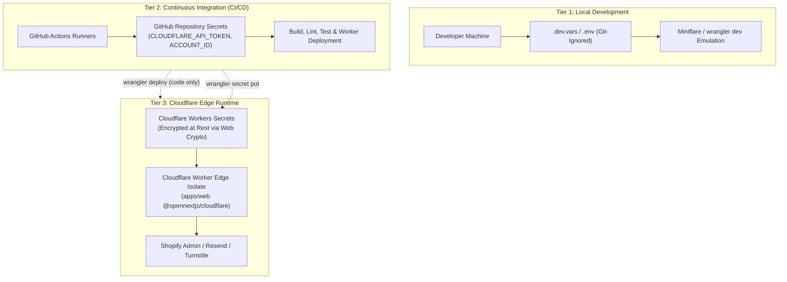

# ChrisShop Secrets Management & Isolation Runbook

> **Document Version**: 1.0.0  
> **Classification**: Internal Operational Security Runbook  
> **Architectural Authority**: `docs/HIGH_LEVEL_DESIGN.md` Section 7  
> **Relevant Issues**: Story 5.3 (#30), Story 2.29 (#140)  

---

## 1. Executive Summary & Objectives

The ChrisShop platform operates on a **Cloudflare-Native Serverless Architecture** (Next.js App Router on Cloudflare Workers, D1 SQLite, Workers KV, R2 Object Storage, and Shopify Headless Commerce).

Per Section 7 of `docs/HIGH_LEVEL_DESIGN.md`, the platform enforces strict **Three-Tier Secrets Isolation** with **Zero Plaintext Secrets** committed to Git, stored in unencrypted repository files, or exposed in client bundles:



---

## 2. Secrets Classification & Inventory Matrix

| Secret Key | Tier / Storage | Impact Level | Rotation Cadence | Description & Scope |
| :--- | :--- | :--- | :--- | :--- |
| `PAYLOAD_SECRET` | Workers Secret | **Critical** | 90 Days | 256-bit cryptographic hex key used for signing JWT authentication cookies and encrypting Payload CMS database sessions. |
| `SHOPIFY_ADMIN_TOKEN` | Workers Secret | **Critical** | 90 Days | Shopify Admin API scoped access token (`shpat_...`) enabling real-time catalog syncing and order status reconciliation. |
| `SHOPIFY_WEBHOOK_SECRET` | Workers Secret | **High** | 180 Days | HMAC-SHA256 signature secret provided by Shopify to cryptographically verify incoming `orders/create` payloads. |
| `SHOPIFY_STOREFRONT_TOKEN` | Workers Secret | **Medium** | 180 Days | Headless Storefront API token used to instantiate Shopify checkout sessions and query active inventory. |
| `CLOUDFLARE_API_TOKEN` | GitHub Actions Secret | **Critical** | 90 Days | Scoped Cloudflare API token granting least-privilege permissions for Worker deployment, D1 migration, KV, and DNS routing. |
| `RESEND_API_KEY` | Workers Secret | **Medium** | 180 Days | API key (`re_...`) for transmitting transactional customer receipts and merchant low-stock notifications. |
| `TURNSTILE_SECRET_KEY` | Workers Secret | **Medium** | 180 Days | Server-side secret key validating Cloudflare Turnstile bot verification challenge tokens during checkout. |
| `OPS_ALERT_WEBHOOK_URL` | Workers Secret | **Low** | 365 Days | Outgoing HTTPS webhook destination (Slack/Discord/PagerDuty) for operational alerts and unhandled error logs. |

---

## 3. Strict Boundary Enforcement Rules

1. **Zero Plaintext Secrets in Git**:
   - Monorepo `wrangler.toml` MUST NEVER declare sensitive secrets under `[vars]` or `[env.*.vars]`. Only public non-sensitive configuration keys (e.g. `SITE_URL`, `CMS_URL`, `SHOPIFY_STORE_DOMAIN`, `NEXT_PUBLIC_*`) may exist in `wrangler.toml`.
2. **Local Development Isolation**:
   - Local environments use `.dev.vars` (or `.env`), which are strictly listed in `.gitignore`.
   - `.env.example` provides safe, non-functional mock values for onboarding.
3. **CI/CD Pipeline Least Privilege**:
   - GitHub Actions workflows (`deploy.yml`, `ci.yml`, `preview-deploy.yml`) are granted ONLY Cloudflare deployment credentials (`CLOUDFLARE_API_TOKEN`, `CLOUDFLARE_ACCOUNT_ID`).
   - Workflows DO NOT have access to, nor do they inject, application runtime secrets (`PAYLOAD_SECRET`, `SHOPIFY_ADMIN_TOKEN`, etc.).
4. **Edge Runtime Injection**:
   - All runtime secrets are provisioned directly to Cloudflare via `wrangler secret put` and injected into the Worker execution context at request runtime by `@opennextjs/cloudflare`.

---

## 4. Initial Environment Provisioning Guide

When bringing up a new environment (e.g. `staging` or `production`), the operator must populate secrets using the Cloudflare CLI.

### 4.1 Production Environment

Run the following interactive commands from the repository root:

```bash
# 1. Payload CMS Session & JWT Signing Key (Auto-generate 32-byte hex key)
pnpm run secrets:rotate --secret PAYLOAD_SECRET --generate --env production

# 2. Shopify Admin API Access Token
pnpm exec wrangler secret put SHOPIFY_ADMIN_TOKEN

# 3. Shopify Storefront API Token
pnpm exec wrangler secret put SHOPIFY_STOREFRONT_TOKEN

# 4. Shopify Webhook HMAC Secret
pnpm exec wrangler secret put SHOPIFY_WEBHOOK_SECRET

# 5. Resend Email Engine API Key
pnpm exec wrangler secret put RESEND_API_KEY

# 6. Cloudflare Turnstile Bot Secret Key
pnpm exec wrangler secret put TURNSTILE_SECRET_KEY

# 7. Operational Alerts Webhook Sink
pnpm exec wrangler secret put OPS_ALERT_WEBHOOK_URL
```

### 4.2 Staging Environment

To populate staging secrets, pass `--env staging`:

```bash
pnpm run secrets:rotate --secret PAYLOAD_SECRET --generate --env staging
pnpm exec wrangler secret put SHOPIFY_ADMIN_TOKEN --env staging
pnpm exec wrangler secret put SHOPIFY_STOREFRONT_TOKEN --env staging
pnpm exec wrangler secret put SHOPIFY_WEBHOOK_SECRET --env staging
pnpm exec wrangler secret put RESEND_API_KEY --env staging
pnpm exec wrangler secret put TURNSTILE_SECRET_KEY --env staging
pnpm exec wrangler secret put OPS_ALERT_WEBHOOK_URL --env staging
```

### 4.3 Listing Configured Secrets

Verify that secrets are registered without exposing their plaintext values:

```bash
# Production
pnpm exec wrangler secret list

# Staging
pnpm exec wrangler secret list --env staging
```

---

## 5. Automated Operational Rotation Procedures

The ChrisShop monorepo provides a turnkey CLI utility for rotating secrets with automated pre- and post-health checks and audit logging:

```bash
pnpm run secrets:rotate --secret <SECRET_NAME> [options]
```

### 5.1 Rotating Payload CMS Secret (`PAYLOAD_SECRET`)
- **Cadence**: Every 90 days.
- **Impact**: Invalides active user sessions; admins must log back in to `/admin`.
- **Command**:
  ```bash
  # Staging
  pnpm run secrets:rotate --secret PAYLOAD_SECRET --generate --env staging

  # Production
  pnpm run secrets:rotate --secret PAYLOAD_SECRET --generate --env production
  ```

### 5.2 Rotating Shopify Admin Token (`SHOPIFY_ADMIN_TOKEN`)
1. Log into Shopify Partner Dashboard or Shopify Store Admin (`https://admin.shopify.com/store/chrishop`).
2. Navigate to **Settings > Apps and sales channels > Develop apps**.
3. Select the custom ChrisShop integration app.
4. Click **API credentials > Generate new token** (or install updated version).
5. Copy the newly generated token (`shpat_...`).
6. Update Cloudflare Workers Secrets:
   ```bash
   pnpm run secrets:rotate --secret SHOPIFY_ADMIN_TOKEN --value "shpat_new_token_value..." --env production
   ```
7. Verify catalog and edge health:
   ```bash
   curl -s https://chrishop.jacobmiller22.com/api/health | jq .
   ```
8. Revoke the previous token in the Shopify Store Admin.

### 5.3 Rotating Shopify Webhook Secret (`SHOPIFY_WEBHOOK_SECRET`)
1. Navigate to **Shopify Admin > Settings > Notifications > Webhooks**.
2. Identify the webhook signing secret for `orders/create`.
3. Update the secret in Cloudflare:
   ```bash
   pnpm run secrets:rotate --secret SHOPIFY_WEBHOOK_SECRET --value "shpss_new_secret..." --env production
   ```
4. Dispatch a test webhook using the Shopify CLI:
   ```bash
   shopify app webhook trigger --topic orders/create --address https://chrishop.jacobmiller22.com/api/webhooks/shopify
   ```

### 5.4 Rotating Cloudflare API Token (`CLOUDFLARE_API_TOKEN`)
1. Navigate to **Cloudflare Dashboard > My Profile > API Tokens**.
2. Click **Create Token** using the **Edit Cloudflare Workers** template, or customize scopes:
   - Account: `Workers Scripts:Edit`, `Workers KV:Edit`, `D1:Edit`, `R2:Edit`
   - Zone: `Zone:Read`, `DNS:Edit`, `Workers Routes:Edit`
3. Generate token and copy token string.
4. Update GitHub Actions Repository Secret:
   ```bash
   gh secret set CLOUDFLARE_API_TOKEN -b "new_token_string..."
   ```
5. Trigger manual verification workflow to confirm CI/CD access:
   ```bash
   gh workflow run ci.yml --ref staging
   ```
6. Delete or disable the previous token in the Cloudflare Dashboard.

---

## 6. Continuous Secrets Auditing (`pnpm run secrets:audit`)

Developers and automated CI pipelines run the monorepo secrets audit via:

```bash
pnpm run secrets:audit
```

The audit script checks:
1. **Git Repository History**: Zero tracked files containing unmasked live secrets.
2. **Gitignore Strictness**: Enforces blocking of `.env*`, `.dev.vars*`, `*.pem`, `*.key`.
3. **Wrangler Zero-Leakage**: Confirms `wrangler.toml` does not contain sensitive variable assignments.
4. **CI/CD Secret Boundary**: Ensures GitHub Actions workflows only receive Cloudflare API deployment tokens.
5. **Runbook Parity**: Guarantees documentation for all required secrets is maintained.

---

## 7. Incident Response & Emergency Compromise Protocol

In the event of an accidental credential exposure (e.g. token pasted in a public issue, rogue commit, or provider alert):

### Step 1: Immediate Token Revocation
- Immediately revoke the compromised credential in the upstream provider portal (Shopify Admin, Cloudflare Dashboard, or Resend).
- Do NOT wait for a scheduled deployment or team meeting. Revocation stops ongoing exploitation immediately.

### Step 2: Emergency Key Rotation
- Provision a freshly minted token using `wrangler secret put` or `pnpm run secrets:rotate`:
  ```bash
  pnpm run secrets:rotate --secret <EXPOSED_SECRET> --value "<NEW_KEY>" --reason "Emergency Revocation - Incident #[ID]"
  ```

### Step 3: Git History Purge (If Committed)
- If a secret was committed to Git:
  1. Revoke the secret first.
  2. Run `git filter-repo` or BFG Repo-Cleaner to purge the sensitive commit from history.
  3. Force push the sanitized branch to GitHub.
  4. Invalidate GitHub pull request caches by closing and reopening affected PRs.

### Step 4: Audit & Log Analysis
- Query Cloudflare Workers Logs via Logpush or `wrangler tail` to inspect traffic during the exposure window.
- Verify whether unauthorized requests accessed protected routes or admin endpoints.
- Log an audit record in the team security tracker.
